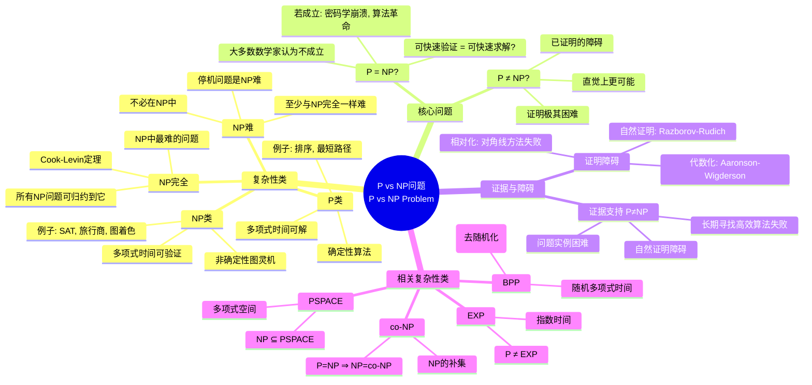
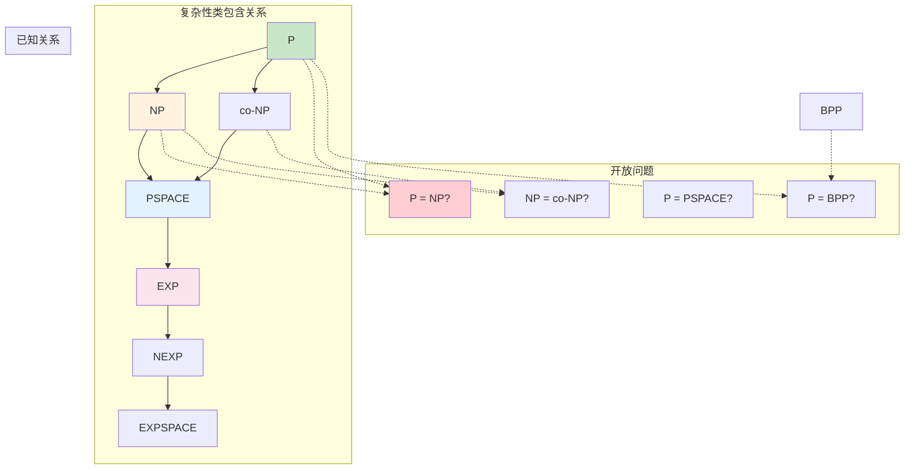
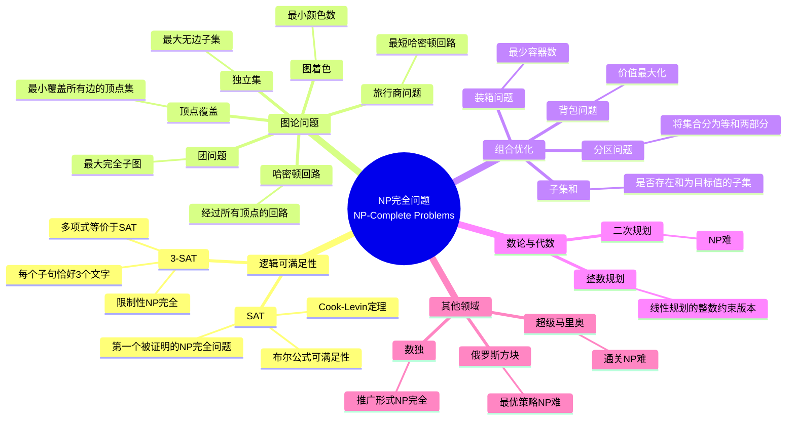
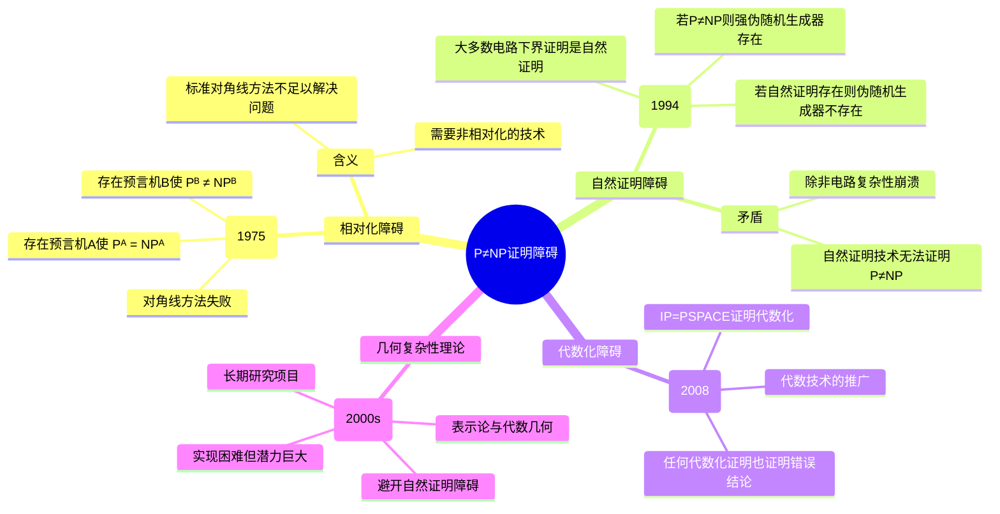
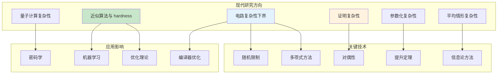
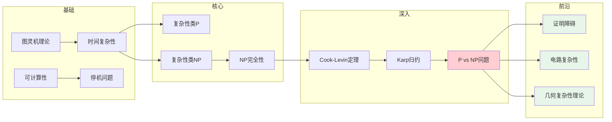

# P vs NP问题 - 思维导图

## 概述

P vs NP问题是计算复杂性理论中最核心、最著名的开放问题，也是克雷数学研究所的千禧年大奖难题之一。问题问的是：是否每个其解可以被快速验证的问题也可以被快速求解？形式上，P类包含所有可在多项式时间内被确定性图灵机解决的问题，而NP类包含所有可在多项式时间内被验证的判定问题。P=NP?还是P≠NP?这个问题的答案将对密码学、算法设计、人工智能等领域产生深远影响。

---

## 核心思维导图



---

## 复杂性类层次结构



---

## NP完全问题



---

## P与NP的关系分析

```mermaid
graph TD
    subgraph 两种可能
        EQ[P = NP?]
    end
    
    subgraph 若 P = NP
        Yes1[密码学崩溃]
        Yes2[所有NP问题有高效算法]
        Yes3[创造性可被自动化]
        Yes4[数学证明可被机器发现]
        Yes5[计算革命]
    end
    
    subgraph 若 P ≠ NP
        No1[密码学安全基础]
        No2[某些问题固有困难]
        No3[启发式算法重要]
        No4[近似算法研究]
        No5[平均复杂性理论]
    end
    
    subgraph 中间可能性
        Maybe1[NP-intermediate]
        Maybe2[图同构问题?]
        Maybe3[因数分解?]
    end
    
    EQ --> |若成立| Yes1
    EQ --> |若不成立| No1

    EQ -.-> Maybe1
    
    Maybe1 --> Maybe2
    Maybe1 --> Maybe3
    
    style EQ fill:#ffcdd2
    style Yes1 fill:#fff3e0
    style No1 fill:#e8f5e9

```

---

## 历史时间线

| 年份 | 人物 | 贡献 |
|------|------|------|
| 1956 | Gödel | 致von Neumann信，预感问题的存在 |
| 1965 | Edmonds, Cobham | 形式化"高效算法"概念 |
| 1971 | Cook | 证明SAT是NP完全的(Cook定理) |
| 1971 | Levin | 独立证明类似结果(苏联) |
| 1972 | Karp | 21个NP完全问题，归约技术 |
| 1970s-80s | 多项研究者 | 发现数百个NP完全问题 |
| 1994 | Shor | 量子算法因数分解，挑战密码学 |
| 2000 | CMI | 列为千禧年大奖难题 |
| 2009 | Fortnow | 《The Golden Ticket》普及著作 |
| 2010s | 多项研究者 | 电路下界，去随机化进展 |

---

## 证明障碍



---

## 现代研究方向



---

## 实际影响

| 领域 | P=NP的影响 | P≠NP的影响 |
|------|-----------|-----------|
| **密码学** | 所有基于NP的加密崩溃 | RSA、椭圆曲线加密安全 |
| **优化** | 旅行商、调度问题可精确求解 | 需要启发式与近似算法 |
| **AI** | 机器可以自动化证明与发现 | 人类创造力保持价值 |
| **生物信息** | 蛋白质折叠问题可解 | 需要启发式方法 |
| **经济学** | 市场均衡高效可计算 | 计算复杂性限制市场设计 |

---

## 重要定理与结果

| 定理 | 陈述 | 意义 |
|------|------|------|
| **Cook-Levin** | SAT是NP完全的 | NP完全性的奠基 |
| **Karp归约** | 21个经典问题是NP完全的 | 建立归约技术 |
| **Ladner** | 若P≠NP则存在NP-intermediate | 中间复杂性类的存在性 |
| **Impagliazzo-Wigderson** | 若P≠NP则BPP=P | 去随机化的条件 |
| **PCP定理** | NP=PCP[O(log n), O(1)] | 近似难度的基础 |

---

## 与其他数学领域的联系

- **数理逻辑**: 问题与一阶逻辑、证明论的联系
- **组合数学**: 图论、组合优化是NP完全问题的主要来源
- **概率论**: 随机算法、概率可验证明(PCP)
- **信息论**: 通信复杂性、信息复杂性
- **代数**: 代数复杂性、矩阵乘法
- **量子计算**: 量子多项式时间(BQP)与NP的关系

---

## 学习路径



---

*文档版本：1.0*  
*创建时间：2026年4月*  
*分类：计算理论 / 复杂性理论 / P vs NP / 思维导图*
