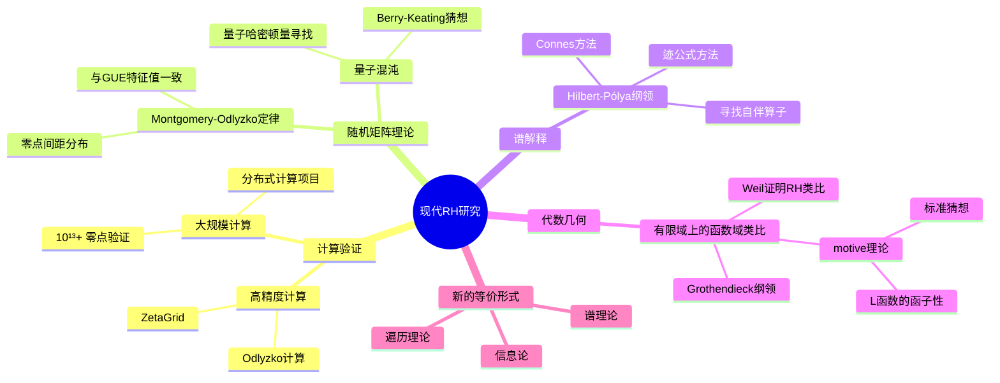
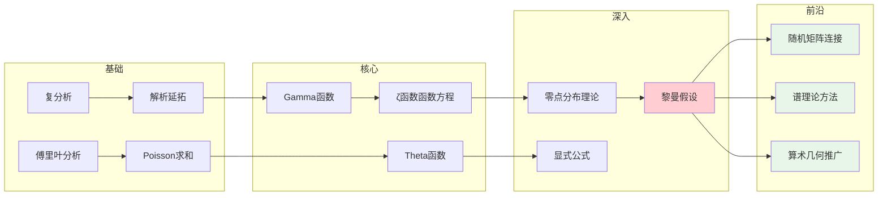

# 黎曼假设 - 思维导图

## 概述

黎曼假设(Riemann Hypothesis, RH)由德国数学家伯恩哈德·黎曼于1859年在他向柏林科学院提交的论文《论小于给定数值的素数个数》中提出。这个猜想断言黎曼ζ函数的所有非平凡零点都位于复平面的临界线 $\text{Re}(s) = \frac{1}{2}$ 上。RH是数学中最重要、最著名的未解决问题之一，与素数分布有着深刻的联系，也是克雷数学研究所的千禧年大奖难题之一。

---

## 核心思维导图

```mermaid
mindmap
  root((黎曼假设<br/>Riemann Hypothesis))
    核心陈述
      ζ函数非平凡零点
        Re(s) = 1/2
        临界线 Critical Line
      等价形式
        Mertens函数界
        素数计数函数误差
        对称矩阵特征值
    ζ函数
      定义
        ζ(s) = Σ 1/nˢ (Re(s)>1)
        解析延拓到 C\\{1}
      平凡零点
        s = -2, -4, -6, ...
      非平凡零点
        0 < Re(s) < 1 中的零点
      函数方程
        ζ(s) = 2ˢ πˢ⁻¹ sin(πs/2) Γ(1-s) ζ(1-s)
    素数联系
      素数定理
        π(x) ~ x/ln(x)
        等价于 ζ(s)≠0 on Re(s)=1
      显式公式
        ψ(x) = x - Σ xᵖ/ρ - ...
        零点与素数幂的直接联系
      误差项
        RH ⇔ π(x) = Li(x) + O(√x ln x)
    广义黎曼假设
      Dirichlet L-函数
        L(s,χ) 零点在 Re(s)=1/2
      Dedekind ζ函数
        代数数域上的推广
      椭圆曲线 L-函数
        BSD猜想的基础
    证据
      计算验证
        10¹³+ 个零点在临界线上
        Gourdon(2004) 10¹³
      理论结果
        41% 零点在临界线上
        Levinson方法
        Conrey改进
```

---

## ζ函数解析结构

```mermaid
graph TD
    subgraph 黎曼ζ函数
        Zeta[ζ(s)]
    end
    
    subgraph 定义区域
        D1[Re(s) > 1<br/>绝对收敛]<-->Def1[ζ(s)=Σ 1/nˢ]
        D2[Re(s) > 0<br/>条件收敛]<-->Def2[η函数解析延拓]
        D3[全平面<br/>除s=1]<-->Def3[函数方程延拓]
    end
    
    subgraph 零点
        T1[平凡零点<br/>s = -2, -4, -6, ...]<-->T2[来自sin(πs/2)]
        NT1[非平凡零点<br/>0<Re(s)<1]<-->NT2[关于1/2对称]
    end
    
    subgraph 特殊值
        S1[s=1<br/>调和级数<br/>发散到∞]
        S2[s=2<br/>π²/6<br/>巴塞尔问题]
        S3[s=-1<br/>-1/12<br/>"所有自然数之和"]
        S4[s=1/2<br/>临界点<br/>零点分布]
    end
    
    Zeta --> D1
    Zeta --> D2
    Zeta --> D3
    Zeta --> T1
    Zeta --> NT1
    Zeta --> S1
    Zeta --> S2
    Zeta --> S3
    Zeta --> S4
    
    NT1 -.-> RH[黎曼假设<br/>所有非平凡零点在 Re(s)=1/2]
    
    style NT1 fill:#ffcdd2
    style RH fill:#ffcdd2
```

---

## 素数与零点的深刻联系

```mermaid
graph TD
    subgraph 黎曼显式公式
        RF[ψ(x) = x - Σ xᵖ/ρ - ln(2π) - ½ ln(1-x⁻²)]
    end
    
    subgraph 左边 - 算术信息
        A1[ψ(x) = Σ_{pᵏ≤x} ln p]<-->A2[切比雪夫函数]
        A2 --> A3[素数幂加权和]
    end
    
    subgraph 右边 - 解析信息
        An1[x<br/>主项]<-->An2[线性增长]
        Zero[Σ xᵖ/ρ<br/>ζ的零点贡献]<-->Zero2[振荡项]
        Const[常数项]
    end
    
    subgraph 关键洞察
        K1[每个零点 ρ 贡献 xᵖ/ρ]
        K2[零点位置决定素数分布的精度]
        K3[RH: 误差 ~ O(√x ln x)]
    end
    
    RF --> A1
    RF --> An1
    RF --> Zero
    RF --> Const
    
    Zero --> K1
    Zero --> K2
    Zero --> K3
    
    style Zero fill:#fff3e0
    style RH fill:#ffcdd2
```

---

## 等价形式与推论

```mermaid
mindmap
  root((RH等价形式))
    素数计数
      π(x) = Li(x) + O(√x ln x)
      ψ(x) = x + O(√x ln²x)
      最优误差界
    Mertens函数
      M(x) = Σ_{n≤x} μ(n)
      RH ⇔ M(x) = O(x^{1/2+ε})
      与随机游走相关
    算术函数
      σ(n) < eᵞ n ln ln n
      对于充分大的n
      Robin准则(1984)
    Farey序列
      |Fₙ| = 3n²/π² + O(n^{1/2+ε})
      Franel-Landau定理
    矩阵理论
      随机矩阵理论联系
      Hilbert-Pólya猜想
        存在自伴算子 H 使得 ζ(1/2+iE) ∝ det(E-H)
      量子混沌连接
    Weil显式公式
      对偶性表述
      迹公式解释
```

---

## 历史时间线

| 年份 | 人物 | 贡献 |
|------|------|------|
| 1859 | 黎曼 | 提出假设，开创解析数论 |
| 1896 | Hadamard, de la Vallée Poussin | 独立证明素数定理 |
| 1914 | Hardy | 证明有无穷多个零点在临界线上 |
| 1942 | Selberg | 证明正比例零点在临界线上 |
| 1974 | Levinson | 证明至少1/3零点在临界线上 |
| 1989 | Conrey | 将比例提高到40% |
| 2004 | Gourdon & Demichel | 计算验证前10¹³个零点 |
| 2020s | 多项研究 | 数值验证持续推进 |

---

## 相关猜想与推广

```mermaid
graph TD
    subgraph 黎曼假设
        RH[经典RH]
    end
    
    subgraph 推广形式
        GRH[广义黎曼假设<br/>Dirichlet L-函数]
        ERH[扩展黎曼假设<br/>代数数域]
        ECRH[椭圆曲线RH<br/>Hasse-Weil L-函数]
        GRH_GL[GL(n)自守形式RH]
    end
    
    subgraph 应用
        A1[素数分布]
        A2[类数问题]
        A3[密码学安全]
        A4[算法复杂性]
    end
    
    RH --> GRH
    RH --> ERH
    RH --> ECRH
    GRH --> GRH_GL
    
    GRH --> A2
    ECRH --> A3
    GRH --> A4
    RH --> A1
    
    style RH fill:#ffcdd2
    style GRH fill:#fff3e0
    style ECRH fill:#fff3e0
```

---

## 现代研究方向



---

## 与其他数学领域的联系

- **解析数论**: RH是素数分布理论的基石
- **代数几何**: Weil猜想(RH的类比)已被Deligne证明
- **随机矩阵理论**: 零点分布与GUE特征值分布的惊人相似
- **量子物理**: Berry-Keating猜想寻找"量子黎曼算子"
- **密码学**: RH的算术推论影响RSA等加密系统的安全分析
- **计算复杂性**: GRH对某些确定性算法的去随机化至关重要

---

## 学习路径



---

*文档版本：1.0*  
*创建时间：2026年4月*  
*分类：数论 / 解析数论 / 黎曼假设 / 思维导图*
