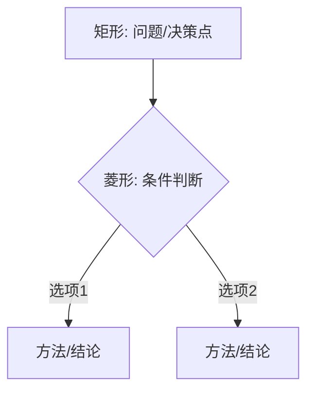

# FormalMath 决策树使用指南

## 概述

本目录包含 **57个数学决策树**，涵盖学习路径选择、问题求解策略、定理应用、学习策略和困难诊断五大类别。这些决策树采用Mermaid流程图语法，可在支持Mermaid的Markdown阅读器中渲染。

---

## 决策树目录

### 一、学习路径决策树（5个）

| 文件 | 主题 | 适用场景 | 难度 |
|------|------|---------|------|
| [01-分析学学习路径决策](./01-分析学学习路径决策.md) | 分析学学习 | 选择实分析、复分析、泛函分析等路径 | ⭐⭐-⭐⭐⭐⭐ |
| [02-代数学学习路径决策](./02-代数学学习路径决策.md) | 代数学学习 | 选择抽象代数、同调代数、代数几何等路径 | ⭐⭐-⭐⭐⭐⭐ |
| [03-几何学习路径决策](./03-几何学习路径决策.md) | 几何学学习 | 选择微分几何、代数几何、拓扑学等路径 | ⭐⭐-⭐⭐⭐⭐ |
| [04-应用数学方向决策](./04-应用数学方向决策.md) | 应用数学 | 选择数学物理、金融数学、计算数学等方向 | ⭐⭐-⭐⭐⭐ |
| [05-入门点选择决策](./05-入门点选择决策.md) | 入门点选择 | 根据背景选择最佳数学入门起点 | ⭐-⭐⭐ |

### 二、问题求解决策树（14个）

#### 基础问题求解（8个）

| 文件 | 主题 | 适用场景 | 难度 |
|------|------|---------|------|
| [06-极限求解方法决策](./06-极限求解方法决策.md) | 极限求解 | 选择数列、函数、多元极限的求解方法 | ⭐⭐-⭐⭐⭐ |
| [07-积分技巧选择决策](./07-积分技巧选择决策.md) | 积分求解 | 选择换元、分部、有理函数等积分技巧 | ⭐⭐-⭐⭐⭐ |
| [08-微分方程解法决策](./08-微分方程解法决策.md) | ODE/PDE | 选择常微分、偏微分方程的解法 | ⭐⭐⭐-⭐⭐⭐⭐ |
| [09-证明方法选择决策](./09-证明方法选择决策.md) | 数学证明 | 选择直接证明、反证法、归纳法等 | ⭐⭐-⭐⭐⭐ |
| [10-代数结构分类决策](./10-代数结构分类决策.md) | 代数结构 | 根据运算性质分类群、环、域等结构 | ⭐⭐⭐-⭐⭐⭐⭐ |
| [11-拓扑性质证明策略](./11-拓扑性质证明策略.md) | 拓扑证明 | 证明开集、连续性、紧致性等性质 | ⭐⭐⭐-⭐⭐⭐⭐ |
| [12-概率分布选择决策](./12-概率分布选择决策.md) | 概率分布 | 根据问题特征选择合适的概率模型 | ⭐⭐-⭐⭐⭐ |
| [13-统计检验选择决策](./13-统计检验选择决策.md) | 统计检验 | 选择合适的假设检验方法 | ⭐⭐⭐-⭐⭐⭐⭐ |

#### 高级问题求解（10个）

| 文件 | 主题 | 适用场景 | 难度 |
|------|------|---------|------|
| [19-收敛性证明策略](./19-收敛性证明策略.md) | 收敛性证明 | ε-N定义、柯西准则、一致收敛等 | ⭐⭐⭐-⭐⭐⭐⭐⭐ |
| [20-积分计算技巧选择](./20-积分计算技巧选择.md) | 积分计算 | 不定积分、定积分、重积分等 | ⭐⭐⭐-⭐⭐⭐⭐ |
| [21-不等式证明策略](./21-不等式证明策略.md) | 不等式证明 | 经典不等式、凸性、积分不等式等 | ⭐⭐⭐-⭐⭐⭐⭐⭐ |
| [22-函数性质分析策略](./22-函数性质分析策略.md) | 函数分析 | 连续性、可微性、极值、凸性等 | ⭐⭐⭐-⭐⭐⭐⭐ |
| [23-渐近分析策略](./23-渐近分析策略.md) | 渐近分析 | Landau记号、Taylor展开、复杂度分析 | ⭐⭐⭐-⭐⭐⭐⭐ |
| [24-群论问题求解策略](./24-群论问题求解策略.md) | 群论问题 | 子群、正规子群、同态、Sylow定理等 | ⭐⭐⭐⭐-⭐⭐⭐⭐⭐ |
| [25-环论问题求解策略](./25-环论问题求解策略.md) | 环论问题 | 理想、商环、PID/UFD、因式分解等 | ⭐⭐⭐⭐-⭐⭐⭐⭐⭐ |
| [26-域论问题求解策略](./26-域论问题求解策略.md) | 域论问题 | 域扩张、Galois理论、有限域等 | ⭐⭐⭐⭐⭐ |
| [27-线性代数问题求解](./27-线性代数问题求解.md) | 线性代数 | 矩阵计算、特征问题、标准形等 | ⭐⭐-⭐⭐⭐⭐ |
| [28-表示论问题求解](./28-表示论问题求解.md) | 表示论 | 表示构造、特征标、不可约分解等 | ⭐⭐⭐⭐⭐ |

#### 几何拓扑问题求解（4个）

| 文件 | 主题 | 适用场景 | 难度 |
|------|------|---------|------|
| [29-同调计算策略](./29-同调计算策略.md) | 同调计算 | 奇异/胞腔/单纯同调、Mayer-Vietoris等 | ⭐⭐⭐⭐⭐ |
| [30-曲率计算策略](./30-曲率计算策略.md) | 曲率计算 | 曲线/曲面/Riemann曲率等 | ⭐⭐⭐⭐-⭐⭐⭐⭐⭐ |
| [31-几何构造策略](./31-几何构造策略.md) | 几何构造 | 尺规作图、射影几何、双曲几何等 | ⭐⭐⭐-⭐⭐⭐⭐ |
| [32-流形分类策略](./32-流形分类策略.md) | 流形分类 | 低维流形、配边理论、示性类等 | ⭐⭐⭐⭐⭐ |

#### 概率统计高级问题（3个）

| 文件 | 主题 | 适用场景 | 难度 |
|------|------|---------|------|
| [33-概率计算策略](./33-概率计算策略.md) | 概率计算 | 古典概型、条件概率、极限定理等 | ⭐⭐⭐-⭐⭐⭐⭐ |
| [34-统计推断策略](./34-统计推断策略.md) | 统计推断 | 点估计、区间估计、贝叶斯推断等 | ⭐⭐⭐-⭐⭐⭐⭐ |
| [35-随机过程分析策略](./35-随机过程分析策略.md) | 随机过程 | Markov链、鞅、布朗运动、SDE等 | ⭐⭐⭐⭐-⭐⭐⭐⭐⭐ |

### 三、定理应用决策树（5个）

| 文件 | 主题 | 适用场景 | 难度 |
|------|------|---------|------|
| [14-中值定理应用决策](./14-中值定理应用决策.md) | 微分中值定理 | Rolle、Lagrange、Cauchy定理的应用 | ⭐⭐⭐-⭐⭐⭐⭐ |
| [15-柯西定理应用决策](./15-柯西定理应用决策.md) | 积分中值定理 | 积分估计、极限计算中的应用 | ⭐⭐⭐-⭐⭐⭐⭐ |
| [16-Sylow定理应用决策](./16-Sylow定理应用决策.md) | Sylow定理 | 有限群结构分析、单群判定 | ⭐⭐⭐⭐-⭐⭐⭐⭐⭐ |
| [17-Galois理论应用决策](./17-Galois理论应用决策.md) | Galois理论 | 方程可解性、域扩张结构分析 | ⭐⭐⭐⭐⭐ |
| [18-对偶性应用决策](./18-对偶性应用决策.md) | 对偶性 | 优化对偶、空间对偶、Pontryagin对偶 | ⭐⭐⭐⭐-⭐⭐⭐⭐⭐ |

### 四、学习策略决策树（20个）

#### 前置知识评估（5个）

| 文件 | 主题 | 适用场景 |
|------|------|---------|
| [19-评估分析学前置知识](./19-评估分析学前置知识.md) | 分析学前置评估 | 评估分析学基础，识别知识缺口 |
| [20-评估代数学前置知识](./20-评估代数学前置知识.md) | 代数学前置评估 | 评估代数学基础，检查抽象思维能力 |
| [21-评估几何学前置知识](./21-评估几何学前置知识.md) | 几何学前置评估 | 评估几何学基础，测试空间想象能力 |
| [22-评估应用数学前置知识](./22-评估应用数学前置知识.md) | 应用数学前置评估 | 评估应用数学基础，检查计算和编程能力 |
| [23-评估证明能力水平](./23-评估证明能力水平.md) | 证明能力评估 | 评估数学证明能力，确定训练方向 |

#### 资源选择决策（5个）

| 文件 | 主题 | 适用场景 |
|------|------|---------|
| [24-教材选择决策](./24-教材选择决策.md) | 教材选择 | 根据目标和水平选择合适教材 |
| [25-视频课程选择决策](./25-视频课程选择决策.md) | 视频课程选择 | 选择适合的在线视频课程 |
| [26-练习资源选择决策](./26-练习资源选择决策.md) | 练习资源选择 | 选择习题集和练习资源 |
| [27-证明训练资源选择](./27-证明训练资源选择.md) | 证明训练资源 | 选择证明能力训练材料 |
| [28-编程工具选择](./28-编程工具选择.md) | 编程工具选择 | 选择数学学习和研究的编程工具 |

#### 学习计划制定（5个）

| 文件 | 主题 | 适用场景 |
|------|------|---------|
| [29-短期学习计划](./29-短期学习计划.md) | 短期学习计划 | 制定1-4周的短期学习计划 |
| [30-长期学习路径](./30-长期学习路径.md) | 长期学习路径 | 规划3个月-2年的长期学习路径 |
| [31-考试准备计划](./31-考试准备计划.md) | 考试准备 | 制定各类数学考试的备考计划 |
| [32-研究准备计划](./32-研究准备计划.md) | 研究准备 | 规划数学研究职业路径 |
| [33-竞赛准备计划](./33-竞赛准备计划.md) | 竞赛准备 | 制定数学竞赛训练计划 |

#### 困难诊断决策（5个）

| 文件 | 主题 | 适用场景 |
|------|------|---------|
| [34-理解困难诊断](./34-理解困难诊断.md) | 理解困难诊断 | 诊断概念理解困难并提供解决方案 |
| [35-计算错误诊断](./35-计算错误诊断.md) | 计算错误诊断 | 分析计算错误类型并提供纠正方法 |
| [36-证明困难诊断](./36-证明困难诊断.md) | 证明困难诊断 | 诊断证明过程中的困难 |
| [37-动机问题诊断](./37-动机问题诊断.md) | 动机问题诊断 | 诊断学习动力问题并提供激励策略 |
| [38-时间管理诊断](./38-时间管理诊断.md) | 时间管理诊断 | 优化数学学习的时间管理 |

---

## 如何使用决策树

### 1. 基本使用方法

每个决策树都遵循以下结构：

```
问题/决策点
    ├── 条件/选项A → 子决策/方法
    ├── 条件/选项B → 子决策/方法
    └── 条件/选项C → 子决策/方法
```

**使用步骤**：
1. **准备阶段**：阅读决策树概述，了解适用范围
2. **起点**：从顶部"根节点"开始
3. **判断**：根据您的具体问题特征，回答每个判断节点的问题
4. **跟随**：沿着分支向下，直到到达叶节点
5. **执行**：查阅相应的"方法详解"部分，执行推荐方法
6. **验证**：使用"检查清单"验证执行结果

### 2. 快速索引

#### 按问题类型查找

| 如果您想... | 查看决策树 |
|------------|-----------|
| 开始学习新领域 | 01-05, 19-23 |
| 求解具体数学问题 | 06-13, 19-35 |
| 理解数学结构 | 10 |
| 证明拓扑性质 | 11 |
| 选择概率统计模型 | 12-13, 33-35 |
| 应用经典定理 | 14-18 |
| 诊断学习困难 | 34-38 |
| 制定学习计划 | 29-33 |

#### 按数学分支查找

| 分支 | 相关决策树 |
|------|-----------|
| 分析学 | 01, 06, 07, 14, 15, 19-23 |
| 代数学 | 02, 10, 16, 17, 24-28 |
| 几何/拓扑 | 03, 11, 29-32 |
| 微分方程 | 08 |
| 概率统计 | 04, 12, 13, 33-35 |
| 基础/逻辑 | 05, 09, 36 |
| 应用数学 | 04, 14-18, 22 |

#### 按难度级别查找

| 级别 | 适合的决策树 |
|------|-------------|
| 初学者（高中-大一） | 05, 06, 07, 09, 12, 19-23, 34-38 |
| 进阶（大二-大三） | 01-04, 08, 10, 11, 13-18, 24-28 |
| 高级（大四-研究生） | 19-35 |

---

## 决策树阅读指南

### Mermaid流程图符号说明



| 符号 | 含义 | 说明 |
|-----|------|------|
| **矩形节点** [ ] | 问题描述、决策点或方法 | 需要理解或执行的内容 |
| **菱形节点** { } | 条件判断、选择分支 | 需要根据条件选择路径 |
| **箭头** --> | 流程方向 | 决策的走向 |
| **标签** \|文字\| | 分支条件说明 | 选择该路径的条件 |

### 颜色标记含义

决策树中使用颜色区分节点类型：

| 颜色 | 含义 | 说明 | CSS颜色 |
|------|------|------|---------|
| 🟩 绿色 | 起始点 | 决策树的根节点 | #e1f5e1 |
| 🟨 黄色 | 决策/方法 | 关键的决策点或推荐方法 | #fff3cd |
| 🟥 红色 | 警告/否定 | 不可行路径或否定结论 | #f8d7da |
| 🟦 蓝色 | 结论/结果 | 成功的结果或推荐路径 | #d4edda |
| 🟪 紫色 | 子分类 | 问题的子分类 | #e2d4f0 |

### 决策树结构说明

每个决策树包含以下部分：

1. **概述**：决策树的用途、适用范围、前置知识
2. **决策树**：Mermaid流程图，可视化决策路径
3. **使用指南**：如何阅读和使用该决策树
4. **核心策略/方法**：详细解释每种方法
5. **示例**：具体示例和完整解题过程
6. **工具与资源**：相关软件、教材、在线资源
7. **检查清单**：自检和执行检查
8. **常见问题**：常见疑问和解答
9. **相关决策树**：可联合使用的其他决策树

---

## 实际应用示例

### 示例1：求解一个极限

**问题**：求 $\lim_{x\to 0} \frac{\sin x - x}{x^3}$

**使用决策树06**：
1. **起点**："求解极限"
2. **类型判断**：函数极限
3. **形式判断**：0/0不定式
4. **方法选择**：
   - 选项A：洛必达法则（可行但可能复杂）
   - 选项B：Taylor展开（推荐，更高效）
5. **执行**：Taylor展开 $\sin x = x - \frac{x^3}{6} + O(x^5)$
6. **计算**：$\frac{(x - x^3/6 + O(x^5)) - x}{x^3} = -\frac{1}{6} + O(x^2)$
7. **结论**：极限为 $-\frac{1}{6}$

### 示例2：选择统计检验

**问题**：比较两种教学方法的效果（学生成绩）

**使用决策树13**：
1. **起点**："选择统计检验"
2. **目标判断**：比较两组均值
3. **样本判断**：两独立样本
4. **假设检验**：
   - 数据是否正态？→ 是
   - 方差是否相等？→ 需要检验
5. **分支选择**：
   - 若方差相等 → t检验（等方差）
   - 若方差不等 → Welch t检验
   - 若非正态 → Mann-Whitney U检验

### 示例3：判断方程可解性

**问题**：五次方程 $x^5 - x + 1 = 0$ 是否有根式解？

**使用决策树17**：
1. **起点**："Galois理论应用"
2. **方程类型**：n≥5的一般方程
3. **Galois群分析**：Gal ≅ S₅
4. **可解性判断**：S₅不可解（含单群A₅）
5. **结论**：无根式解

---

## 注意事项

### 使用原则

1. **决策树是指导而非绝对规则**
   - 某些问题可能有多种解决途径
   - 决策树提供的是推荐路径，不是唯一路径
   - 根据实际情况灵活调整

2. **条件判断需要准确**
   - 错误的条件判断会导致错误的推荐
   - 不确定时可以使用"检查清单"辅助判断
   - 必要时查阅相关概念的定义

3. **深入理解优于机械套用**
   - 理解决策背后的数学原理更重要
   - 不要只依赖决策树，要结合理论学习
   - 尝试理解为什么选择这个路径

4. **结合多个决策树**
   - 复杂问题可能需要综合多个决策树
   - 查看"相关决策树"部分获取推荐
   - 建立决策树之间的联系

### 常见误区

| 误区 | 正确做法 |
|-----|---------|
| 跳过准备阶段直接看决策树 | 先阅读概述，了解适用范围 |
| 只看决策树不看方法详解 | 到达叶节点后阅读详细方法 |
| 忽略检查清单 | 使用检查清单验证决策和执行 |
| 期望决策树解决所有问题 | 决策树是辅助工具，不能完全替代思考 |
| 只使用一次就放弃 | 多次使用，积累经验，调整路径 |

---

## 扩展与贡献

### 添加新的决策树

如需添加新的决策树，请遵循以下格式：

```markdown
# 决策树标题

## 概述
- **用途**：简要说明决策树的用途
- **适用范围**：适用的数学领域和难度
- **前置知识**：需要的基础知识

## 决策树
\`\`\`mermaid
flowchart TD
    A[起始] --> B{判断}
    B -->|是| C[方法A]
    B -->|否| D[方法B]
    
    style A fill:#e1f5e1
    style C fill:#d4edda
\`\`\`

## 使用指南
如何使用该决策树的说明

## 核心策略
详细解释每种方法

## 示例
提供2-3个具体示例

## 工具与资源
- 软件工具
- 推荐教材
- 在线资源

## 检查清单
- [ ] 决策前检查项
- [ ] 执行检查项
- [ ] 验证检查项

## 常见问题
Q: 常见问题1
A: 回答1

## 相关决策树
- [相关决策树1](./xx-xxx.md)
```

### 更新现有决策树

当数学方法有新发展时，可以：
1. 在决策树中添加新分支
2. 更新"方法详解"部分
3. 添加新的应用示例
4. 更新"工具与资源"部分

---

## 相关资源

### FormalMath项目内部资源

- **[概念图谱](../concept/)**：查看相关概念的定义和关系
- **[问题库](../problems/)**：练习决策树的应用
- **[工具集](../tools/)**：计算辅助工具
- **[数学家理念体系](../数学家理念体系/)**：数学家的思维方式

### 外部资源

- **数学软件**：
  - Mathematica / WolframAlpha
  - MATLAB / Octave
  - SageMath
  - GeoGebra
  
- **在线学习平台**：
  - Coursera
  - MIT OpenCourseWare
  - Khan Academy
  - 3Blue1Brown (YouTube)

- **数学社区**：
  - Math StackExchange
  - MathOverflow
  - Reddit r/math
  - AoPS (Art of Problem Solving)

---

## 版本信息

- **当前版本**：2.0
- **创建日期**：2026年4月
- **最后更新**：2026年4月4日
- **决策树数量**：57个
- **覆盖领域**：分析、代数、几何、概率统计、应用数学、学习方法

### 更新日志

| 版本 | 日期 | 更新内容 |
|-----|------|---------|
| 1.0 | 2026-04 | 初始版本，18个决策树 |
| 2.0 | 2026-04-04 | 全面提升实用性，扩展至57个决策树 |

---

## 反馈与支持

### 提供反馈

如发现决策树有改进空间，或有新的决策场景需要添加，请：
1. 记录使用过程中的问题和建议
2. 参考现有决策树的格式和风格
3. 提交新的决策树或改进建议

### 联系方式

- **项目主页**：[FormalMath GitHub](https://github.com/formalmath)
- **问题反馈**：[提交Issue](https://github.com/formalmath/issues)
- **邮件联系**：maintainer@formalmath.org

---

*本指南是FormalMath项目的一部分，旨在为数学学习和研究提供系统化的决策支持。*

**祝学习愉快！** 🎯
