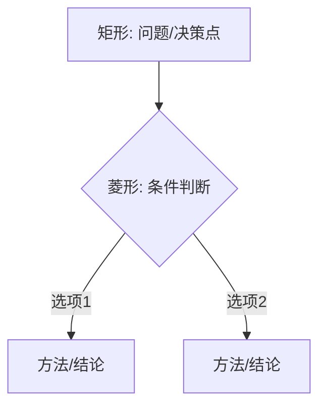

# FormalMath 决策树使用指南

## 概述

本目录包含18个数学决策树，涵盖学习路径选择、问题求解策略和定理应用三个类别。这些决策树采用Mermaid流程图语法，可在支持Mermaid的Markdown阅读器中渲染。

## 决策树目录

### 一、学习路径决策树（5个）

| 文件 | 主题 | 适用场景 |
|------|------|---------|
| `01-分析学学习路径决策.md` | 分析学学习 | 选择实分析、复分析、泛函分析等路径 |
| `02-代数学学习路径决策.md` | 代数学学习 | 选择抽象代数、同调代数、代数几何等路径 |
| `03-几何学习路径决策.md` | 几何学学习 | 选择微分几何、代数几何、拓扑学等路径 |
| `04-应用数学方向决策.md` | 应用数学 | 选择数学物理、金融数学、计算数学等方向 |
| `05-入门点选择决策.md` | 入门点选择 | 根据背景选择最佳数学入门起点 |

### 二、问题求解决策树（8个）

| 文件 | 主题 | 适用场景 |
|------|------|---------|
| `06-极限求解方法决策.md` | 极限求解 | 选择数列、函数、多元极限的求解方法 |
| `07-积分技巧选择决策.md` | 积分求解 | 选择换元、分部、有理函数等积分技巧 |
| `08-微分方程解法决策.md` | ODE/PDE | 选择常微分、偏微分方程的解法 |
| `09-证明方法选择决策.md` | 数学证明 | 选择直接证明、反证法、归纳法等 |
| `10-代数结构分类决策.md` | 代数结构 | 根据运算性质分类群、环、域等结构 |
| `11-拓扑性质证明策略.md` | 拓扑证明 | 证明开集、连续性、紧致性等性质 |
| `12-概率分布选择决策.md` | 概率分布 | 根据问题特征选择合适的概率模型 |
| `13-统计检验选择决策.md` | 统计检验 | 选择合适的假设检验方法 |

### 三、定理应用决策树（5个）

| 文件 | 主题 | 适用场景 |
|------|------|---------|
| `14-中值定理应用决策.md` | 微分中值定理 | Rolle、Lagrange、Cauchy定理的应用 |
| `15-柯西定理应用决策.md` | 积分中值定理 | 积分估计、极限计算中的应用 |
| `16-Sylow定理应用决策.md` | Sylow定理 | 有限群结构分析、单群判定 |
| `17-Galois理论应用决策.md` | Galois理论 | 方程可解性、域扩张结构分析 |
| `18-对偶性应用决策.md` | 对偶性 | 优化对偶、空间对偶、Pontryagin对偶 |

## 如何使用决策树

### 1. 基本使用方法

每个决策树都遵循以下结构：

```
问题/决策点
    ├── 条件/选项A → 子决策/方法
    ├── 条件/选项B → 子决策/方法
    └── 条件/选项C → 子决策/方法
```

**使用步骤**：
1. 从顶部"根节点"开始
2. 根据您的具体问题特征，沿着分支向下
3. 到达"叶节点"获得推荐方法
4. 查阅相应的"方法详解"部分

### 2. 快速索引

#### 按问题类型查找

| 如果您想... | 查看决策树 |
|------------|-----------|
| 开始学习新领域 | 01-05 |
| 求解具体数学问题 | 06-09 |
| 理解数学结构 | 10 |
| 证明拓扑性质 | 11 |
| 选择概率统计模型 | 12-13 |
| 应用经典定理 | 14-18 |

#### 按数学分支查找

| 分支 | 相关决策树 |
|------|-----------|
| 分析学 | 01, 06, 07, 14, 15 |
| 代数学 | 02, 10, 16, 17 |
| 几何/拓扑 | 03, 11 |
| 微分方程 | 08 |
| 概率统计 | 04, 12, 13 |
| 基础/逻辑 | 05, 09 |
| 应用数学 | 04, 14-18 |

## 决策树阅读指南

### Mermaid流程图符号说明



- **矩形节点** [ ]：问题描述、决策点或方法
- **菱形节点** { }：条件判断、选择分支
- **箭头** -->：流程方向
- **标签** |文字|：分支条件说明

### 颜色标记含义

决策树中使用颜色区分节点类型：

| 颜色 | 含义 | 说明 |
|------|------|------|
| 🟩 绿色 | 起始点 | 决策树的根节点 |
| 🟨 黄色 | 决策/方法 | 关键的决策点或推荐方法 |
| 🟥 红色 | 警告/否定 | 不可行路径或否定结论 |
| 🟦 蓝色 | 子分类 | 问题的子分类 |
| ⬜ 无色 | 中间节点 | 过渡性节点 |

## 实际应用示例

### 示例1：求解一个极限

**问题**：求 $\lim_{x\to 0} \frac{\sin x - x}{x^3}$

**使用决策树06**：
1. 函数极限 → 不定式0/0
2. 可选择：洛必达法则 或 Taylor展开
3. Taylor展开更高效：$\sin x = x - x^3/6 + O(x^5)$
4. 结果：$-1/6$

### 示例2：选择统计检验

**问题**：比较两种教学方法的效果（学生成绩）

**使用决策树13**：
1. 比较均值 → 两独立样本
2. 检验假设：方差是否相等？
3. 若方差相等 → t检验（等方差）
4. 若方差不等 → Welch t检验
5. 若非正态 → Mann-Whitney U

### 示例3：判断方程可解性

**问题**：五次方程 $x^5 - x + 1 = 0$ 是否有根式解？

**使用决策树17**：
1. 方程可解性 → n≥5
2. Galois群分析 → 一般五次方程
3. Gal ≅ S₅
4. S₅不可解（含单群A₅）
5. 结论：无根式解

## 注意事项

1. **决策树是指导而非绝对规则**：某些问题可能有多种解决途径
2. **条件判断需要准确**：错误的条件判断会导致错误的推荐
3. **深入理解优于机械套用**：理解决策背后的数学原理更重要
4. **结合多个决策树**：复杂问题可能需要综合多个决策树

## 扩展与贡献

### 添加新的决策树

如需添加新的决策树，请遵循以下格式：

```markdown
# 决策树标题

## 概述
简要说明决策树的用途

## 决策树
\`\`\`mermaid
flowchart TD
    A[起始] --> B{判断}
    B -->|是| C[方法A]
    B -->|否| D[方法B]
\`\`\`

## 方法详解
详细解释每种方法

## 示例
提供具体示例
```

### 更新现有决策树

当数学方法有新发展时，可以：
1. 在决策树中添加新分支
2. 更新"方法详解"部分
3. 添加新的应用示例

## 相关资源

- **FormalMath概念图谱**：查看相关概念的定义和关系
- **FormalMath问题库**：练习决策树的应用
- **FormalMath工具集**：计算辅助工具

## 版本信息

- **创建日期**：2026年4月
- **版本**：1.0
- **决策树数量**：18个
- **覆盖领域**：分析、代数、几何、概率统计、应用数学

---

*本指南是FormalMath项目的一部分，旨在为数学学习和研究提供系统化的决策支持。*
