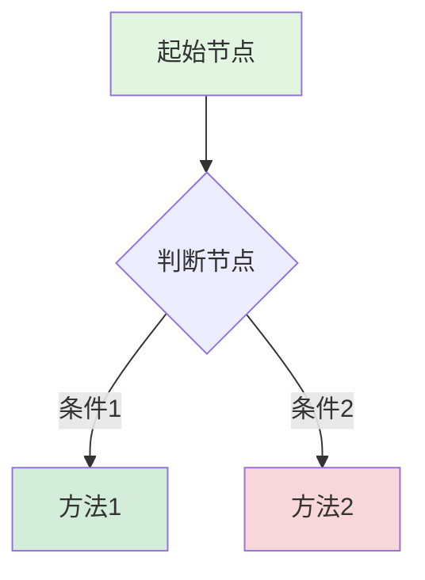

# 高级问题求解决策树索引

## 概述

本索引汇总了 **19个高级数学问题求解决策树**，涵盖分析学、代数学、几何拓扑、概率统计四大核心领域。这些决策树旨在为研究生级别和进阶本科生提供系统化的数学问题求解策略指导。

**适用对象**：
- 数学专业高年级本科生
- 数学研究生
- 需要深入研究数学的研究者
- 准备数学竞赛的高水平选手

---

## 决策树目录

### 一、分析学问题求解决策树（5个）

| 编号 | 文件名 | 主题 | 核心内容 | 适用场景 | 难度 |
|------|--------|------|----------|----------|------|
| 19 | [收敛性证明策略](./19-收敛性证明策略.md) | 收敛性证明 | ε-N定义、柯西准则、单调有界、一致收敛、随机收敛 | 数列/函数/级数/积分收敛证明 | ⭐⭐⭐-⭐⭐⭐⭐⭐ |
| 20 | [积分计算技巧选择](./20-积分计算技巧选择.md) | 积分计算 | 不定积分、定积分、重积分、曲线曲面积分、特殊函数 | 各类积分问题的技巧选择 | ⭐⭐⭐-⭐⭐⭐⭐ |
| 21 | [不等式证明策略](./21-不等式证明策略.md) | 不等式证明 | 经典不等式、函数方法、凸性、积分不等式、概率不等式 | 数学分析中的不等式证明 | ⭐⭐⭐-⭐⭐⭐⭐⭐ |
| 22 | [函数性质分析策略](./22-函数性质分析策略.md) | 函数分析 | 连续性、可微性、单调性、极值、凸性、渐近行为 | 函数全面性质分析 | ⭐⭐⭐-⭐⭐⭐⭐ |
| 23 | [渐近分析策略](./23-渐近分析策略.md) | 渐近分析 | Landau记号、Taylor展开、极限计算、特殊函数渐近 | 渐近估计与复杂度分析 | ⭐⭐⭐-⭐⭐⭐⭐ |

**学习路径建议**：
```
19(收敛性) → 20(积分) → 21(不等式) → 22(函数分析) → 23(渐近)
```

---

### 二、代数学问题求解决策树（5个）

| 编号 | 文件名 | 主题 | 核心内容 | 适用场景 | 难度 |
|------|--------|------|----------|----------|------|
| 24 | [群论问题求解策略](./24-群论问题求解策略.md) | 群论问题 | 子群、正规子群、同态、Sylow定理、群作用 | 群论结构与性质分析 | ⭐⭐⭐⭐-⭐⭐⭐⭐⭐ |
| 25 | [环论问题求解策略](./25-环论问题求解策略.md) | 环论问题 | 理想、商环、同态、PID/UFD、因式分解 | 环论结构与分类 | ⭐⭐⭐⭐-⭐⭐⭐⭐⭐ |
| 26 | [域论问题求解策略](./26-域论问题求解策略.md) | 域论问题 | 域扩张、Galois理论、有限域、可分性、方程可解性 | 域论与Galois对应 | ⭐⭐⭐⭐⭐ |
| 27 | [线性代数问题求解](./27-线性代数问题求解.md) | 线性代数 | 矩阵计算、特征问题、标准形、内积空间、二次型 | 线性代数计算与证明 | ⭐⭐-⭐⭐⭐⭐ |
| 28 | [表示论问题求解](./28-表示论问题求解.md) | 表示论 | 表示构造、特征标、不可约分解、诱导表示 | 群表示论问题求解 | ⭐⭐⭐⭐⭐ |

**学习路径建议**：
```
27(线性代数) → 24(群论) → 25(环论) → 26(域论) → 28(表示论)
```

---

### 三、几何拓扑问题求解决策树（5个）

| 编号 | 文件名 | 主题 | 核心内容 | 适用场景 | 难度 |
|------|--------|------|----------|----------|------|
| 11 | [拓扑性质证明策略](./11-拓扑性质证明策略.md) | 拓扑证明 | 开集/闭集、连续性、紧致性、连通性证明 | 点集拓扑性质证明 | ⭐⭐⭐-⭐⭐⭐⭐ |
| 29 | [同调计算策略](./29-同调计算策略.md) | 同调计算 | 奇异/胞腔/单纯同调、上同调、Mayer-Vietoris | 代数拓扑同调群计算 | ⭐⭐⭐⭐⭐ |
| 30 | [曲率计算策略](./30-曲率计算策略.md) | 曲率计算 | 曲线/曲面/Riemann曲率、Ricci/标量曲率 | 微分几何曲率计算 | ⭐⭐⭐⭐-⭐⭐⭐⭐⭐ |
| 31 | [几何构造策略](./31-几何构造策略.md) | 几何构造 | 尺规作图、射影几何、双曲几何、代数几何 | 几何构造问题求解 | ⭐⭐⭐-⭐⭐⭐⭐ |
| 32 | [流形分类策略](./32-流形分类策略.md) | 流形分类 | 低维流形、配边理论、示性类、手术理论 | 微分流形分类问题 | ⭐⭐⭐⭐⭐ |

**学习路径建议**：
```
11(拓扑) → 29(同调) → 30(曲率) → 31(构造) → 32(分类)
```

---

### 四、概率统计问题求解决策树（4个）

| 编号 | 文件名 | 主题 | 核心内容 | 适用场景 | 难度 |
|------|--------|------|----------|----------|------|
| 33 | [概率计算策略](./33-概率计算策略.md) | 概率计算 | 古典概型、条件概率、分布计算、期望方差、极限定理 | 概率论核心计算问题 | ⭐⭐⭐-⭐⭐⭐⭐ |
| 34 | [统计推断策略](./34-统计推断策略.md) | 统计推断 | 点估计、区间估计、假设检验、贝叶斯推断 | 统计推断方法选择 | ⭐⭐⭐-⭐⭐⭐⭐ |
| 35 | [随机过程分析策略](./35-随机过程分析策略.md) | 随机过程 | Markov链、Poisson过程、鞅、布朗运动、SDE | 随机过程分析与计算 | ⭐⭐⭐⭐-⭐⭐⭐⭐⭐ |
| 13 | [统计检验选择决策](./13-统计检验选择决策.md) | 统计检验 | 参数/非参数检验、检验选择策略 | 统计检验方法选择 | ⭐⭐⭐-⭐⭐⭐⭐ |

**学习路径建议**：
```
33(概率计算) → 13(检验选择) → 34(统计推断) → 35(随机过程)
```

---

## 快速索引

### 按数学分支

| 分支 | 决策树编号 | 难度范围 |
|------|-----------|---------|
| **分析学** | 19, 20, 21, 22, 23 | ⭐⭐⭐-⭐⭐⭐⭐⭐ |
| **代数学** | 24, 25, 26, 27, 28 | ⭐⭐-⭐⭐⭐⭐⭐ |
| **几何/拓扑** | 11, 29, 30, 31, 32 | ⭐⭐⭐-⭐⭐⭐⭐⭐ |
| **概率统计** | 33, 34, 35, 13 | ⭐⭐⭐-⭐⭐⭐⭐⭐ |

### 按问题类型

| 问题类型 | 决策树编号 | 特点 |
|----------|-----------|------|
| **证明类** | 11, 19, 21, 22, 23 | 需要严格的逻辑推理 |
| **计算类** | 20, 27, 29, 30, 33, 35 | 需要熟练的计算技巧 |
| **结构分析** | 24, 25, 26, 28, 31, 32 | 需要抽象思维能力 |
| **推断/检验** | 13, 34 | 需要统计思维和数据敏感性 |

### 按难度级别

| 级别 | 决策树编号 | 前置知识要求 |
|------|-----------|-------------|
| **进阶本科** | 11, 13, 19, 20, 21, 22, 23, 27, 33, 34 | 数学分析、线性代数、概率论 |
| **研究生** | 24, 25, 26, 28, 29, 30, 31, 32, 35 | 抽象代数、拓扑学、测度论 |

---

## 使用建议

### 1. 问题求解流程

```
┌─────────────────────────────────────────────┐
│ Step 1: 识别问题所属数学领域                  │
│ 问题：这是分析/代数/几何/概率问题？            │
└─────────────────────┬───────────────────────┘
                      ▼
┌─────────────────────────────────────────────┐
│ Step 2: 确定问题类型                          │
│ 问题：这是证明/计算/分类/推断问题？            │
└─────────────────────┬───────────────────────┘
                      ▼
┌─────────────────────────────────────────────┐
│ Step 3: 查阅对应决策树                        │
│ 行动：使用快速索引找到相关决策树               │
└─────────────────────┬───────────────────────┘
                      ▼
┌─────────────────────────────────────────────┐
│ Step 4: 按决策树分支逐步分析                   │
│ 注意：准确回答每个判断节点的问题               │
└─────────────────────┬───────────────────────┘
                      ▼
┌─────────────────────────────────────────────┐
│ Step 5: 选择合适策略实施                       │
│ 行动：执行决策树推荐的方法                    │
└─────────────────────┬───────────────────────┘
                      ▼
┌─────────────────────────────────────────────┐
│ Step 6: 验证结果                              │
│ 行动：使用检查清单验证结果正确性               │
└─────────────────────────────────────────────┘
```

### 2. 交叉引用

复杂问题可能需要多个决策树：

| 组合场景 | 相关决策树 | 说明 |
|---------|-----------|------|
| **分析+代数** | 收敛性证明 + 线性代数 | 收敛性证明可能涉及特征值分析 |
| **几何+代数** | 流形分类 + 同调计算 | 流形分类涉及同调群计算 |
| **概率+分析** | 随机过程 + 渐近分析 | 随机过程分析需要渐近技巧 |
| **代数+几何** | 群论 + 几何构造 | 几何对称性涉及群论 |

**使用示例**：

```
问题：证明某随机序列的收敛性

Step 1: 33-概率计算策略
    ↓ 确定随机变量的性质
Step 2: 19-收敛性证明策略
    ↓ 选择适当的收敛模式
Step 3: 21-不等式证明策略（如需要估计）
    ↓ 建立所需的不等式
Step 4: 23-渐近分析策略（如需要渐近估计）
    ↓ 完成渐近分析
```

### 3. 进阶学习路径

#### 分析学进阶路径

```
基础阶段：
├── 06-极限求解方法决策（基础极限计算）
├── 07-积分技巧选择决策（基础积分技巧）
└── 14-中值定理应用决策（基础定理应用）

进阶阶段：
├── 19-收敛性证明策略（严格收敛理论）
├── 20-积分计算技巧选择（高级积分技巧）
├── 21-不等式证明策略（分析不等式）
├── 22-函数性质分析策略（函数分析）
└── 23-渐近分析策略（渐近方法）
```

#### 代数学进阶路径

```
基础阶段：
├── 10-代数结构分类决策（基础代数结构）
├── 16-Sylow定理应用决策（基础群论）
└── 17-Galois理论应用决策（基础域论）

进阶阶段：
├── 27-线性代数问题求解（矩阵计算）
├── 24-群论问题求解策略（群论深入）
├── 25-环论问题求解策略（环论深入）
├── 26-域论问题求解策略（域论深入）
└── 28-表示论问题求解（表示论）
```

#### 几何拓扑进阶路径

```
基础阶段：
├── 03-几何学习路径决策（几何方向选择）
└── 11-拓扑性质证明策略（基础拓扑）

进阶阶段：
├── 29-同调计算策略（代数拓扑）
├── 30-曲率计算策略（微分几何）
├── 31-几何构造策略（几何构造）
└── 32-流形分类策略（流形理论）
```

---

## 与其他决策树的关系

本系列决策树与 `00-学习策略决策树索引.md` 中的决策树形成互补：

| 类型 | 目标 | 示例 | 使用时机 |
|------|------|------|---------|
| **学习路径决策树** | 指导学习方向和资源选择 | 01-分析学学习路径决策 | 开始学习新领域 |
| **问题求解决策树** | 指导具体数学问题求解 | 19-收敛性证明策略 | 遇到具体数学问题 |
| **诊断决策树** | 诊断学习困难并提供建议 | 36-证明困难诊断 | 学习过程中遇到困难 |

**联合使用示例**：

```
场景：学习实分析中的收敛性理论

Step 1: 学习准备阶段
├── 19-评估分析学前置知识（评估基础）
├── 24-教材选择决策（选择教材）
└── 30-长期学习路径（规划学习）

Step 2: 学习过程
├── 01-分析学学习路径决策（确认路径）
└── 19-收敛性证明策略（具体学习）

Step 3: 遇到困难
└── 36-证明困难诊断（解决困难）

Step 4: 应用练习
└── 26-练习资源选择决策（选择练习）
```

---

## 技术说明

### Mermaid流程图

所有决策树使用 Mermaid 流程图语法编写，可在支持 Mermaid 的 Markdown 阅读器中渲染。

**基本语法示例**：


### 颜色标记系统

| 颜色 | 含义 | CSS颜色码 | 使用场景 |
|------|------|----------|---------|
| 🟩 绿色 | 起始点 | #e1f5e1 | 决策树的根节点 |
| 🟨 黄色 | 决策/方法 | #fff3cd | 关键的决策点或推荐方法 |
| 🟥 红色 | 警告/否定 | #f8d7da | 不可行路径或否定结论 |
| 🟦 蓝色 | 结论/结果 | #d4edda | 成功的结果或推荐路径 |
| 🟪 紫色 | 子分类 | #e2d4f0 | 问题的子分类 |

### 符号约定

- **矩形节点 [ ]**：问题描述、决策点或方法
- **菱形节点 { }**：条件判断、选择分支
- **箭头 -->**：流程方向
- **标签 |文字|**：分支条件说明

---

## 决策树详情速查

### 分析学决策树

#### 19-收敛性证明策略
- **核心内容**：ε-N定义、柯西准则、单调有界、一致收敛
- **关键技巧**：放缩技巧、N的选取、一致收敛判别
- **常见错误**：混淆点态与一致收敛、忽略条件检验

#### 20-积分计算技巧选择
- **核心内容**：换元法、分部积分、有理函数、特殊函数
- **关键技巧**：换元选择、分部顺序、对称性利用
- **验证方法**：求导验证、数值验证

#### 21-不等式证明策略
- **核心内容**：经典不等式、凸性方法、积分不等式
- **关键技巧**：放缩、构造函数、Jensen不等式
- **适用场景**：估计、优化、极限证明

#### 22-函数性质分析策略
- **核心内容**：连续性、可微性、单调性、凸性
- **关键技巧**：定义验证、导数分析、极限行为
- **应用**：极值问题、函数逼近

#### 23-渐近分析策略
- **核心内容**：Landau记号、Taylor展开、渐近展开
- **关键技巧**：展开阶数选择、主项提取
- **应用**：算法复杂度、近似计算

### 代数学决策树

#### 24-群论问题求解策略
- **核心内容**：子群、正规子群、同态、Sylow定理
- **关键技巧**：Lagrange定理、轨道-稳定子定理
- **经典应用**：群分类、单群判定

#### 25-环论问题求解策略
- **核心内容**：理想、商环、PID/UFD、因式分解
- **关键技巧**：理想对应定理、唯一分解判定
- **经典应用**：代数数论、代数几何

#### 26-域论问题求解策略
- **核心内容**：域扩张、Galois理论、有限域
- **关键技巧**：Galois对应、可分性判定
- **经典应用**：方程可解性、尺规作图

#### 27-线性代数问题求解
- **核心内容**：矩阵计算、特征问题、标准形
- **关键技巧**：初等变换、谱分解、Jordan标准形
- **应用**：数值计算、数据分析

#### 28-表示论问题求解
- **核心内容**：表示构造、特征标、不可约分解
- **关键技巧**：特征标正交关系、诱导表示
- **应用**：物理学、组合数学

### 几何拓扑决策树

#### 29-同调计算策略
- **核心内容**：奇异/胞腔同调、Mayer-Vietoris
- **关键技巧**：胞腔分解、长正合序列
- **经典计算**：球面、射影空间、透镜空间

#### 30-曲率计算策略
- **核心内容**：曲线曲率、Riemann曲率、Ricci曲率
- **关键技巧**：Christoffel符号、Gauss方程
- **应用**：广义相对论、几何分析

#### 31-几何构造策略
- **核心内容**：尺规作图、射影几何、代数几何
- **关键技巧**：构造可解性、对偶原理
- **经典问题**：古希腊三大难题

#### 32-流形分类策略
- **核心内容**：低维流形、示性类、配边理论
- **关键技巧**：Morse理论、手术理论
- **经典结果**：Poincaré猜想、四维流形

### 概率统计决策树

#### 33-概率计算策略
- **核心内容**：条件概率、分布计算、极限定理
- **关键技巧**：全概率公式、特征函数
- **经典问题**：首达时、极值分布

#### 34-统计推断策略
- **核心内容**：点估计、区间估计、假设检验
- **关键技巧**：MLE、置信区间、功效分析
- **应用**：数据分析、实验设计

#### 35-随机过程分析策略
- **核心内容**：Markov链、鞅、布朗运动
- **关键技巧**：生成函数、停时定理
- **应用**：金融数学、排队论

---

## 版本信息

- **当前版本**：2.0
- **创建日期**：2026年4月4日
- **最后更新**：2026年4月4日
- **决策树数量**：19个高级问题求解决策树
- **覆盖领域**：分析学、代数学、几何拓扑、概率统计

### 更新日志

| 版本 | 日期 | 更新内容 |
|-----|------|---------|
| 2.0 | 2026-04-04 | 全面提升实用性，新增详细说明和学习路径 |
| 1.0 | 2026-04-04 | 初始版本，创建高级问题求解决策树索引 |

---

## 反馈与贡献

### 提供反馈

如发现决策树有改进空间，请：
1. 记录使用过程中的问题和建议
2. 说明具体的决策场景
3. 通过GitHub Issue提交反馈

### 贡献新决策树

如需添加新的高级问题求解决策树，请遵循：
1. 确保主题具有足够的深度和广度
2. 参考现有决策树的格式和风格
3. 包含完整的示例和工具推荐
4. 与现有决策树建立关联

---

*本索引是 FormalMath 项目的一部分，旨在为数学学习和研究提供系统化的决策支持。*

**开始探索高级数学问题求解的世界！** 🎯
