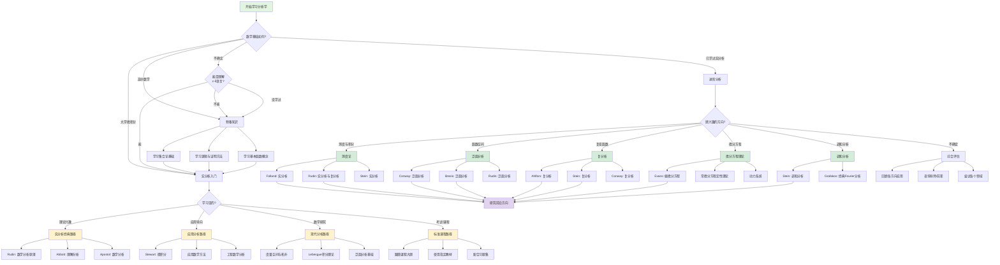

# 分析学学习路径决策树

## 概述

**用途**：帮助学习者根据个人背景和目标选择最合适的分析学学习路径  
**适用对象**：数学专业学生、工科研究生、自学者  
**覆盖领域**：实分析、复分析、泛函分析、测度论、微分方程  
**预计决策时间**：10-15分钟

---

## 决策树

---

## 使用指南

### 决策前准备

1. **诚实评估当前水平**
   - 回顾已学过的数学课程
   - 测试对ε-δ语言的理解
   - 评估证明写作能力

2. **明确学习目标**
   - 是为了课程考试？
   - 是为了理论研究？
   - 是为了应用问题？
   - 是为了职业转型？

3. **评估时间投入**
   - 每天可投入的学习时间
   - 期望完成时间
   - 是否有deadline

### 如何使用本决策树

1. 从根节点"开始学习分析学"开始
2. 根据您的实际情况选择分支
3. 如果某个判断不确定，可以使用"不确定"分支
4. 到达推荐路径后，查看"路径详解"
5. 根据"推荐教材"选择学习材料

---

## 路径详解

### 预备知识路径

**适用人群**：只有高中数学基础或分析学初学者

**学习目标**：
- 建立集合论基础概念
- 掌握基本逻辑和证明方法
- 理解函数、极限的直观概念

**推荐学习内容**：

| 主题 | 推荐资源 | 学习时间 |
|-----|---------|---------|
| 集合论基础 | 《离散数学》 Rosen | 2-3周 |
| 逻辑与证明 | 《如何证明它》 Velleman | 2-3周 |
| 微积分预习 | 《微积分》 Stewart 前6章 | 4-6周 |

**检查点**：
- [ ] 能理解集合的并、交、补运算
- [ ] 能写出简单的ε-δ证明
- [ ] 能理解函数的单射、满射概念

### 实分析入门路径

#### 经典理论路径（Rudin/Abbott）

**适用人群**：数学专业学生，注重理论基础

**特点**：
- 注重严格性与理论基础
- 证明严谨，抽象程度高
- 适合有数学研究目标的学习者

**推荐教材**：

| 教材 | 作者 | 难度 | 特点 |
|-----|------|------|------|
| 《数学分析原理》 | Rudin | ⭐⭐⭐⭐ | 经典教材，简明扼要 |
| 《理解分析》 | Abbott | ⭐⭐⭐ | 详细解释，适合自学 |
| 《数学分析》 | Apostol | ⭐⭐⭐⭐ | 内容全面，理论应用兼顾 |

**学习建议**：
1. **循序渐进**：不要跳过基础直接学习高阶内容
2. **多做证明**：分析学的核心是严格的证明
3. **联系直观**：抽象概念需要几何直观支撑
4. **阅读多本教材**：不同作者的不同视角有助于理解

#### 应用导向路径（Stewart）

**适用人群**：工科、物理、经济等应用学科学生

**特点**：
- 注重计算技巧与应用
- 实例丰富，直观易懂
- 适合快速应用于实际问题

**推荐教材**：
- Stewart《微积分》：经典工科微积分教材
- Boyce《工程数学》：应用导向，工程实例丰富

#### 现代分析路径

**适用人群**：有明确数学研究目标的学习者

**特点**：
- 直接进入度量空间、拓扑等现代框架
- 强调结构化和一般化
- 为后续泛函分析、微分几何打基础

**推荐教材**：
- G.F. Simmons《拓扑学与现代分析》
- Kreyszig《泛函分析》

### 进阶分析路径

| 方向 | 核心内容 | 推荐教材 | 前置知识 |
|------|---------|---------|---------|
| **测度论** | Lebesgue测度与积分、收敛定理 | Folland《实分析》 | 实分析基础 |
| **泛函分析** | 赋范空间、算子理论、谱理论 | Conway《泛函分析》 | 线性代数、实分析 |
| **复分析** | 解析函数、留数定理、共形映射 | Ahlfors《复分析》 | 实分析基础 |
| **微分方程** | 存在性、唯一性、正则性理论 | Evans《偏微分方程》 | 实分析、泛函分析 |
| **调和分析** | Fourier分析、奇异积分 | Stein《调和分析》 | 实分析、复分析 |

---

## 示例

### 示例1：数学专业本科生

**背景**：大二数学专业，已学习微积分和线性代数
**目标**：系统学习实分析，为研究生阶段做准备

**决策路径**：
1. 数学基础：大学微积分 ✓
2. 学习目的：数学研究
3. 推荐路径：经典理论路径 → 进阶分析

**具体计划**：
- **第一学期**：Rudin《数学分析原理》+ Abbott《理解分析》参考
- **第二学期**：Folland《实分析》（测度论部分）
- **暑期**：Ahlfors《复分析》
- **第三学期**：Conway《泛函分析》

### 示例2：工科研究生

**背景**：机械工程硕士，需要用微分方程建模
**目标**：掌握偏微分方程理论和数值方法

**决策路径**：
1. 数学基础：大学微积分 ✓
2. 学习目的：应用导向
3. 推荐路径：应用分析路径 → 微分方程

**具体计划**：
- **第1-2个月**：复习多变量微积分，学习Stewart高级内容
- **第3-4个月**：Evans《偏微分方程》第1-5章
- **第5-6个月**：学习有限元方法，结合实际工程问题

### 示例3：自学者

**背景**：工作中需要数据分析，想系统学习数学
**目标**：建立扎实的分析学基础

**决策路径**：
1. 数学基础：高中数学 ✓
2. 先学习预备知识
3. 然后选择应用导向路径

**具体计划**：
- **预备阶段**（2个月）：集合论、逻辑、基础微积分
- **基础阶段**（4个月）：Stewart《微积分》系统学习
- **进阶阶段**（6个月）：根据兴趣选择应用方向

---

## 工具与资源

### 推荐软件

| 软件 | 用途 | 平台 | 费用 |
|-----|------|------|------|
| **Mathematica** | 符号计算、可视化 | Win/Mac/Linux | 付费 |
| **MATLAB** | 数值计算、仿真 | Win/Mac/Linux | 付费/教育版 |
| **Python + NumPy/SciPy** | 科学计算、数据分析 | 全平台 | 免费 |
| **GeoGebra** | 几何可视化、函数绘图 | 全平台 | 免费 |
| **Desmos** | 函数可视化 | Web | 免费 |

### 在线资源

| 资源 | 类型 | 链接 | 说明 |
|-----|------|------|------|
| **MIT OCW** | 课程 | ocw.mit.edu | 麻省理工开放课程，含分析学课程 |
| **3Blue1Brown** | 视频 | youtube.com/3blue1brown | 微积分、线性代数可视化 |
| **Math StackExchange** | 社区 | math.stackexchange.com | 数学问答社区 |
| **Wikipedia** | 参考 | wikipedia.org | 数学概念快速查询 |
| **arXiv** | 论文 | arxiv.org/math | 数学研究论文 |

### 推荐习题集

- **Rudin《数学分析原理》**：每章习题，经典必做
- **Browder《数学分析》**：习题丰富，难度适中
- **Stewart《微积分》**：大量应用习题
- **Apostol《数学分析》**：理论与计算兼顾

---

## 检查清单

### 决策前检查

- [ ] 已诚实评估当前数学水平
- [ ] 已明确学习目标
- [ ] 已评估可用学习时间
- [ ] 已了解各路径的特点和要求

### 学习过程检查

- [ ] 每天保持至少1-2小时学习时间
- [ ] 每周完成至少一个主要定理的证明
- [ ] 定期回顾和总结
- [ ] 做充分的习题练习

### 阶段完成检查

- [ ] 能独立写出ε-δ证明
- [ ] 理解完备性、连续性、可微性的概念
- [ ] 能应用主要定理解决问题
- [ ] 完成了足够的习题量

---

## 常见问题

### Q: Rudin太难了，看不懂怎么办？

**A**: 这是正常现象。建议：
1. 配合Abbott《理解分析》一起读，Abbott解释更详细
2. 先看例题和特殊情形，再理解一般证明
3. 加入学习小组或寻找导师指导
4. 不要卡在一个地方太久，可以跳过后再回来

### Q: 应用导向路径是否不够"数学"？

**A**: 不是。应用导向路径同样包含严格的数学内容，只是：
1. 更多关注计算技巧和应用
2. 实例更丰富，更容易建立直观
3. 可以根据需要再补充理论深度

### Q: 如何判断自己是否准备好学习进阶内容？

**A**: 完成以下自测：
1. 能不看教材写出ε-δ定义
2. 能证明连续函数在紧集上的最值定理
3. 能理解Lebesgue积分与Riemann积分的区别
4. 完成了基础教材80%以上的习题

### Q: 学习分析学需要多少时间？

**A**: 取决于路径和目标：
- **基础路径**（应用导向）：6-12个月
- **标准路径**（经典理论）：12-18个月
- **深入路径**（现代分析）：18-24个月

建议每天至少投入1-2小时，保持连续性。

### Q: 没有老师指导能自学吗？

**A**: 可以，但需要：
1. 选择适合自学的教材（如Abbott）
2. 利用在线资源（MIT OCW、3Blue1Brown）
3. 参与数学社区（Math StackExchange）
4. 找到学习伙伴互相讨论

---

## 相关决策树

- [05-入门点选择决策](./05-入门点选择决策.md) - 如果不确定是否从分析学开始
- [19-评估分析学前置知识](./19-评估分析学前置知识.md) - 评估当前分析学基础
- [24-教材选择决策](./24-教材选择决策.md) - 更详细的教材选择指导
- [30-长期学习路径](./30-长期学习路径.md) - 制定完整学习计划
- [06-极限求解方法决策](./06-极限求解方法决策.md) - 具体计算技巧
- [19-收敛性证明策略](./19-收敛性证明策略.md) - 高级证明技巧

---

## 版本信息

- **版本**：2.0
- **更新日期**：2026年4月4日
- **更新内容**：添加使用指南、检查清单、常见问题、工具资源

---

*本决策树是FormalMath项目的一部分，旨在为数学学习提供系统化的决策支持。*
