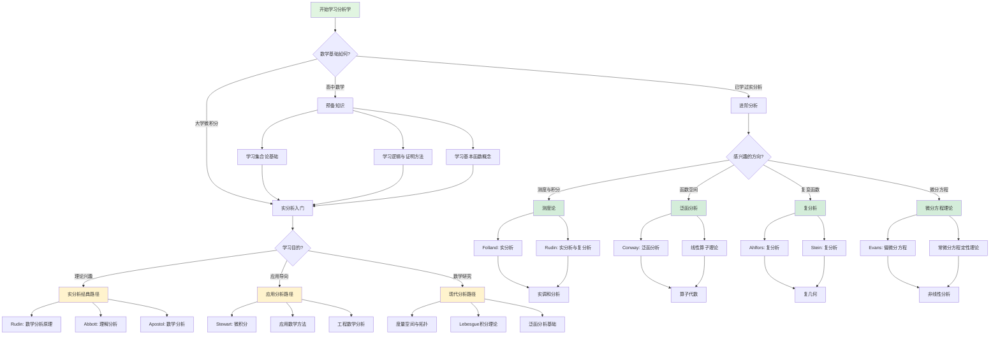

# 分析学学习路径决策树

## 概述

本决策树帮助学习者根据个人背景和目标选择最合适的分析学学习路径。

## 决策树

## 路径说明

### 预备知识路径
适合只有高中数学基础的学习者，需要先补充：
- 集合论与数理逻辑
- 基本的证明方法
- 函数、极限的直观理解

### 实分析入门路径
**经典理论路径**（Rudin/Abbott）：
- 适合数学专业学生
- 注重严格性与理论基础
- 推荐书籍：Rudin《数学分析原理》、Abbott《理解分析》

**应用导向路径**（Stewart）：
- 适合工科、物理、经济等应用学科
- 注重计算技巧与应用
- 推荐书籍：Stewart《微积分》

**现代分析路径**：
- 适合有明确数学研究目标的学习者
- 直接进入度量空间、拓扑等现代框架

### 进阶分析路径
| 方向 | 核心内容 | 推荐教材 |
|------|---------|---------|
| 测度论 | Lebesgue测度与积分 | Folland《实分析》 |
| 泛函分析 | 赋范空间、算子理论 | Conway《泛函分析》 |
| 复分析 | 解析函数、留数定理 | Ahlfors《复分析》 |
| 微分方程 | 存在性、唯一性、正则性 | Evans《偏微分方程》 |

## 学习建议

1. **循序渐进**：不要跳过基础直接学习高阶内容
2. **多做证明**：分析学的核心是严格的证明
3. **联系直观**：抽象概念需要几何直观支撑
4. **阅读多本教材**：不同作者的不同视角有助于理解
