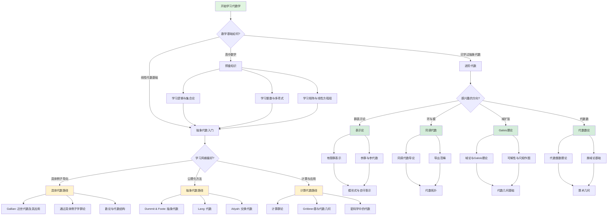

msc_primary: "00A99"
msc_secondary: ['00-XX']
---

# 代数学学习路径决策树

## 概述

本决策树帮助学习者根据个人背景和目标选择最合适的代数学学习路径。

## 决策树



## 路径说明

#
## 检查清单

#
## 常见问题

### Q: 如何确定我选择的决策路径是正确的？

**A**: 
1. 回顾每个决策节点的条件是否符合
2. 使用检查清单验证
3. 如果可能，用替代方法交叉验证结果

### Q: 如果决策树没有覆盖我的特殊情况怎么办？

**A**:
1. 查看"相关决策树"寻找更具体的指导
2. 在Math StackExchange等社区寻求帮助
3. 记录特殊情况，作为决策树改进建议反馈

### Q: 决策树推荐的方法不起作用怎么办？

**A**:
1. 检查是否正确执行了所有步骤
2. 回顾决策路径，看是否有误判
3. 尝试决策树中提到的替代方法
4. 寻求导师或同学的帮助

## 决策前检查

- [ ] 已明确问题的类型和条件
- [ ] 已收集必要的信息
- [ ] 已排除明显的错误路径

### 执行过程检查

- [ ] 按照决策树路径逐步分析
- [ ] 记录每个决策节点的选择
- [ ] 验证中间结果的正确性

### 结果验证检查

- [ ] 结果符合预期
- [ ] 已通过替代方法验证（如适用）
- [ ] 边界情况已考虑

## 预备知识路径
- 逻辑与集合论基础
- 整数理论（整除、同余）
- 多项式环的基本性质
- 矩阵运算与线性方程组

### 抽象代数入门路径

**具体例子导向**（Gallian）：
- 从对称群、置换群等具体例子出发
- 循序渐进建立抽象概念
- 适合初学者和对应用感兴趣的学习者

**公理化方法**（Dummit & Foote）：
- 从公理系统直接构建理论
- 内容全面，适合数学专业
- 被誉为代数学的"圣经"

**计算代数路径**：
- 注重算法实现与计算
- 与计算机科学、密码学联系紧密

### 进阶代数路径

| 方向 | 核心内容 | 推荐教材 |
|------|---------|---------|
| 表示论 | 群表示、特征标理论 | Fulton & Harris |
| 同调代数 | Ext、Tor、复形 | Weibel |
| Galois理论 | 域扩张、可解性 | Stewart |
| 代数数论 | 代数整数、理想类群 | Marcus |

## 代数学知识结构

```

代数学
├── 初等代数
│   ├── 线性代数
│   └── 多项式理论
├── 抽象代数
│   ├── 群论
│   ├── 环论
│   └── 域论
└── 高等代数
    ├── 表示论
    ├── 同调代数
    ├── 代数几何
    └── 代数数论

```

## 学习建议

1. **重视例子**：抽象概念需要通过大量例子来理解
2. **画图辅助**：群的结构、环的包含关系等可以画图表示
3. **计算练习**：同态、商结构等需要大量计算练习
4. **联系其他领域**：代数与几何、数论、分析都有深刻联系

## 相关决策树

- [代数结构分类决策](./10-代数结构分类决策.md)
- [群论问题求解策略](./24-群论问题求解策略.md)

---

*本决策树是FormalMath项目的一部分*
