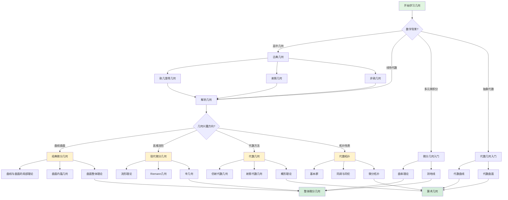

msc_primary: "00A99"
msc_secondary: ['00-00']
---

# 几何学习路径决策树

## 概述

本决策树帮助学习者根据个人背景和目标选择最合适的几何学习路径。

## 决策树



## 路径说明

#
## 检查清单

#
## 常见问题

### Q: 如何确定我选择的决策路径是正确的？

**A**: 
1. 回顾每个决策节点的条件是否符合
2. 使用检查清单验证
3. 如果可能，用替代方法交叉验证结果

### Q: 如果决策树没有覆盖我的特殊情况怎么办？

**A**:
1. 查看"相关决策树"寻找更具体的指导
2. 在Math StackExchange等社区寻求帮助
3. 记录特殊情况，作为决策树改进建议反馈

### Q: 决策树推荐的方法不起作用怎么办？

**A**:
1. 检查是否正确执行了所有步骤
2. 回顾决策路径，看是否有误判
3. 尝试决策树中提到的替代方法
4. 寻求导师或同学的帮助

## 决策前检查

- [ ] 已明确问题的类型和条件
- [ ] 已收集必要的信息
- [ ] 已排除明显的错误路径

### 执行过程检查

- [ ] 按照决策树路径逐步分析
- [ ] 记录每个决策节点的选择
- [ ] 验证中间结果的正确性

### 结果验证检查

- [ ] 结果符合预期
- [ ] 已通过替代方法验证（如适用）
- [ ] 边界情况已考虑

## 古典几何路径
适合高中几何基础，学习：
- **欧几里得几何**：公理体系、三角形、圆
- **射影几何**：无穷远点、对偶原理
- **非欧几何**：双曲几何、椭圆几何

### 解析几何路径
以线性代数为基础：
- 向量空间中的几何
- 二次曲线与二次曲面
- 坐标变换

### 微分几何路径

**经典微分几何**（曲线曲面）：
- 曲线论：曲率、挠率、Frenet标架
- 曲面论：第一、第二基本形式
- Gauss绝妙定理
- 推荐教材：do Carmo《曲线与曲面的微分几何》

**现代微分几何**（流形）：
- 微分流形
- 张量分析
- Riemann度量
- 推荐教材：Lee《光滑流形导论》

### 代数几何路径
- 代数簇
- 概形（Scheme）
- 层与上同调
- 推荐教材：Hartshorne《代数几何》

### 代数拓扑路径
- 基本群
- 覆盖空间
- 同调群
- 推荐教材：Hatcher《代数拓扑》

## 几何学知识网络

```

几何学
├── 古典几何
│   ├── 欧几里得几何
│   ├── 射影几何
│   └── 非欧几何
├── 微分几何
│   ├── 曲线曲面论
│   ├── Riemann几何
│   └── 辛几何
├── 代数几何
│   ├── 代数曲线
│   ├── 代数曲面
│   └── 概形理论
└── 拓扑学
    ├── 点集拓扑
    ├── 代数拓扑
    └── 微分拓扑

```

## 学习建议

1. **可视化**：几何学习离不开画图，培养空间想象能力
2. **计算与理论结合**：既要会计算曲率等不变量，也要理解几何意义
3. **注意不变量**：几何的核心是研究在变换下保持不变的性质
4. **联系物理**：现代几何与物理学（广义相对论、规范场论）有密切联系

## 相关决策树

- [拓扑性质证明策略](./11-拓扑性质证明策略.md)

---

*本决策树是FormalMath项目的一部分*
