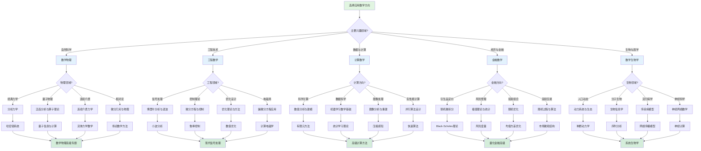

msc_primary: "00A99"
msc_secondary: ['00-XX']
---

# 应用数学方向选择决策树

## 概述

本决策树帮助学习者根据个人兴趣和职业目标选择最合适的应用数学方向。

## 决策树

## 方向说明

### 数学物理
将数学方法应用于物理问题的研究：
- **分析力学**：Lagrange力学、Hamilton力学
- **量子数学**：Hilbert空间、算子代数
- **连续介质力学**：流体力学、弹性力学
- **相对论数学**：微分几何在物理中的应用

### 工程数学
为工程问题提供数学工具：
- **信号处理**：傅里叶分析、滤波器设计
- **控制理论**：稳定性分析、最优控制
- **优化设计**：结构优化、形状优化
- **计算电磁学**：Maxwell方程数值解

### 计算数学
算法设计与数值方法：
- **科学计算**：数值线性代数、微分方程数值解
- **数据科学**：机器学习、统计学习理论
- **图像处理**：图像重建、计算机视觉
- **高性能计算**：并行算法、快速算法

### 金融数学
数学在金融领域的应用：
- **衍生品定价**：随机微积分、Black-Scholes模型
- **风险管理**：VaR、极值理论
- **投资组合**：均值方差优化、随机优化
- **高频交易**：市场微观结构建模

### 数学生物学
数学在生命科学中的应用：
- **种群动力学**：微分方程模型
- **生物信息学**：序列分析、统计方法
- **流行病学**：传染病传播模型
- **神经科学**：神经网络数学理论

## 核心数学工具

| 应用领域 | 主要数学工具 | 推荐先修课程 |
|---------|-------------|-------------|
| 数学物理 | 微分方程、泛函分析、李群 | 实分析、微分几何 |
| 工程数学 | 复分析、偏微分方程、优化 | 复分析、数值分析 |
| 计算数学 | 数值分析、线性代数、概率 | 线性代数、程序设计 |
| 金融数学 | 随机过程、偏微分方程、统计 | 概率论、随机过程 |
| 数学生物学 | 动力系统、图论、统计 | 常微分方程、概率论 |

## 职业发展路径

- **学术界**：应用数学研究所、交叉学科研究中心
- **工业界**：科技公司研发部门、工程咨询公司
- **金融行业**：量化分析师、风险管理师
- **政府机构**：科研院所、政策研究部门

## 相关决策树

- [决策树使用指南](./00-决策树使用指南.md)

---

*本决策树是FormalMath项目的一部分*
