msc_primary: "00A99"
msc_secondary: ['00-00']
---

# 根据背景选择数学入门点决策树

## 概述

本决策树帮助不同背景的学习者找到最适合自己的数学学习起点。

## 决策树

```mermaid
flowchart TD
    A[开始学习数学] --> B{您的背景是?}
    
    B -->|高中生/预科生| C[中学数学加强]
    B -->|理工科本科生| D[大学数学衔接]
    B -->|文科转理科| E[数学基础重建]
    B -->|在职进修| F[应用导向入门]
    B -->|已有基础复习| G[诊断评估]
    
    C --> C1{数学兴趣?}
    C1 -->|竞赛方向| C2[竞赛数学]
    C1 -->|大学预备| C3[大学数学先修]
    C1 -->|兴趣拓展| C4[数学欣赏]
    
    C2 --> C2a[代数技巧强化]
    C2 --> C2b[几何方法训练]
    C2 --> C2c[组合思维培养]
    
    C3 --> C3a[微积分预备]
    C3 --> C3b[线性代数直观]
    C3 --> C3c[数学证明入门]
    
    C4 --> C4a[数学史与思想]
    C4 --> C4b[趣味数学问题]
    C4 --> C4c[数学与日常生活]
    
    D --> D1{专业方向?}
    D1 -->|数学/物理| D2[严格数学分析]
    D1 -->|工程/计算机| D3[应用数学路径]
    D1 -->|经济/金融| D4[数学模型入门]
    D1 -->|生物/医学| D5[生物数学基础]
    
    D2 --> D2a[ε-δ分析]
    D2 --> D2b[抽象代数入门]
    D2 --> D2c[线性代数严格化]
    
    D3 --> D3a[工程数学分析]
    D3 --> D3b[数值计算方法]
    D3 --> D3c[离散数学]
    
    D4 --> D4a[微积分应用]
    D4 --> D4b[概率统计基础]
    D4 --> D4c[优化初步]
    
    D5 --> D5a[微分方程模型]
    D5 --> D5b[生物统计]
    D5 --> D5c[离散生物数学]
    
    E --> E1[逻辑思维训练]
    E --> E2[代数基础]
    E --> E3[几何直观]
    
    F --> F1{职业需求?}
    F1 -->|数据分析| F2[统计与数据科学]
    F1 -->|金融分析| F3[金融数学基础]
    F1 -->|工程技术| F4[工程数学速成]
    F1 -->|编程开发| F5[算法数学]
    
    G --> G1[知识评估测试]
    G1 --> G2{薄弱环节?}
    G2 -->|代数| G3[代数补强]
    G2 -->|分析| G4[分析补强]
    G2 -->|几何| G5[几何补强]
    G2 -->|综合| G6[系统复习]
    
    C2a --> H[进入大学数学]
    C2b --> H
    C2c --> H
    C3a --> H
    C3b --> H
    C3c --> H
    C4a --> I[继续兴趣学习]
    C4b --> I
    C4c --> I
    D2a --> J[专业数学进阶]
    D2b --> J
    D2c --> J
    D3a --> K[应用数学深化]
    D3b --> K
    D3c --> K
    D4a --> L[数量方法专业]
    D4b --> L
    D4c --> L
    D5a --> M[生物数学专业]
    D5b --> M
    D5c --> M
    E1 --> N[基础数学完成]
    E2 --> N
    E3 --> N
    F2 --> O[职业技能提升]
    F3 --> O
    F4 --> O
    F5 --> O
    G3 --> P[全面能力提升]
    G4 --> P
    G5 --> P
    G6 --> P
    
    style A fill:#e1f5e1
    style H fill:#d4edda
    style I fill:#d4edda
    style J fill:#d4edda
    style K fill:#d4edda
    style L fill:#d4edda
    style M fill:#d4edda
    style N fill:#d4edda
    style O fill:#d4edda
    style P fill:#d4edda

```

## 背景特定建议

### 高中生/预科生

**竞赛方向**：
- 重点：解题技巧、思维训练
- 推荐：《数学奥林匹克小丛书》
- 关键能力：创造性思维、快速推理

**大学预备**：
- 重点：高等数学概念预习
- 推荐：《托马斯微积分》（选读）、《线性代数应该这样学》
- 关键能力：抽象思维、严格证明

**兴趣拓展**：
- 重点：数学文化和思想
- 推荐：《什么是数学》《数学之美》
- 关键能力：数学鉴赏力、联想能力

### 理工科本科生

**数学/物理专业**：
- 起点：严格的ε-δ分析
- 核心课程：数学分析、高等代数
- 建议：不要跳过证明，培养严格性

**工程/计算机专业**：
- 起点：应用导向的微积分和线性代数
- 核心课程：工程数学、离散数学
- 建议：注重计算能力和应用建模

**经济/金融专业**：
- 起点：微积分应用和概率统计
- 核心课程：经济数学、计量经济学
- 建议：理解数学模型的经济含义

### 文科转理科

**挑战**：
- 逻辑思维方式的转变
- 符号语言的适应
- 抽象概念的理解

**建议路径**：
1. 从具体例子入手，建立直观
2. 逐步接触简单证明
3. 培养数学阅读的习惯
4. 大量练习基础计算

### 在职进修

**数据分析方向**：
- 统计基础 → 回归分析 → 机器学习
- 工具：R/Python
- 应用：商业智能、数据驱动决策

**金融分析方向**：
- 微积分 → 概率论 → 随机过程
- 工具：Excel/VBA, Python
- 应用：投资分析、风险管理

**工程技术方向**：
- 工程数学 → 数值方法 → 专业应用
- 工具：MATLAB/Mathematica
- 应用：仿真建模、工程计算

## 自我评估清单

选择入门点前，问自己以下问题：

1. **数学基础**：
   - [ ] 代数运算是否熟练？
   - [ ] 函数概念是否清晰？
   - [ ] 几何直观如何？

2. **学习目标**：
   - [ ] 是为了考试/学位？
   - [ ] 是为了工作应用？
   - [ ] 是出于个人兴趣？

3. **时间投入**：
   - [ ] 每天能投入多少时间？
   - [ ] 希望在多长时间内达到目标？

4. **先修知识**：
   - [ ] 是否有相关学科背景？
   - [ ] 是否学过编程？

## 推荐学习资源

| 背景 | 推荐教材 | 在线资源 |
|------|---------|---------|
| 高中生 | 《高中数学竞赛教程》 | Khan Academy |
| 理工科 | 《数学分析》（陈纪修） | MIT OCW |
| 文科转 | 《给文科生的数学》 | 3Blue1Brown |
| 在职 | 《应用数学导论》 | Coursera |

## 相关决策树

- [决策树使用指南](./00-决策树使用指南.md)

---

*本决策树是FormalMath项目的一部分*
