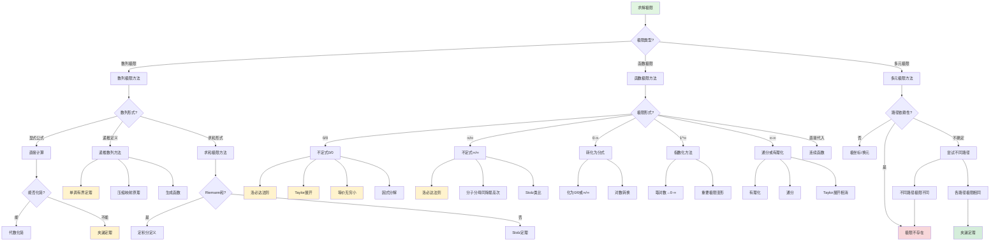

msc_primary: "00A99"
msc_secondary: ['00-XX']
---

# 极限求解方法选择决策树

## 概述

本决策树帮助选择求解极限问题的最合适方法。

## 决策树

## 方法详解

#

## 工具与资源

### 推荐软件

| 软件 | 用途 | 平台 | 费用 |
|-----|------|------|------|
| **Mathematica** | 符号计算、可视化 | 全平台 | 付费 |
| **MATLAB** | 数值计算、仿真 | 全平台 | 付费/教育版 |
| **Python + NumPy/SciPy** | 科学计算 | 全平台 | 免费 |
| **SageMath** | 开源数学软件 | 全平台 | 免费 |
| **GeoGebra** | 几何可视化 | 全平台 | 免费 |

### 在线资源

| 资源 | 类型 | 说明 |
|-----|------|------|
| **Math StackExchange** | 社区 | 数学问答社区 |
| **Wikipedia** | 参考 | 数学概念查询 |
| **arXiv** | 论文 | 数学研究论文 |
| **GitHub** | 代码 | 数学相关开源项目 |

### 推荐教材与参考

- 根据具体决策树内容推荐相关教材
- 查阅相关领域的经典著作
- 参考在线课程和视频讲解

## 检查清单

#
## 常见问题

### Q: 如何确定我选择的决策路径是正确的？

**A**: 
1. 回顾每个决策节点的条件是否符合
2. 使用检查清单验证
3. 如果可能，用替代方法交叉验证结果

### Q: 如果决策树没有覆盖我的特殊情况怎么办？

**A**:
1. 查看"相关决策树"寻找更具体的指导
2. 在Math StackExchange等社区寻求帮助
3. 记录特殊情况，作为决策树改进建议反馈

### Q: 决策树推荐的方法不起作用怎么办？

**A**:
1. 检查是否正确执行了所有步骤
2. 回顾决策路径，看是否有误判
3. 尝试决策树中提到的替代方法
4. 寻求导师或同学的帮助

## 决策前检查

- [ ] 已明确问题的类型和条件
- [ ] 已收集必要的信息
- [ ] 已排除明显的错误路径

### 执行过程检查

- [ ] 按照决策树路径逐步分析
- [ ] 记录每个决策节点的选择
- [ ] 验证中间结果的正确性

### 结果验证检查

- [ ] 结果符合预期
- [ ] 已通过替代方法验证（如适用）
- [ ] 边界情况已考虑

## 数列极限

**夹逼定理**：
- 适用：数列被两个同极限数列夹住
- 条件：$a_n \leq b_n \leq c_n$ 且 $\lim a_n = \lim c_n = L$
- 结论：$\lim b_n = L$

**单调有界定理**：
- 适用：单调递推数列
- 步骤：
  1. 证明单调性（数学归纳法）
  2. 证明有界性
  3. 设极限为L，代入递推式求解

**Stolz定理**：
- 适用：分式型数列极限 $\lim \frac{a_n}{b_n}$
- 条件：$b_n$严格单调趋于无穷
- 公式：$\lim \frac{a_n}{b_n} = \lim \frac{a_{n+1}-a_n}{b_{n+1}-b_n}$

### 函数极限

**洛必达法则**：
- 适用：0/0 或 ∞/∞ 型
- 条件：分子分母可导，导数比的极限存在
- 注意：可能需要多次应用

**Taylor展开**：
- 适用：x→0附近的极限
- 常用展开：
  - $e^x = 1 + x + \frac{x^2}{2} + O(x^3)$
  - $\ln(1+x) = x - \frac{x^2}{2} + O(x^3)$
  - $\sin x = x - \frac{x^3}{6} + O(x^5)$

**等价无穷小替换**：
- x→0时：
  - $\sin x \sim x$
  - $\tan x \sim x$
  - $1-\cos x \sim \frac{x^2}{2}$
  - $\ln(1+x) \sim x$
  - $e^x-1 \sim x$

### 多元极限

**路径检验法**：
- 沿y=kx路径：若极限与k有关，则极限不存在
- 沿曲线路径：如y=x², y=x³等

**极坐标变换**：
- 令x=rcosθ, y=rsinθ
- 若极限与θ无关，仅依赖于r→0，则极限存在

## 技巧总结

| 问题特征 | 首选方法 | 备选方法 |
|---------|---------|---------|
| 有理函数∞/∞ | 同除最高次 | 洛必达 |
| 根式差 | 有理化 | Taylor |
| 指数型1^∞ | 取对数 | 重要极限 |
| 三角函数 | 等价无穷小 | Taylor |
| 递推数列 | 单调有界 | 压缩映射 |
| 积分和 | Riemann和 | 积分估计 |

## 相关决策树

- [分析学学习路径决策](./01-分析学学习路径决策.md)
- [收敛性证明策略](./19-收敛性证明策略.md)

---

*本决策树是FormalMath项目的一部分*
