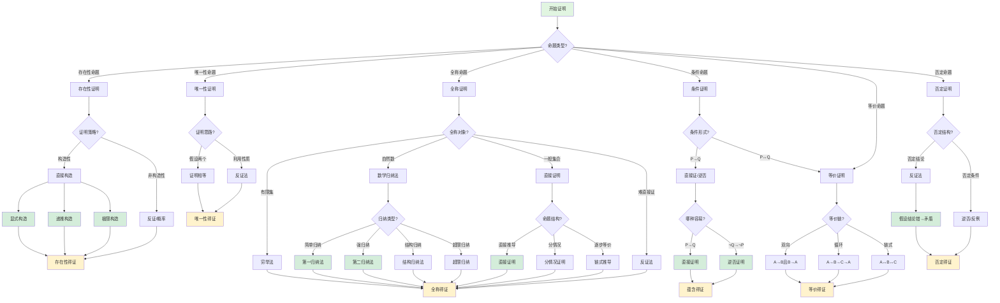

msc_primary: "00A99"
msc_secondary: ['00-00']
---

# 证明方法选择决策树

## 概述

本决策树帮助选择数学证明的最合适方法：直接证明、反证法、数学归纳法等。

## 决策树



## 证明方法详解

### 直接证明

**适用**：从前提到结论有清晰的逻辑路径

**基本形式**：

```

已知P，通过逻辑推理得Q

```

**示例**：证明两个偶数之和为偶数

```

设a=2m, b=2n（偶数定义）
a+b = 2m+2n = 2(m+n) = 2k（偶数定义）

```

### 反证法

**适用**：
- 直接证明困难
- 结论涉及否定
- 涉及"不存在""唯一"

**基本形式**：

```

假设结论不成立 → 推出矛盾 → 结论成立

```

**经典应用**：
- √2是无理数
- 素数无穷多
- 实数不可数

### 逆否证明

**原理**：P→Q 等价于 ¬Q→¬P

**适用**：否定结论比肯定前提更容易处理

**示例**：证明"若n²偶，则n偶"
- 逆否：若n奇，则n²奇
- 证明：n=2k+1 → n²=4k²+4k+1=2(2k²+2k)+1（奇）

### 数学归纳法

**第一归纳法**：

```

1. 基础：P(1)成立
2. 归纳：P(k)→P(k+1)
3. 结论：∀n, P(n)

```

**强归纳法**：

```

1. 基础：P(1)成立
2. 归纳：(∀m≤k, P(m))→P(k+1)
3. 结论：∀n, P(n)

```

**结构归纳法**：
- 对递归定义的结构（如树、公式）进行归纳
- 基础：原子结构
- 归纳：复合结构的构造

### 构造性证明

**显式构造**：直接给出满足条件的对象
**示例**：证明存在无理数的无理数次幂为有理数
- 考虑 a = √2^√2
- 若a有理，得证
- 若a无理，则 a^√2 = (√2^√2)^√2 = √2² = 2 有理

### 分情况证明

**适用**：结论在不同情况下需要不同处理

**原则**：
- 情况穷尽且互斥
- 每种情况都推出结论

## 证明策略选择

| 命题特征 | 推荐方法 | 替代方法 |
|---------|---------|---------|
| ∀x, P(x) | 直接证 | 反证 |
| ∃x, P(x) | 构造 | 反证 |
| P→Q | 直接 | 逆否 |
| P↔Q | 双向 | 循环链 |
| ¬P | 反证 | - |
| P∧Q | 分别证 | - |
| P∨Q | 分情况 | - |
| 涉及N | 归纳 | - |
| 无限集 | 归纳/对角线 | - |

## 常见错误

1. **循环论证**：用结论证明结论
2. **以偏概全**：从特殊到一般的错误推广
3. **偷换概念**：证明过程中改变定义
4. **不当反证**：假设过于宽泛导致矛盾与假设无关

## 相关决策树

- [决策树使用指南](./00-决策树使用指南.md)

---

*本决策树是FormalMath项目的一部分*
