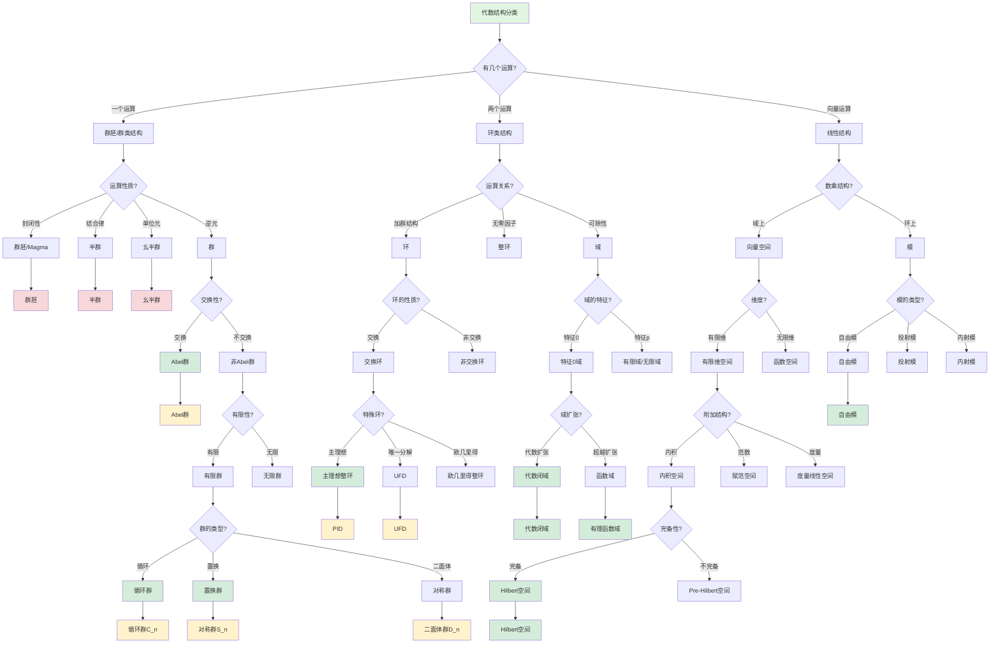

msc_primary: "00A99"
msc_secondary: ['00-XX']
---

# 代数结构分类决策树

## 概述

本决策树帮助根据运算性质对代数结构进行分类和识别。

## 决策树



## 代数结构层次

### 群类结构（一个运算）

```

群胚(Magma)
  ↓ 结合律
半群(Semigroup)
  ↓ 单位元
幺半群(Monoid)
  ↓ 逆元
群(Group)
  ↓ 交换律
Abel群

```

**关键性质**：
- **群胚**：封闭性
- **半群**：封闭 + 结合
- **幺半群**：封闭 + 结合 + 单位元
- **群**：封闭 + 结合 + 单位元 + 逆元

### 环类结构（两个运算）

```

环(Ring)
  ├── 加法群
  └── 乘法半群
      ↓ 交换
交换环
  ↓ 无零因子
整环(Integral Domain)
  ↓ 可除
域(Field)

```

**重要关系**：
- **欧几里得整环** ⊂ **主理想整环** ⊂ **唯一分解整环** ⊂ **整环**

### 线性结构

```

模(Module)
  ↓ 自由
自由模
  ↓ 域上
向量空间
  ↓ 内积
内积空间
  ↓ 完备
Hilbert空间

```

## 结构判定算法

### 判定群的步骤

1. **封闭性**：∀a,b∈S, a·b∈S
2. **结合律**：(a·b)·c = a·(b·c)
3. **单位元**：∃e, ∀a, e·a = a·e = a
4. **逆元**：∀a, ∃a⁻¹, a·a⁻¹ = e
5. **交换律**（判定Abel群）：a·b = b·a

### 判定环的步骤

1. 加法构成交换群
2. 乘法构成半群
3. 分配律：a(b+c) = ab + ac, (b+c)a = ba + ca
4. 乘法交换性（判定交换环）
5. 无零因子（判定整环）：ab=0 → a=0 或 b=0
6. 非零元可逆（判定域）

## 常见例子

| 结构 | 例子 | 说明 |
|------|------|------|
| 群 | (ℤ,+), (ℚ*,×) | 整数加法群，非零有理数乘法群 |
| Abel群 | (ℤ_n,+), (ℚ,+) | 所有元素可交换 |
| 环 | ℤ[x], M_n(ℝ) | 多项式环，矩阵环 |
| 域 | ℚ, ℝ, ℂ, ℤ_p | 有理数、实数、复数、有限域 |
| 向量空间 | ℝ^n, C[0,1] | n维空间，连续函数空间 |
| Hilbert空间 | L²(ℝ), ℓ² | 平方可积函数，平方可和序列 |

## 结构间的映射

### 同态
保持运算的映射：φ(a·b) = φ(a)·φ(b)

### 同构
双射同态：两个代数结构"相同"

### 结构不变量
- 群的阶、元素的阶
- 环的特征
- 向量空间的维数

## 相关决策树

- [代数学学习路径决策](./02-代数学学习路径决策.md)
- [群论问题求解策略](./24-群论问题求解策略.md)

---

*本决策树是FormalMath项目的一部分*
