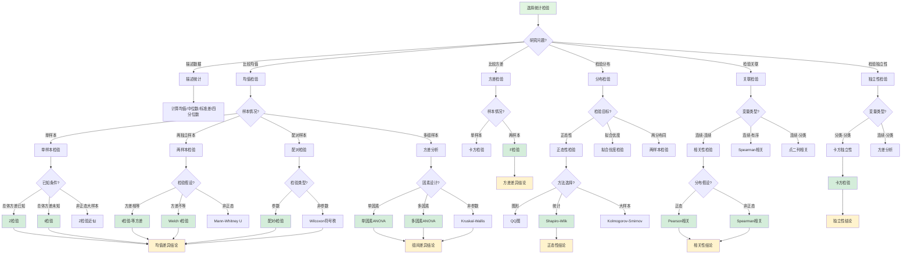

msc_primary: "00A99"
msc_secondary: ['00-XX']
---

# 统计检验选择决策树

## 概述

本决策树帮助根据数据类型和研究问题选择最合适的统计检验方法。

## 决策树



## 均值检验详解

### 单样本检验

**Z检验**（总体方差已知）：

```

H₀: μ = μ₀
Z = (X̄ - μ₀) / (σ/√n) ~ N(0,1)

```

**t检验**（总体方差未知）：

```

H₀: μ = μ₀
t = (X̄ - μ₀) / (S/√n) ~ t(n-1)

```

### 两独立样本检验

**等方差t检验**：

```

t = (X̄₁ - X̄₂) / [S_p√(1/n₁ + 1/n₂)]
S_p² = [(n₁-1)S₁² + (n₂-1)S₂²] / (n₁+n₂-2)

```

**Welch t检验**（方差不等）：

```

t = (X̄₁ - X̄₂) / √(S₁²/n₁ + S₂²/n₂)
自由度调整

```

### 配对检验

**配对t检验**：

```

计算差值dᵢ = X₁ᵢ - X₂ᵢ
t = d̄ / (S_d/√n)

```

### 方差分析ANOVA

**单因素ANOVA**：

```

H₀: μ₁ = μ₂ = ... = μ_k
F = MS_between / MS_within ~ F(k-1, N-k)

```

**事后检验**：Tukey HSD、Bonferroni校正

## 非参数检验

### Mann-Whitney U检验
- 替代两样本t检验
- 不假设正态分布
- 基于秩次

### Wilcoxon符号秩检验
- 替代配对t检验
- 基于差值的秩次

### Kruskal-Wallis检验
- 替代单因素ANOVA
- 多组比较的非参数方法

## 分布检验

### 正态性检验

**Shapiro-Wilk检验**（小样本）：
- 功效最高
- 适合n < 5000

**Kolmogorov-Smirnov检验**：
- 适合大样本
- 可检验任意分布

**Anderson-Darling检验**：
- 对尾部敏感
- 适合检测尾部偏离

### 卡方拟合优度检验

```

χ² = Σ(O_i - E_i)² / E_i

```

## 关联性检验

### Pearson相关系数
- 线性相关
- 要求正态分布
- r ∈ [-1, 1]

### Spearman秩相关
- 单调相关
- 非参数
- 对异常值稳健

### Kendall's Tau
- 协同性度量
- 适合小样本

## 检验选择速查表

| 研究问题 | 数据条件 | 推荐检验 | 替代检验 |
|---------|---------|---------|---------|
| 单样本均值 | 正态、方差已知 | Z检验 | - |
| 单样本均值 | 正态、方差未知 | t检验 | Z检验（大样本） |
| 两独立样本 | 正态、等方差 | t检验 | Welch t检验 |
| 两独立样本 | 正态、不等方差 | Welch t检验 | - |
| 两独立样本 | 非正态 | Mann-Whitney | Bootstrap |
| 配对样本 | 正态 | 配对t检验 | - |
| 配对样本 | 非正态 | Wilcoxon | Sign检验 |
| 多组比较 | 正态、等方差 | ANOVA | Welch ANOVA |
| 多组比较 | 非正态 | Kruskal-Wallis | - |
| 方差比较 | 正态 | F检验 | Levene检验 |
| 正态性 | 小样本 | Shapiro-Wilk | - |
| 正态性 | 大样本 | Kolmogorov-Smirnov | Anderson-Darling |
| 独立性 | 分类变量 | 卡方检验 | Fisher精确检验 |
| 相关性 | 连续、正态 | Pearson | Spearman |
| 相关性 | 连续、非正态 | Spearman | Kendall |

## 检验步骤

1. **明确研究问题**：描述、比较、关联、预测？
2. **识别变量类型**：连续、分类、有序？
3. **检查假设条件**：正态性、等方差、独立性
4. **选择适当检验**：参数或非参数
5. **确定显著性水平**：通常α=0.05
6. **计算检验统计量**
7. **做出统计决策**：拒绝或不拒绝H₀
8. **报告效应量**：不仅看p值

## 相关决策树

- [应用数学方向决策](./04-应用数学方向决策.md)
- [概率分布选择决策](./12-概率分布选择决策.md)

---

*本决策树是FormalMath项目的一部分*
