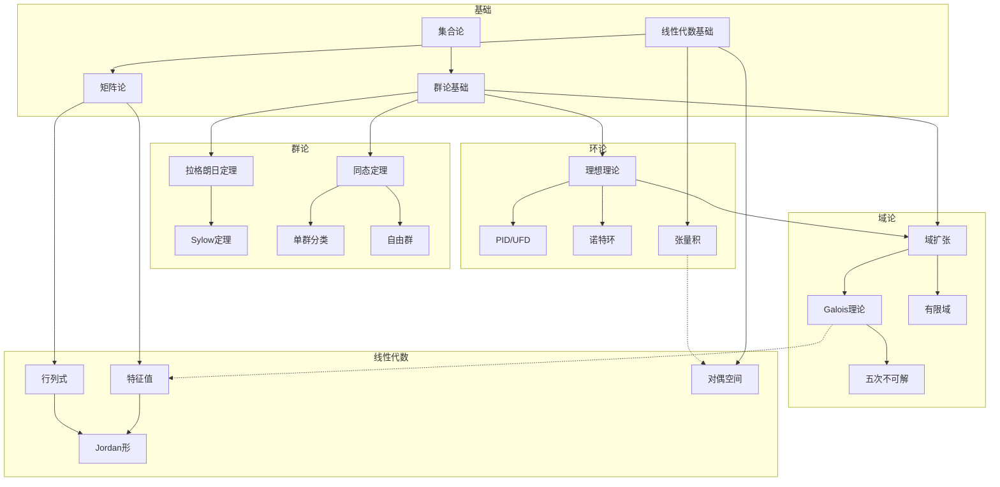

# 代数学推理树索引

本文档汇总了代数学核心定理的推理树，涵盖群论、环论、域论与Galois理论、线性代数四大领域。

---

## 目录结构

### 一、群论推理树（5个）

| 序号 | 文件名 | 主题 | 核心内容 |
|-----|--------|------|---------|
| 01 | `01-拉格朗日定理推导链.md` | 拉格朗日定理 | 陪集分解、指数公式、重要推论 |
| 02 | `02-Sylow定理完整证明树.md` | Sylow三定理 | 存在性、共轭性、计数定理 |
| 03 | `03-同态基本定理链.md` | 同态定理 | 第一/二/三/四同构定理 |
| 04 | `04-单群分类概述树.md` | 单群分类 | 四大类单群、分类定理 |
| 05 | `05-自由群构造推导.md` | 自由群 | 泛性质、Nielsen-Schreier定理 |

### 二、环论推理树（4个）

| 序号 | 文件名 | 主题 | 核心内容 |
|-----|--------|------|---------|
| 06 | `06-理想对应定理链.md` | 理想对应 | 商环理想对应、素/极大理想 |
| 07 | `07-PID到UFD推导.md` | PID→UFD | 唯一分解整环、不可约=素元 |
| 08 | `08-诺特环升链条件.md` | 诺特环 | ACC、希尔伯特基定理 |
| 09 | `09-张量积性质推导.md` | 张量积 | 泛性质、Hom-张量伴随 |

### 三、域论与Galois理论（4个）

| 序号 | 文件名 | 主题 | 核心内容 |
|-----|--------|------|---------|
| 10 | `10-域扩张次数链.md` | 域扩张次数 | 塔法则、代数元、本原元定理 |
| 11 | `11-Galois基本定理完整推导.md` | Galois理论 | Galois对应、正规子群 |
| 12 | `12-五次方程不可解性.md` | Abel-Ruffini | S₅非可解性、根式可解条件 |
| 13 | `13-有限域结构推导.md` | 有限域 | F_{pⁿ}结构、Frobenius自同构 |

### 四、线性代数推理树（4个）

| 序号 | 文件名 | 主题 | 核心内容 |
|-----|--------|------|---------|
| 14 | `14-行列式性质推导.md` | 行列式 | 置换展开、Laplace展开、几何意义 |
| 15 | `15-特征值与对角化链.md` | 对角化 | 特征值、谱定理、可对角化条件 |
| 16 | `16-Jordan标准形推导.md` | Jordan形 | 广义特征空间、Jordan块 |
| 17 | `17-对偶空间理论.md` | 对偶空间 | 零化子、转置映射、Riesz表示 |

---

## 知识依赖图



---

## 阅读建议

### 学习路径1：群论优先

```

01拉格朗日定理 → 03同态基本定理 → 02Sylow定理 → 04单群分类 → 05自由群

```

### 学习路径2：Galois理论路径

```

06理想对应 → 10域扩张次数 → 11Galois基本定理 → 12五次不可解 → 13有限域

```

### 学习路径3：线性代数深化

```

14行列式 → 15特征值与对角化 → 16Jordan标准形 → 17对偶空间 → 09张量积

```

### 完整路径

```

01 → 03 → 06 → 07 → 10 → 11 → 15 → 16

```

---

## 格式说明

所有推理树文件使用 **Markdown + Mermaid** 语法：
- **定理陈述**：清晰的问题描述
- **推理树**：Mermaid流程图展示逻辑结构
- **详细证明**：分步骤推导
- **性质表**：关键结论汇总
- **应用网络**：相关理论联系
- **参考**：经典教材引用

---

## 文件清单

```

docs/inference-trees/
├── 00-索引-代数学推理树.md        (本文件)
├── 01-拉格朗日定理推导链.md
├── 02-Sylow定理完整证明树.md
├── 03-同态基本定理链.md
├── 04-单群分类概述树.md
├── 05-自由群构造推导.md
├── 06-理想对应定理链.md
├── 07-PID到UFD推导.md
├── 08-诺特环升链条件.md
├── 09-张量积性质推导.md
├── 10-域扩张次数链.md
├── 11-Galois基本定理完整推导.md
├── 12-五次方程不可解性.md
├── 13-有限域结构推导.md
├── 14-行列式性质推导.md
├── 15-特征值与对角化链.md
├── 16-Jordan标准形推导.md
└── 17-对偶空间理论.md

```

总计 **17个推理树** + **1个索引文档**

---

## 参考教材

- Dummit & Foote, *Abstract Algebra*
- Artin, *Algebra*
- Hoffman & Kunze, *Linear Algebra*
- Atiyah-Macdonald, *Introduction to Commutative Algebra*
- Stewart, *Galois Theory*

---

*生成时间：2026年4月*
