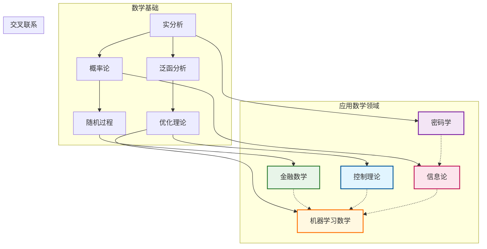

# 应用数学推理树索引

本文档汇总了应用数学核心领域的推理树集合，涵盖金融数学、机器学习数学、控制理论、信息论和密码学五大领域。

---

## 目录结构

### 一、金融数学推理树（3个）

| 序号 | 文件名 | 主题 | 核心内容 |
|-----|--------|------|----------|
| 01 | `app-fin-black-scholes.md` | Black-Scholes公式 | 随机微分方程、风险中性定价、BS-PDE、希腊字母 |
| 02 | `app-fin-risk-neutral-pricing.md` | 风险中性定价理论 | 鞅测度、第一/二基本定理、无套利定价 |
| 03 | `app-fin-interest-rate-models.md` | 利率模型 | Vasicek、CIR、HJM框架、LIBOR市场模型 |

### 二、机器学习数学推理树（4个）

| 序号 | 文件名 | 主题 | 核心内容 |
|-----|--------|------|----------|
| 04 | `app-ml-gradient-descent-convergence.md` | 梯度下降收敛性 | 凸优化、强凸性、Nesterov加速、SGD收敛 |
| 05 | `app-ml-neural-network-approximation.md` | 神经网络近似理论 | Cybenko定理、Barron空间、深度分离、VC维 |
| 06 | `app-ml-svm-duality.md` | SVM对偶理论 | 拉格朗日对偶、KKT条件、核技巧、软间隔 |
| 07 | `app-ml-generalization-bounds.md` | 泛化误差界 | VC维、Rademacher复杂度、PAC学习、稳定性 |

### 三、控制理论推理树（3个）

| 序号 | 文件名 | 主题 | 核心内容 |
|-----|--------|------|----------|
| 08 | `app-ctrl-controllability.md` | 可控性判定理论 | Kalman秩判据、PBH判据、Kalman分解、标准型 |
| 09 | `app-ctrl-pontryagin-principle.md` | 最优控制Pontryagin原理 | Hamiltonian系统、极大值原理、横截条件、LQR |
| 10 | `app-ctrl-kalman-filter.md` | Kalman滤波推导 | 最小均方估计、卡尔曼增益、Riccati方程、正交投影 |

### 四、信息论推理树（2个）

| 序号 | 文件名 | 主题 | 核心内容 |
|-----|--------|------|----------|
| 11 | `app-info-channel-capacity.md` | 信道容量推导 | 互信息、典型序列、信道编码定理、AWGN容量 |
| 12 | `app-info-rate-distortion.md` | 率失真理论 | 失真度量、率失真函数、高斯信源、向量量化 |

### 五、密码学推理树（2个）

| 序号 | 文件名 | 主题 | 核心内容 |
|-----|--------|------|----------|
| 13 | `app-crypto-rsa-security.md` | RSA安全性推导 | 大整数分解、RSA问题、OAEP、侧信道防护 |
| 14 | `app-crypto-zero-knowledge.md` | 零知识证明理论 | 交互证明、零知识性、Sigma协议、zk-SNARK |

---

## 知识依赖图



---

## 学习路径建议

### 路径1：金融数学路径

```

Black-Scholes公式 → 风险中性定价 → 利率模型

```

### 路径2：机器学习数学路径

```

梯度下降收敛性 → 神经网络近似理论 → SVM对偶理论 → 泛化误差界

```

### 路径3：控制与估计路径

```

可控性判定 → Kalman滤波 → 最优控制Pontryagin原理

```

### 路径4：信息与密码路径

```

信道容量 → 率失真理论 → RSA安全性 → 零知识证明

```

### 综合路径

```

优化理论（梯度下降）→ 机器学习 → 金融数学（定价）→ 信息论 → 密码学

```

---

## 格式说明

所有推理树文件使用 **Markdown + Mermaid** 语法：
- **定理陈述**：清晰的数学问题描述
- **推理树**：Mermaid流程图展示推导结构
- **详细推导**：分步骤数学证明
- **依赖关系**：理论间的前置依赖
- **关键公式**：核心结论汇总表
- **参考资源**：经典教材与论文引用

---

## 文件清单

```

docs/inference-trees/
├── 00-索引-应用数学推理树.md          (本文件)
├── app-fin-black-scholes.md           (01-Black-Scholes公式)
├── app-fin-risk-neutral-pricing.md    (02-风险中性定价)
├── app-fin-interest-rate-models.md    (03-利率模型)
├── app-ml-gradient-descent-convergence.md    (04-梯度下降收敛性)
├── app-ml-neural-network-approximation.md    (05-神经网络近似)
├── app-ml-svm-duality.md              (06-SVM对偶理论)
├── app-ml-generalization-bounds.md    (07-泛化误差界)
├── app-ctrl-controllability.md        (08-可控性判定)
├── app-ctrl-pontryagin-principle.md   (09-Pontryagin原理)
├── app-ctrl-kalman-filter.md          (10-Kalman滤波)
├── app-info-channel-capacity.md       (11-信道容量)
├── app-info-rate-distortion.md        (12-率失真理论)
├── app-crypto-rsa-security.md         (13-RSA安全性)
└── app-crypto-zero-knowledge.md       (14-零知识证明)

```

总计 **14个推理树** + **1个索引文档**

---

## 参考教材

### 金融数学
- Shreve, S. E. (2004). *Stochastic Calculus for Finance II*
- Andersen, L. & Piterbarg, V. (2010). *Interest Rate Modeling*

### 机器学习数学
- Mohri, M., et al. (2018). *Foundations of Machine Learning*
- Bach, F. (2017). "Breaking the Curse of Dimensionality with Convex Neural Networks"

### 控制理论
- Kailath, T. (1980). *Linear Systems*
- Liberzon, D. (2012). *Calculus of Variations and Optimal Control Theory*

### 信息论
- Cover, T. M. & Thomas, J. A. (2006). *Elements of Information Theory*
- MacKay, D. J. C. (2003). *Information Theory, Inference, and Learning Algorithms*

### 密码学
- Goldreich, O. (2001). *Foundations of Cryptography*
- Boneh, D. & Shoup, V. (2020). *A Graduate Course in Applied Cryptography*

---

*生成时间：2026年4月*
