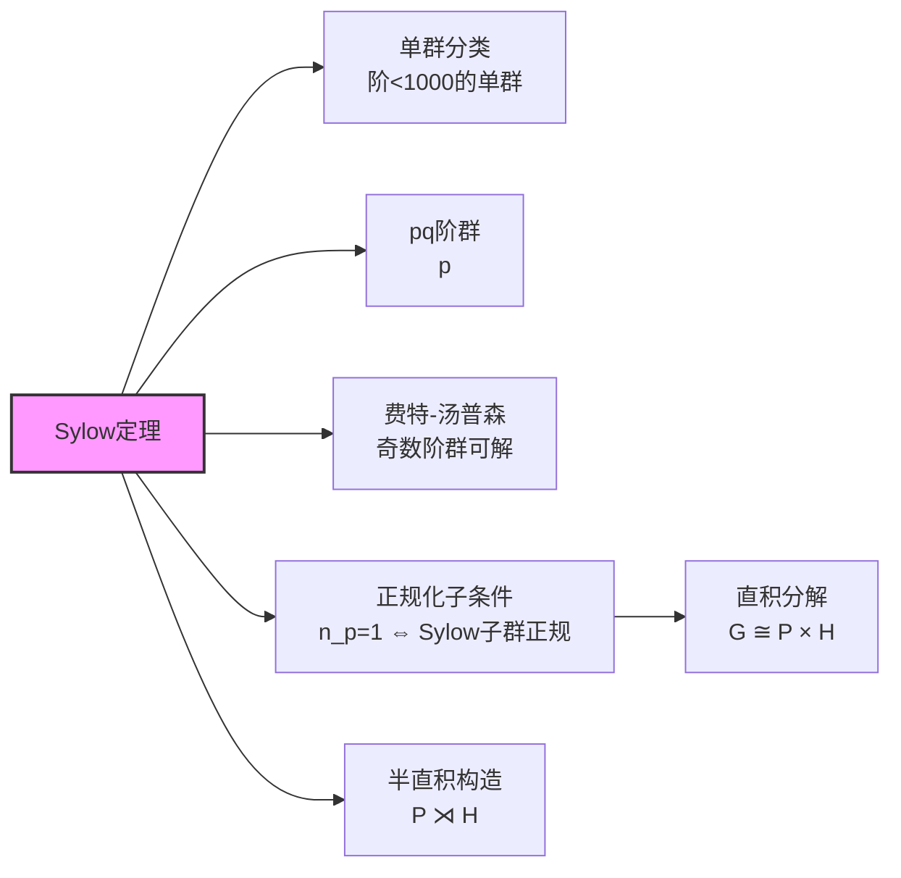

# Sylow定理完整证明树

## 定理陈述

**Sylow三定理**：设 $G$ 是有限群，$|G| = p^n m$，其中 $p$ 不整除 $m$。

1. **存在性**：$G$ 有 $p^n$ 阶子群（Sylow $p$-子群）
2. **共轭性**：所有Sylow $p$-子群互相共轭
3. **计数**：Sylow $p$-子群个数 $n_p \equiv 1 \pmod{p}$ 且 $n_p \mid m$

---

## 完整推理树

```mermaid
graph TD
    A[|G| = pⁿm<br/>p∤m] --> B[群作用<br/>G × X → X]
    B --> C[选择集合X<br/>|X| = pⁿ的子集]
    C --> D[组合数分析<br/>C(pⁿm, pⁿ) ≡ m (mod p)]
    D --> E[轨道分解<br/>X = ⊔ Orbᵢ]
    E --> F[存在轨道长度<br/>|Orb| = pᵏ, k≤n]
    F --> G[稳定子分析<br/>|Stab| = pⁿ⁻ᵏm]
    
    H[类方程技术<br/>p-群作用] --> I[p-群中心非平凡<br/>|Z(P)| > 1]
    I --> J[归纳论证<br/>对|P|归纳]
    J --> K[存在正规子群<br/>N ⊲ P, |N| = pⁿ⁻¹]
    
    G --> L[Sylow第一定理<br/>∃ P ≤ G, |P| = pⁿ]
    K --> L
    
    L --> M[设P是Sylow p-子群<br/>Q是任意p-子群]
    M --> N[Q在G/P上作用<br/>左乘作用]
    N --> O[不动点分析<br/>X^Q = {gP : Q ⊆ gPg⁻¹}]
    O --> P[应用p-群引理<br/>|X^Q| ≡ |X| ≡ m (mod p)]
    P --> Q[Q ⊆ 某共轭gPg⁻¹]
    
    Q --> R[Sylow第二定理<br/>所有Sylow子群共轭]
    
    R --> S[设n_p = Sylow p-子群个数]
    S --> T[G共轭作用于<br/>Syl_p(G)]
    T --> U[轨道 = 所有Sylow子群<br/>传递作用]
    U --> V[n_p = [G : N_G(P)]]
    V --> W[n_p | m]
    
    S --> X[限制P作用于<br/>Syl_p(G)\\{P}]
    X --> Y[不动点分析<br/>gPg⁻¹ = P ⇔ g ∈ N_G(P)]
    Y --> Z[应用p-群引理<br/>n_p ≡ 1 (mod p)]
    
    W --> AA[Sylow第三定理<br/>n_p ≡ 1 (mod p), n_p | m]
    Z --> AA
    
    style L fill:#f9f,stroke:#333,stroke-width:2px
    style R fill:#f9f,stroke:#333,stroke-width:2px
    style AA fill:#f9f,stroke:#333,stroke-width:2px
```

---

## 核心引理详解

### 引理1：组合数模p性质

**引理**：$\binom{p^n m}{p^n} \equiv m \pmod{p}$

**证明**：利用Lucas定理或直接展开：
$$\binom{p^n m}{p^n} = \prod_{i=0}^{p^n-1} \frac{p^n m - i}{p^n - i}$$

对 $p \nmid i$，分子分母模 $p^n$ 可约；对 $p^k \mid\mid i$，分析 $p$-进赋值。

### 引理2：p-群作用的不动点

**引理**：设 $p$-群 $P$ 作用在有限集 $X$ 上，则 $|X^P| \equiv |X| \pmod{p}$

**证明**：由轨道-稳定子，非不动点的轨道长度被 $p$ 整除。

### 引理3：p-群中心非平凡

**引理**：非平凡 $p$-群 $P$ 有非平凡中心。

**证明**：类方程：$|P| = |Z(P)| + \sum [P : C_P(x_i)]$，右边各项被 $p$ 整除。

---

## 三定理独立证明

### 第一定理证明（存在性）

**方法**：计数论证

1. 设 $X = \{S \subseteq G : |S| = p^n\}$，则 $|X| = \binom{p^n m}{p^n}$
2. $G$ 左乘作用于 $X$
3. 由引理1，$|X| \equiv m \not\equiv 0 \pmod{p}$
4. 存在轨道 $Orb(S)$ 使 $p \nmid |Orb(S)|$
5. $|Orb(S)| = [G : G_S]$，故 $p^n \mid |G_S|$
6. 又 $|G_S| \leq |S| = p^n$（因为 $G_S \cdot s \subseteq S$ 对 $s \in S$）
7. 故 $|G_S| = p^n$，即 $G_S$ 是Sylow $p$-子群 ∎

### 第二定理证明（共轭性）

**方法**：不动点技巧

1. 设 $P \in \text{Syl}_p(G)$，$Q$ 是任意 $p$-子群
2. $Q$ 在 $G/P$ 上左乘作用
3. 不动点：$(G/P)^Q = \{gP : qgP = gP, \forall q \in Q\}$
4. 即 $g^{-1}Qg \subseteq P$，亦即 $Q \subseteq gPg^{-1}$
5. 由引理2，$|(G/P)^Q| \equiv |G/P| = m \not\equiv 0 \pmod{p}$
6. 不动点非空，故存在 $g$ 使 $Q \subseteq gPg^{-1}$
7. 若 $|Q| = p^n$，则 $Q = gPg^{-1}$ ∎

### 第三定理证明（计数）

**方法**：群作用分析

**部分1**：$n_p \mid m$
- $G$ 共轭作用于 $\text{Syl}_p(G)$
- 由第二定理，作用是传递的
- 稳定子是 $N_G(P)$，故 $n_p = [G : N_G(P)] \mid [G : P] = m$

**部分2**：$n_p \equiv 1 \pmod{p}$
- 固定 $P \in \text{Syl}_p(G)$，让 $P$ 共轭作用于 $\text{Syl}_p(G)$
- 不动点：$\{Q : gQg^{-1} = Q, \forall g \in P\}$
- 即 $P \subseteq N_G(Q)$，故 $P, Q$ 都是 $N_G(Q)$ 的Sylow $p$-子群
- 在 $N_G(Q)$ 中，$P$ 和 $Q$ 共轭，但 $Q \trianglelefteq N_G(Q)$，故 $P = Q$
- 唯一不动点是 $P$ 自身
- 由引理2，$n_p \equiv 1 \pmod{p}$ ∎

---

## 应用与推论



### 经典应用表

| 阶数 | 群结构 | Sylow分析 |
|-----|-------|----------|
| $pq$ ($p<q$) | 若 $q \not\equiv 1 \pmod{p}$，则循环 | $n_q = 1$，$G$ 有正规 $q$-子群 |
| $p^2$ | 交换群：$\mathbb{Z}_{p^2}$ 或 $\mathbb{Z}_p^2$ | 由分类定理 |
| $p^2q$ | 多种情况 | 分析 $n_p, n_q$ 的所有可能 |
| 60 | $A_5$ 是唯一非交换单群 | $n_5 = 6$，作用给出单同态到 $S_6$ |

---

## 参考

- Sylow, L. (1872). *Théorèmes sur les groupes de substitutions*
- Wielandt, H. (1959). *Ein Beweis für die Existenz der Sylowgruppen*
- Serre, *Linear Representations of Finite Groups*, Chapter 6
