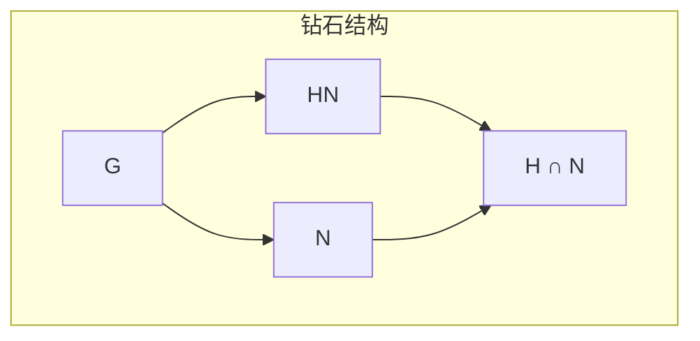

# 同态基本定理链

## 核心定理陈述

**同态基本定理（第一同构定理）**：设 $\varphi: G \to H$ 是群同态，则
$$G / \ker(\varphi) \cong \text{Im}(\varphi)$$

---

## 完整推理树

```mermaid
graph TD
    A[群同态 φ: G → H<br/>保持运算结构] --> B[核 Ker φ = φ⁻¹(e)<br/>φ的纤维结构]
    B --> C[核是正规子群<br/>Ker φ ⊲ G]
    C --> D[商群 G/Ker φ<br/>陪集作为元素]
    
    A --> E[像 Im φ = φ(G)<br/>H的子群]
    E --> F[像的同构类<br/>Im φ ≤ H]
    
    D --> G[自然同态<br/>π: G → G/Ker φ<br/>π(g) = gKer φ]
    
    G --> H[诱导映射<br/>φ̄: G/Ker φ → Im φ<br/>φ̄(gKer φ) = φ(g)]
    H --> I[φ̄良定性<br/>gKer φ = hKer φ ⇒ φ(g)=φ(h)]
    H --> J[φ̄同态性<br/>φ̄(xy) = φ̄(x)φ̄(y)]
    H --> K[φ̄单射<br/>φ̄(x)=e ⇒ x=Ker φ]
    H --> L[φ̄满射<br/>∀y∈Im φ, ∃x: φ̄(x)=y]
    
    I --> M[第一同构定理<br/>G/Ker φ ≅ Im φ]
    J --> M
    K --> M
    L --> M
    
    M --> N[第二同构定理<br/>HN/N ≅ H/(H∩N)]
    M --> O[第三同构定理<br/>(G/N)/(M/N) ≅ G/M]
    M --> P[对应定理<br/>G/N的子群 ↔ G的含N子群]
    
    Q[H ≤ G, N ⊲ G] --> R[积子群 HN<br/>= {hn : h∈H, n∈N}]
    R --> S[HN ≤ G 且 N ⊲ HN]
    S --> T[同态 H → HN/N<br/>h ↦ hN]
    T --> U[核 = H ∩ N]
    U --> N
    
    V[N ⊲ G, M ⊲ G<br/>N ⊆ M] --> W[M/N ⊲ G/N]
    W --> X[同态 G/N → G/M<br/>gN ↦ gM]
    X --> Y[核 = M/N]
    Y --> O
    
    style M fill:#f9f,stroke:#333,stroke-width:2px
    style N fill:#bbf,stroke:#333,stroke-width:1px
    style O fill:#bbf,stroke:#333,stroke-width:1px
    style P fill:#bbf,stroke:#333,stroke-width:1px

```

---

## 四个基本定理详解

### 第一同构定理

**定理**：$G / \ker(\varphi) \cong \text{Im}(\varphi)$

**构造性证明**：

```

G ---φ---> Im φ ⊆ H

|          ∧
π|         / φ̄
|        /

v       /
G/Ker φ

```

1. **自然投影** $\pi: G \to G/K$，$\pi(g) = gK$，其中 $K = \ker(\varphi)$
2. **诱导映射** $\bar{\varphi}(gK) = \varphi(g)$
3. **验证**：
   - 良定性：$gK = hK \Rightarrow g^{-1}h \in K \Rightarrow \varphi(g^{-1}h) = e \Rightarrow \varphi(g) = \varphi(h)$
   - 同态：$\bar{\varphi}(gK \cdot hK) = \bar{\varphi}(ghK) = \varphi(gh) = \varphi(g)\varphi(h) = \bar{\varphi}(gK)\bar{\varphi}(hK)$
   - 单射：$\bar{\varphi}(gK) = e \Rightarrow \varphi(g) = e \Rightarrow g \in K \Rightarrow gK = K$
   - 满射：显然由定义

---

### 第二同构定理（钻石定理）

**定理**：设 $H \leq G$，$N \trianglelefteq G$，则
$$HN/N \cong H/(H \cap N)$$

**证明思路**：



1. 考虑 $\psi: H \to HN/N$，$\psi(h) = hN$
2. $\psi$ 是同态（因为 $N \trianglelefteq G$）
3. $\ker(\psi) = H \cap N$
4. $\text{Im}(\psi) = HN/N$
5. 应用第一同构定理即得 ∎

---

### 第三同构定理

**定理**：设 $N \trianglelefteq M \trianglelefteq G$，则
$$(G/N)/(M/N) \cong G/M$$

**证明思路**：

1. 定义 $\theta: G/N \to G/M$，$\theta(gN) = gM$
2. 验证良定性：$gN = hN \Rightarrow g^{-1}h \in N \subseteq M \Rightarrow gM = hM$
3. $\theta$ 是满同态
4. $\ker(\theta) = \{gN : gM = M\} = \{gN : g \in M\} = M/N$
5. 应用第一同构定理 ∎

---

### 对应定理（第四同构定理）

**定理**：设 $N \trianglelefteq G$，则存在双射：
$$\{\text{含 } N \text{ 的 } G \text{ 的子群}\} \longleftrightarrow \{G/N \text{ 的子群}\}$$
$$H \longmapsto H/N$$

且此对应保持：包含关系、正规性、指数。

**证明要点**：

- **映射1**：$H \mapsto \pi(H) = H/N$，其中 $\pi: G \to G/N$
- **映射2**：$\bar{K} \mapsto \pi^{-1}(\bar{K})$
- 互逆验证：$\pi^{-1}(\pi(H)) = H$，$\pi(\pi^{-1}(\bar{K})) = \bar{K}$
- 正规性：$H \trianglelefteq G \Leftrightarrow H/N \trianglelefteq G/N$

---

## 应用网络

```mermaid
graph LR
    I[同构定理] --> A[商群分类<br/>Z/nZ ≅ Zₙ]
    I --> B[导群结构<br/>G/G'的交换化]
    I --> C[可解群判定<br/>导列终止于{e}]
    I --> D[中心扩张<br/>1→A→E→G→1]
    I --> E[同调代数<br/>正合序列]
    
    A --> F[循环群定理<br/>任意循环群商群]
    B --> G[Abel化函子<br/>Grp → Ab]
    D --> H[群扩张分类<br/>H²(G,A)]
    
    style I fill:#f9f,stroke:#333,stroke-width:2px

```

---

## 典型应用

### 应用1：循环群结构

**命题**：$\mathbb{Z}/n\mathbb{Z} \cong \mathbb{Z}_n$

**证明**：定义 $\varphi: \mathbb{Z} \to \mathbb{Z}_n$，$\varphi(k) = k \mod n$
- $\ker(\varphi) = n\mathbb{Z}$
- $\text{Im}(\varphi) = \mathbb{Z}_n$
- 由第一同构定理即得 ∎

### 应用2：Abel化

**命题**：$G/G' \cong G^{\text{ab}}$，其中 $G' = [G,G]$ 是换位子群

**证明**：对任意交换群 $A$，
$$\text{Hom}(G/G', A) \cong \{\varphi \in \text{Hom}(G,A) : G' \subseteq \ker(\varphi)\} = \text{Hom}(G,A)$$
因为交换群的同态自动消去换位子。

### 应用3：矩阵群结构

**例子**：$\text{GL}_n(\mathbb{F})/\text{SL}_n(\mathbb{F}) \cong \mathbb{F}^\times$

**证明**：行列式映射 $\det: \text{GL}_n(\mathbb{F}) \to \mathbb{F}^\times$
- $\ker(\det) = \text{SL}_n(\mathbb{F})$
- $\text{Im}(\det) = \mathbb{F}^\times$（满射）

---

## 范畴论视角

```mermaid
graph TD
    A[群范畴 Grp] --> B[商构造<br/>余等化子]
    B --> C[第一同构定理<br/>像 ≅ 余像]
    
    D[正合序列<br/>1→K→G→H→1] --> E[短正合<br/>K=Ker, H=Im]
    E --> F[扩张理论<br/>Ext¹(H,K)]
    
    G[遗忘函子<br/>Grp → Set] --> H[自由群<br/>左伴随]
    H --> I[Abel化<br/>右伴随: G↦G/G']
    
    style C fill:#f9f,stroke:#333,stroke-width:2px

```

---

## 参考

- Dummit & Foote, Chapter 3
- Aluffi, *Algebra: Chapter 0*, Chapter II.7
- Mac Lane, *Categories for the Working Mathematician*
