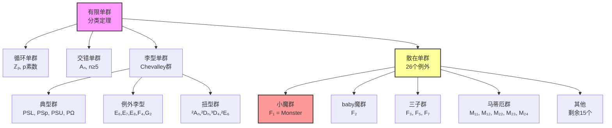
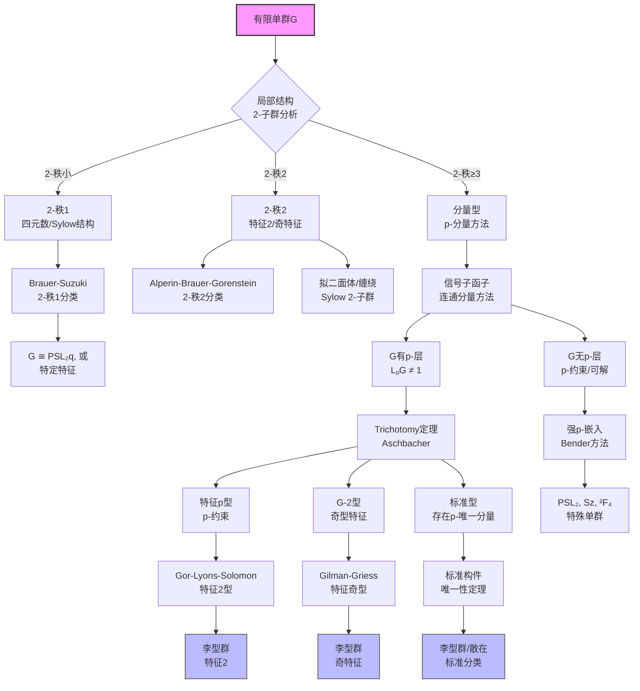
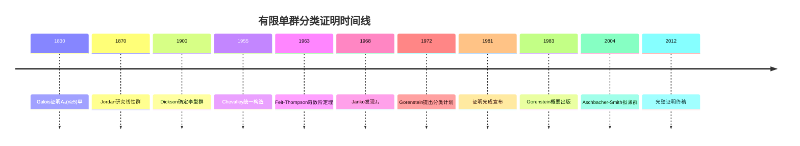
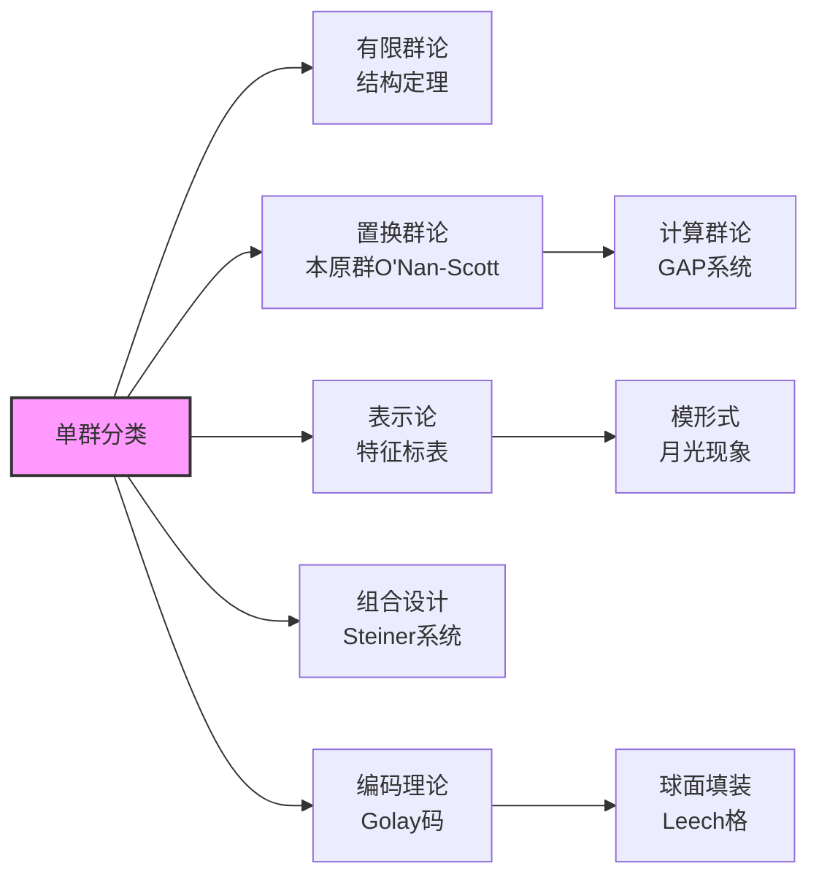

# 单群分类概述树

## 核心概念

**单群 (Simple Group)**：非平凡群 $G$ 称为单群，若其只有平凡的正规子群 $\{e\}$ 和 $G$ 本身。

---

## 分类定理总览



---

## 分类推理树



---

## 四大类详解

### 1. 循环单群 $Z_p$

**特征**：唯一的交换有限单群

```mermaid
graph LR
    A[|G| = p 素数] --> B[G ≅ ℤₚ]

    B --> C[交换单群<br/>仅有平凡子群]
    
    D[拉格朗日定理] --> E[p阶群无<br/>非平凡子群]
    E --> A

```

### 2. 交错单群 $A_n$ ($n \geq 5$)

**经典定理 (Galois)**：$A_n$ 对 $n \geq 5$ 是单群

```mermaid
graph TD
    A[Aₙ, n≥5] --> B[3-轮换生成<br/>Aₙ = ⟨(123), (124), ...⟩]
    B --> C[正规子群N ⊲ Aₙ]
    C --> D{N含3-轮换?}
    D -->|是| E[N含所有3-轮换]

    E --> F[N = Aₙ]
    
    D -->|否| G[N的轮换结构]

    G --> H[分析N中元素<br/>轮换分解类型]
    H --> I[导出矛盾<br/>N必须含3-轮换]
    
    J[稳定子分析] --> K[Aₙ作用在<br/>{1,...,n}]
    K --> L[原始性<br/>本原置换群]
    L --> M[Jordan定理<br/>本原群含3-轮换⇒Aₙ或Sₙ]
    
    style A fill:#f9f,stroke:#333,stroke-width:2px

```

**关键步骤**：证明任意非平凡正规子群必含3-轮换

### 3. 李型单群

```mermaid
graph TD
    A[复单李代数<br/>g = LieG] --> B[Chevalley基<br/>{hᵢ, eₐ}]
    B --> C[结构常数<br/>在ℤ中]
    C --> D[整数形式<br/>gℤ]
    
    D --> E[域F上的李代数<br/>gF = gℤ ⊗ F]
    E --> F[Chevalley群<br/>G(F) = ⟨exp teₐ⟩]
    
    F --> G[例外群<br/>E₆,E₇,E₈,F₄,G₂]
    F --> H[典型群<br/>SL, Sp, SO, SU]
    
    H --> I[射影化<br/>PSLₙ = SLₙ/Z]
    H --> J[辛群<br/>PSp₂ₙ]
    H --> K[正交群<br/>PΩₙ]
    H --> L[酉群<br/>PSUₙ]
    
    M[域自同构<br/>Frobenius] --> N[扭型群<br/>Steinberg群]
    N --> O[²Aₙ = PSUₙ₊₁]
    N --> P[²Dₙ, ³D₄<br/>²E₆]
    N --> Q[Suzuki群<br/>²B₂ = Sz]
    N --> R[Ree群<br/>²F₄, ²G₂]
    
    style G fill:#bbf,stroke:#333,stroke-width:1px
    style I fill:#bbf,stroke:#333,stroke-width:1px

```

**典型李型群表**

| 记号 | 名称 | 阶数（近似） | 极小表示维 |
|-----|------|-----------|----------|
| $A_n(q) = PSL_{n+1}(q)$ | 射影特殊线性 | $q^{n(n+1)/2}$ | $n+1$ |
| $B_n(q) = P\Omega_{2n+1}(q)$ | 射影正交 | $q^{n^2}$ | $2n+1$ |
| $C_n(q) = PSp_{2n}(q)$ | 射影辛 | $q^{n^2}$ | $2n$ |
| $D_n(q) = P\Omega_{2n}^+(q)$ | 射影正交(+) | $q^{n(n-1)}$ | $2n$ |
| $^2A_n(q^2) = PSU_{n+1}(q)$ | 射影酉 | $q^{n(n+1)/2}$ | $n+1$ |
| $E_8(q)$ | 例外群 | $q^{120}$ | 248 |

### 4. 散在单群

```mermaid
graph TD
    A[26个散在单群] --> B[快乐家族<br/>魔群的子商]
    A --> C[其他散在<br/>非魔群子商]
    
    B --> B1[小魔群F₁<br/>|F₁| ≈ 8×10⁵³]

    B --> B2[baby魔群F₂]
    B --> B3[三子群F₃,F₅,F₇]
    B --> B4[Harada-Norton HN]
    B --> B5[Thompson Th]
    B --> B6[Held He]
    
    C --> C1[马蒂厄群<br/>M₁₁, M₁₂, M₂₂, M₂₃, M₂₄]
    C --> C2[Janko群<br/>J₁, J₂, J₃, J₄]
    C --> C3[Conway群<br/>Co₁, Co₂, Co₃]
    C --> C4[Fischer群<br/>Fi₂₂, Fi₂₃, Fi₂₄']
    C --> C5[Higman-Sims HS]
    C --> C6[McLaughlin McL]
    C --> C7[Suzuki Suz]
    C --> C8[Lyons Ly]
    C --> C9[ONan ON]
    C --> C10[Rudvalis Ru]
    
    B1 --> D[月光猜想<br/>Moonshine]
    D --> E[顶点代数<br/>Monster VOA]
    
    style B1 fill:#f99,stroke:#333,stroke-width:2px

```

---

## 分类定理的历史证明



---

## 关键技术方法

### 局部分析法

```mermaid
graph TD
    A[局部分析] --> B[p-局部子群<br/>N_G(P), P∈Sylₚ]
    B --> C[融合系统<br/>F_S(G)]
    C --> D[信号子函子<br/>θ(G;p)]
    D --> E[连通分量<br/>Lₚ'层]
    
    E --> F[分量型群<br/>E(G) ≠ 1]
    E --> G[特征p型<br/>F*(G) = Oₚ(G)]
    
    F --> H[标准型方法<br/>唯一分量情形]
    G --> I[融合分析<br/>Amalgam方法]

```

### 特征标理论

```mermaid
graph LR
    A[特征标理论] --> B[诱导特征标<br/>Ind_H^G]
    A --> C[模表示<br/>Brauer特征标]
    A --> D[块论<br/>p-块分解]
    
    B --> E[Frobenius互反]
    C --> F[分解矩阵
    D --> G[缺陷群分析]

```

---

## 应用与影响



---

## 参考

- Gorenstein, *Finite Simple Groups*
- Gorenstein-Lyons-Solomon, *The Classification of the Finite Simple Groups*
- Wilson, *The Finite Simple Groups*
- Conway et al., *Atlas of Finite Groups*
