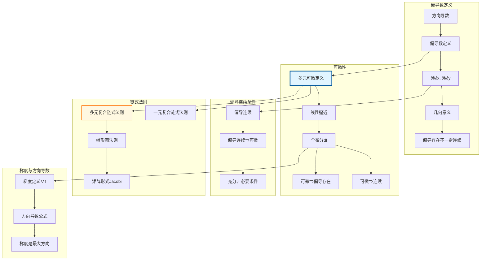

# 偏导数 → 可微性 → 链式法则推理树

## 概述
本推理树展示多元微分学核心链条：从偏导数定义到多元函数可微性，最终建立链式法则的完整理论框架。

## 推理步骤详解

### 第一步：偏导数定义

**定义**：设 $f: \mathbb{R}^n \to \mathbb{R}$，在点 $a$ 关于 $x_i$ 的偏导数：

$$\frac{\partial f}{\partial x_i}(a) = \lim_{h \to 0} \frac{f(a + he_i) - f(a)}{h}$$

其中 $e_i$ 是第 $i$ 个单位向量。

### 第二步：可微性定义

**定义**：$f$ 在 $a$ 点可微，若存在线性映射 $L: \mathbb{R}^n \to \mathbb{R}$：

$$f(a + h) - f(a) = L(h) + o(\|h\|), \quad h \to 0$$

**定理**：若 $f$ 可微，则偏导数存在且 $L(h) = \sum \frac{\partial f}{\partial x_i}(a) h_i$

### 第三步：链式法则

**定理**：设 $g: \mathbb{R}^m \to \mathbb{R}^n$ 在 $x$ 可微，$f: \mathbb{R}^n \to \mathbb{R}^p$ 在 $g(x)$ 可微，则 $f \circ g$ 可微且：

$$D(f \circ g)(x) = Df(g(x)) \cdot Dg(x)$$

Jacobi矩阵形式：$J_{f \circ g} = J_f \cdot J_g$

### 第四步：梯度与方向导数

**梯度**：$\nabla f = (\frac{\partial f}{\partial x_1}, ..., \frac{\partial f}{\partial x_n})$

**方向导数**：$D_u f = \nabla f \cdot u$

**性质**：$|\nabla f|$ 是最大方向导数，方向为梯度方向。
