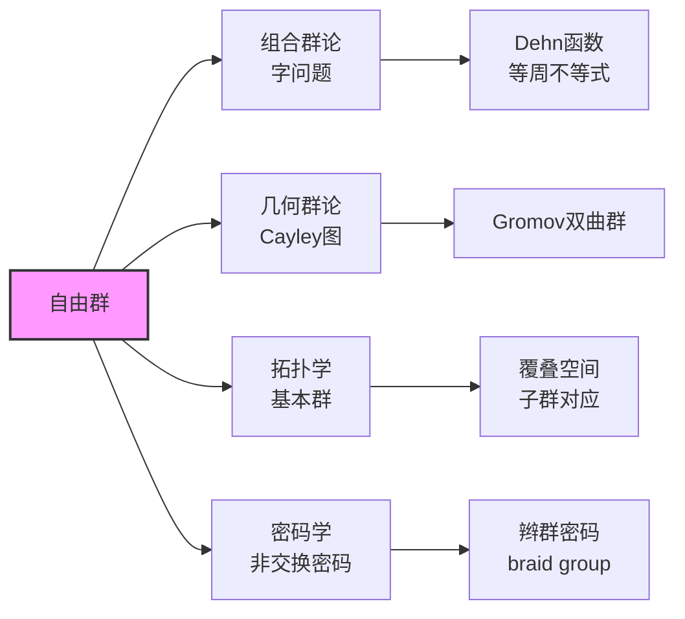

# 自由群构造推导

## 核心概念

**自由群 (Free Group)**：群 $F$ 称为在生成集 $S$ 上的自由群，若任意映射 $S \to G$（$G$ 为任意群）可唯一延拓为群同态 $F \to G$。

---

## 构造推理树

```mermaid
graph TD
    A[集合 S<br/>字母表] --> B[字母的逆<br/>S⁻¹ = {s⁻¹ : s∈S}]
    B --> C[字母表扩展<br/>S̃ = S ⊔ S⁻¹]
    
    C --> D[字 Word<br/>S̃上的有限序列]
    D --> E[字连接<br/>w₁·w₂ 拼接]
    E --> F[自由幺半群<br/>S̃*]
    
    F --> G[约化操作<br/>删除ss⁻¹, s⁻¹s]
    G --> H[约化字<br/>无相邻互逆对]
    
    H --> I[等价关系<br/>w₁ ~ w₂ 约化相同]
    I --> J[自由群<br/>F(S) = S̃*/~]
    
    K[泛性质] --> L[任意映射<br/>f: S → G]
    L --> M[唯一延拓<br/>f̃: F(S) → G]
    M --> N[同态验证<br/>f̃(w₁w₂) = f̃(w₁)f̃(w₂)]
    
    J --> O[万有性质<br/>F(S)是自由对象]
    N --> O
    
    O --> P[群表示<br/>G = ⟨S | R⟩]

    O --> Q[nielsen-schreier<br/>自由群的子群自由]
    O --> R[自由积<br/>G₁ * G₂]
    
    style J fill:#f9f,stroke:#333,stroke-width:2px
    style O fill:#bbf,stroke:#333,stroke-width:1px

```

---

## 详细构造

### 1. 字与约化

**定义**：设 $S$ 为集合，$S^{-1} = \{s^{-1} : s \in S\}$ 为形式逆的集合。

- **字**：$\tilde{S} = S \sqcup S^{-1}$ 上的有限序列 $w = x_1 x_2 \cdots x_n$，$x_i \in \tilde{S}$
- **空字**：$\varepsilon$（单位元）
- **字长**：$|w| = n$

**初等约化**：删除形如 $ss^{-1}$ 或 $s^{-1}s$ 的子串

**约化字**：无法进一步约化的字

**定理**：任意字有唯一的约化形式

**证明概要**：
- 对字长归纳
- 证明不同约化顺序得到相同结果（Church-Rosser性质）
- 利用Diamond引理

### 2. 自由群的群结构

**乘法**：$[w_1] \cdot [w_2] = [\text{约化}(w_1 w_2)]$

**验证**：
1. **封闭性**：约化字的连接再约化仍是约化字
2. **结合性**：$([w_1][w_2])[w_3] = [w_1]([w_2][w_3])$（约化唯一性）
3. **单位元**：$[\varepsilon]$
4. **逆元**：$[x_1 \cdots x_n]^{-1} = [x_n^{-1} \cdots x_1^{-1}]$

---

## 泛性质（万有性质）

```mermaid
graph LR
    subgraph 泛性质图
    S[S] -->|包含| F[F(S)]
    S -->|f| G[G]
    F -->|∃! f̃| G

    end
    
    style F fill:#f9f,stroke:#333,stroke-width:2px

```

**定理**：设 $i: S \hookrightarrow F(S)$ 为包含映射。对任意群 $G$ 和映射 $f: S \to G$，存在唯一的同态 $\tilde{f}: F(S) \to G$ 使下图交换：

$$
\tilde{f}([x_1 \cdots x_n]) = f(x_1)^{\pm 1} \cdots f(x_n)^{\pm 1}
$$

**证明**：
- **存在性**：在生成元上定义，延拓到整个群
- **唯一性**：同态由生成元像唯一决定

---

## 重要定理网络

```mermaid
graph TD
    A[自由群F(S)] --> B[Nielsen-Schreier<br/>子群自由]
    A --> C[秩不变性<br/>|S| = rank F]

    A --> D[Hopf性质<br/>满自同态⇒自同构]
    A --> E[剩余有限性<br/>∩H=1, [F:H]<∞]
    
    B --> B1[证明方法<br/>Schreier陪集图]
    B --> B2[指数公式<br/>rank H - 1 = [F:H](rank F - 1)]
    
    F[群G] --> G[生成集<br/>⟨S⟩ = G]
    F --> H[关系集<br/>R ⊆ F(S)]
    G --> I[群表示<br/>G ≅ F(S)/⟨⟨R⟩⟩]
    H --> I
    
    I --> J[自由积<br/>G₁ * G₂ = F(S₁⊔S₂)/N]
    I --> K[共合积<br/>G₁ *ₐ G₂]
    I --> L[HNN扩张<br/>G *_φ]
    
    style A fill:#f9f,stroke:#333,stroke-width:2px
    style B fill:#bbf,stroke:#333,stroke-width:1px

```

---

## Nielsen-Schreier 定理

**定理**：自由群的任意子群仍是自由群。

**证明思路**（拓扑方法）：

```mermaid
graph TD
    A[F(S) = π₁(X)] --> B[X = ∨ₛ S¹<br/>花束图]
    B --> C[子群H ≤ F(S)]
    C --> D[覆叠空间<br/>p: X̃ → X]
    D --> E[H = π₁(X̃)]
    E --> F[X̃是图<br/>1维CW复形]
    F --> G[图的π₁自由<br/>生成元 = 边]
    
    style G fill:#bbf,stroke:#333,stroke-width:1px

```

**Schreier公式**：若 $H \leq F(S)$ 且 $[F:H] = n$，则
$$\text{rank}(H) - 1 = n(\text{rank}(F) - 1)$$

---

## 群表示理论

### 定义

**群表示**：$G = \langle S \mid R \rangle$，其中
- $S$：生成元集
- $R \subseteq F(S)$：关系集
- $G \cong F(S) / \langle\langle R \rangle\rangle$，$\langle\langle R \rangle\rangle$ 是 $R$ 的正规闭包

### 例子

| 群 | 表示 | 说明 |
|---|------|-----|
| $D_{2n}$ | $\langle r, s \mid r^n = s^2 = 1, srs = r^{-1} \rangle$ | 二面体群 |
| $S_3$ | $\langle a, b \mid a^2 = b^2 = (ab)^3 = 1 \rangle$ | 对称群 |
| $A_4$ | $\langle x, y \mid x^2 = y^3 = (xy)^3 = 1 \rangle$ | 交错群 |
| $Q_8$ | $\langle i, j \mid i^4 = 1, i^2 = j^2, iji^{-1} = j^{-1} \rangle$ | 四元数群 |

---

## 自由积与共合积

```mermaid
graph TD
    A[G₁] --> C[G₁ * G₂]
    B[G₂] --> C
    
    C --> D[泛性质<br/>交换图]
    D --> E[任意同态<br/>G₁→H, G₂→H]
    
    F[G₁] --> H[G₁ *ₐ G₂]
    G[G₂] --> H
    I[A] -->|φ₁| G₁
    I -->|φ₂| G₂
    
    H --> J[等同A的像<br/>φ₁(a) = φ₂(a)]
    J --> K[Seifert-van Kampen<br/>基本群计算]
    
    L[G] --> M[HNN扩张<br/>G *_φ]
    N[A,B ≤ G] -->|同构φ| M

    M --> O[添加稳定子t<br/>tat⁻¹ = φ(a)]
    O --> P[Bass-Serre理论<br/>树的作用]
    
    style C fill:#bbf,stroke:#333,stroke-width:1px
    style H fill:#bbf,stroke:#333,stroke-width:1px

```

---

## 应用网络



---

## 参考

- Magnus-Karrass-Solitar, *Combinatorial Group Theory*
- Lyndon-Schupp, *Combinatorial Group Theory*
- Serre, *Trees*
- Bridson-Haefliger, *Metric Spaces of Non-Positive Curvature*
