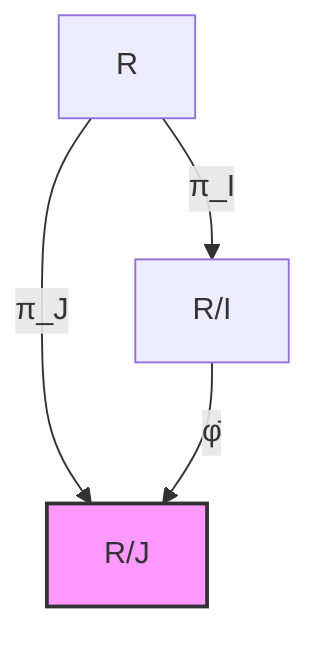

# 理想对应定理链

## 核心定理陈述

**理想对应定理**：设 $R$ 是环，$I \subseteq R$ 是理想，则存在包含关系的双射：
$$\{\text{含 } I \text{ 的 } R \text{ 的理想}\} \longleftrightarrow \{R/I \text{ 的理想}\}$$

---

## 推理树

```mermaid
graph TD
    A[环R] --> B[理想I ⊆ R<br/>加法子群且吸收乘法]
    B --> C[商环R/I<br/>陪集r+I作为元素]
    
    C --> D[自然同态<br/>π: R → R/I]
    D --> E[核Ker π = I]
    D --> F[像Im π = R/I]
    
    G[J ⊇ I的理想] --> H[J/I ⊆ R/I<br/>商理想]
    H --> I[商理想良定性<br/>(j₁+I)+(j₂+I)=(j₁+j₂)+I]
    
    J[K ⊆ R/I的理想] --> K[原像π⁻¹K ⊆ R]
    K --> L[π⁻¹K是理想<br/>包含I]
    
    I --> M[对应定理<br/>J ↦ J/I]
    L --> M
    M --> N[双射验证<br/>π⁻¹(J/I) = J]
    
    N --> O[理想格同构<br/>Lattice isomorphism]
    O --> P[商商同构<br/>R/J ≅ (R/I)/(J/I)]
    
    M --> Q[素理想对应<br/>P ⊇ I素 ⇔ P/I素]
    M --> R[极大理想对应<br/>M ⊇ I极大 ⇔ M/I极大]
    
    style M fill:#f9f,stroke:#333,stroke-width:2px
    style P fill:#bbf,stroke:#333,stroke-width:1px
    style Q fill:#bbf,stroke:#333,stroke-width:1px

```

---

## 详细证明

### 1. 对应关系的建立

定义映射：
$$\Phi: \{J : I \subseteq J \trianglelefteq R\} \to \{K : K \trianglelefteq R/I\}$$
$$\Phi(J) = J/I = \{j + I : j \in J\}$$

**证明 $\Phi$ 是良定义的**：
- 若 $J$ 是 $R$ 的理想且 $J \supseteq I$，验证 $J/I$ 是 $R/I$ 的理想：
  - $(j_1 + I) + (j_2 + I) = (j_1 + j_2) + I \in J/I$ ✓
  - $(r + I)(j + I) = rj + I \in J/I$（因 $rj \in J$）✓

### 2. 逆映射

定义：$\Psi(K) = \pi^{-1}(K) = \{r \in R : r + I \in K\}$

**验证 $\Psi(K)$ 是含 $I$ 的理想**：
- $I \subseteq \Psi(K)$：因 $i + I = 0 + I \in K$ ✓
- 理想的其他条件由 $\pi^{-1}$ 保持

### 3. 互逆验证

- $\Psi(\Phi(J)) = \pi^{-1}(J/I) = J$（由定义直接验证）
- $\Phi(\Psi(K)) = \pi^{-1}(K)/I = K$（由 $\pi$ 的满射性）

---

## 理想性质保持

```mermaid
graph TD
    A[理想对应] --> B[素性保持]
    A --> C[极大性保持]
    A --> D[根理想保持]
    A --> E[准素理想保持]
    
    B --> B1[P ⊇ I素<br/>⇔ R/P整环]
    B1 --> B2[R/P ≅ (R/I)/(P/I)<br/>⇔ P/I素]
    
    C --> C1[M ⊇ I极大<br/>⇔ R/M域]
    C1 --> C2[R/M ≅ (R/I)/(M/I)<br/>⇔ M/I极大]
    
    D --> D1[√J = {r : rⁿ∈J}]<br/>⇒ √(J/I) = (√J)/I]
    
    E --> E1[准素理想Q<br/>⇒ Q/I准素]
    
    style B fill:#bbf,stroke:#333,stroke-width:1px
    style C fill:#bbf,stroke:#333,stroke-width:1px

```

### 性质保持表

| 性质 | $J \supseteq I$ | $J/I \subseteq R/I$ | 证明关键 |
|-----|----------------|-------------------|---------|
| 素理想 | $P$ 素 | $P/I$ 素 | $R/P \cong (R/I)/(P/I)$ |
| 极大理想 | $M$ 极大 | $M/I$ 极大 | $R/M$ 是域 |
| 根理想 | $\sqrt{J}$ | $\sqrt{J/I}$ | 幂零元对应 |
| 准素理想 | $Q$ 准素 | $Q/I$ 准素 | 零因子幂零 |

---

## 商商同构定理

**定理**：设 $I \subseteq J$ 都是 $R$ 的理想，则
$$R/J \cong (R/I)/(J/I)$$

**证明**：



1. 考虑合成映射 $R \xrightarrow{\pi_I} R/I \xrightarrow{\pi_{J/I}} (R/I)/(J/I)$
2. 核是 $\{r : r + I \in J/I\} = J$
3. 由环同态基本定理即得 ∎

---

## 应用：素谱与极大谱

```mermaid
graph TD
    A[Spec R<br/>素理想集] --> B[拓扑结构<br/>Zariski拓扑]
    B --> C[V(I) = {P ⊇ I}<br/>闭集]
    
    C --> D[Spec R/I ≅ V(I)]
    D --> E[包含I的素理想<br/>↔ R/I的素理想]
    
    E --> F[局部化<br/>R_P]
    E --> G[维数理论<br/>dim R/I = 高度]
    
    H[MaxSpec R<br/>极大理想] --> I[MaxSpec R/I<br/>↔ 含I的极大理想]
    
    style D fill:#f9f,stroke:#333,stroke-width:2px

```

---

## 例子

### 例子1：整数环

$R = \mathbb{Z}$，$I = (6) = 6\mathbb{Z}$

$$\mathbb{Z}/6\mathbb{Z} \cong \mathbb{Z}_6$$

- $\mathbb{Z}_6$ 的理想：$(0), (2), (3), (1)$
- 对应的 $\mathbb{Z}$ 中含 $(6)$ 的理想：$(6), (2), (3), (1)$

### 例子2：多项式环

$R = k[x]$，$I = (x^2)$

$$k[x]/(x^2) \cong k[\varepsilon]/(\varepsilon^2)$$

（双数环）

- $k[x]/(x^2)$ 的理想对应于 $(x^2)$ 之上 $(0)$ 之上的理想
- 即 $(x^2), (x), (1)$

---

## 推广：模的对应定理

```mermaid
graph TD
    A[模M] --> B[子模N ⊆ M]
    B --> C[商模M/N]
    C --> D[子模对应<br/>含N的子模 ↔ M/N的子模]
    
    D --> E[模同构<br/>M/L ≅ (M/N)/(L/N)]
    
    style D fill:#f9f,stroke:#333,stroke-width:2px

```

---

## 参考

- Atiyah-Macdonald, *Introduction to Commutative Algebra*, Chapter 1
- Dummit & Foote, Chapter 7
- Eisenbud, *Commutative Algebra*, Chapter 2
