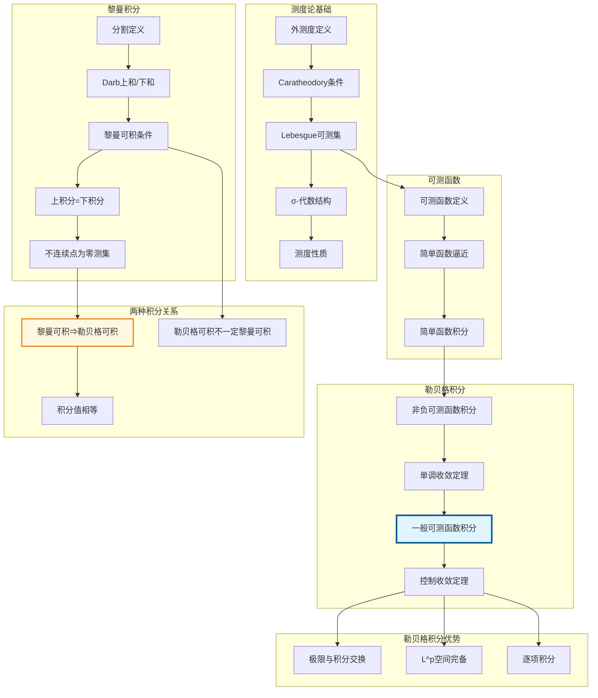

msc_primary: "00A99"
msc_secondary: ['00-XX']
---

# 黎曼积分 → 勒贝格积分推理树

## 概述
本推理树展示从黎曼积分出发，通过可测集和可测函数的概念，最终建立勒贝格积分理论的完整推理链。



## 推理步骤详解

### 第一步：黎曼积分回顾

**定义**：$f$ 在 $[a,b]$ 黎曼可积，若：

$$\overline{\int_a^b} f = \underline{\int_a^b} f$$

**Lebesgue判别法**：$f$ 黎曼可积当且仅当 $f$ 有界且不连续点为零测集。

### 第二步：Lebesgue测度

**外测度**：$m^*(E) = \inf\{\sum |I_n|: E \subset \bigcup I_n\}$

**可测集**：$E$ 可测当且仅当对任意 $A$：
$$m^*(A) = m^*(A \cap E) + m^*(A \cap E^c)$$

### 第三步：可测函数

**定义**：$f$ 可测当且仅当对任意开集 $O$，$f^{-1}(O)$ 可测。

**简单函数逼近**：任何非负可测函数可由简单函数单调逼近。

### 第四步：勒贝格积分

**非负简单函数**：$\int \sum a_i \chi_{E_i} = \sum a_i m(E_i)$

**非负可测函数**：$\int f = \sup\{\int \varphi: 0 \leq \varphi \leq f, \varphi \text{简单}\}$

**一般可测函数**：$f = f^+ - f^-$，$\int f = \int f^+ - \int f^-$

### 第五步：积分关系

**定理**：若 $f$ 黎曼可积，则 $f$ 勒贝格可积且积分值相等。

**依赖关系**：

```

黎曼可积 ⇒ 有界+不连续点零测
    ↓
可测函数
    ↓
勒贝格可积

```
