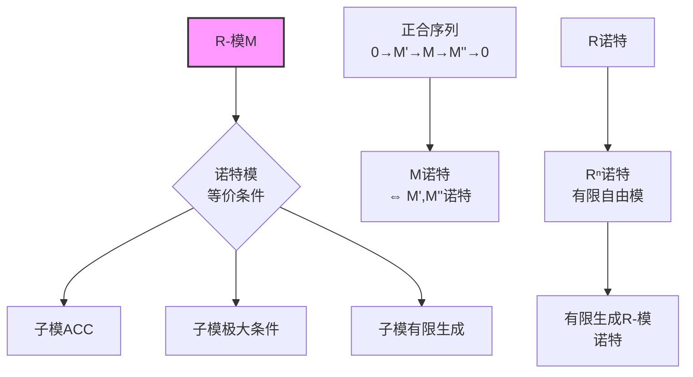

# 诺特环升链条件

## 核心概念

**诺特环 (Noetherian Ring)**：环 $R$ 称为诺特环，若满足以下等价条件之一：

1. **升链条件 (ACC)**：任意理想升链 $I_1 \subseteq I_2 \subseteq \cdots$ 稳定
2. **极大条件**：任意非空理想集合有极大元
3. **有限生成**：任意理想有限生成

---

## 推理树

```mermaid
graph TD
    A[环R] --> B{等价刻画}
    B --> C[ACC<br/>升链条件]
    B --> D[极大条件<br/>理想集的极大元]
    B --> E[有限生成<br/>每个理想f.g.]
    
    C --> C1[I₁ ⊆ I₂ ⊆ ...<br/>∃N, I_N = I_{N+1} = ...]
    D --> D1[非空理想集S<br/>∃I∈S, 极大]
    E --> E1[任意理想I<br/>I = a₁R + ... + aₙR]
    
    C1 --> F[三者等价]
    D1 --> F
    E1 --> F
    
    F --> G[诺特环<br/>Noetherian Ring]
    
    G --> H[希尔伯特基定理<br/>R诺特 ⇒ R[x]诺特]
    G --> I[局部化保持<br/>S⁻¹R诺特]
    G --> J[商环保持<br/>R/I诺特]
    
    H --> K[多元多项式<br/>k[x₁,...,xₙ]诺特]
    K --> L[代数几何<br/>有限生成代数]
    
    G --> M[准素分解<br/>理想 = 准素理想交]
    M --> N[相伴素理想<br/>Ass(M)]
    
    style G fill:#f9f,stroke:#333,stroke-width:2px
    style H fill:#bbf,stroke:#333,stroke-width:1px
    style M fill:#bbf,stroke:#333,stroke-width:1px

```

---

## 等价性证明

### ACC $\Rightarrow$ 极大条件

**证明**：反证法。

- 设 $S$ 是非空理想集，无极大元
- 归纳构造严格升链：取 $I_1 \in S$，由无极大元，存在 $I_2 \supsetneq I_1$，...
- 这与ACC矛盾 ∎

### 极大条件 $\Rightarrow$ 有限生成

**证明**：

- 设 $I$ 是理想，考虑 $S = \{\text{$I$ 的有限生成子理想}\}$
- $S \neq \emptyset$（含 $(0)$）
- 由极大条件，$S$ 有极大元 $J = (a_1, \ldots, a_n)$
- 若 $J \subsetneq I$，取 $a \in I \setminus J$
- 则 $J' = (a_1, \ldots, a_n, a) \in S$ 严格大于 $J$，矛盾
- 故 $J = I$ 有限生成 ∎

### 有限生成 $\Rightarrow$ ACC

**证明**：

- 设 $I_1 \subseteq I_2 \subseteq \cdots$ 是升链
- 令 $I = \bigcup I_n$，验证 $I$ 是理想
- $I$ 有限生成：$I = (a_1, \ldots, a_m)$
- 每个 $a_i \in I_{N_i}$，取 $N = \max N_i$
- 则所有 $a_i \in I_N$，故 $I \subseteq I_N \subseteq I_{N+1} \subseteq \cdots \subseteq I$
- 链在 $N$ 处稳定 ∎

---

## 希尔伯特基定理

**定理**：若 $R$ 是诺特环，则 $R[x]$ 也是诺特环。

```mermaid
graph TD
    A[R诺特环] --> B[设I ⊆ R[x]<br/>非f.g.理想]
    B --> C[构造序列<br/>f₁, f₂, ... ∈ I]
    C --> D[首项系数<br/>a₁, a₂, ... ∈ R]
    D --> E[理想(a₁) ⊆ (a₁,a₂) ⊆ ...]
    E --> F[R诺特<br/>链稳定于(a₁,...,aₙ)]
    F --> G[J = (f₁,...,fₙ) ⊆ I]
    G --> H[取最小次数元<br/>f_{n+1} ∈ I\\J]
    H --> I[首项系数∈(a₁,...,aₙ)<br/>可约化次数]
    I --> J[矛盾<br/>次数最小性]
    
    K[归纳] --> L[R[x₁,...,xₙ]<br/>诺特]
    
    style A fill:#f9f,stroke:#333,stroke-width:2px

```

**证明概要**：

1. 假设 $I \subseteq R[x]$ 非有限生成
2. 归纳选择 $f_n \in I \setminus (f_1, \ldots, f_{n-1})$ 最小次数
3. 令 $a_n$ 为 $f_n$ 的首项系数
4. 理想升链 $(a_1) \subseteq (a_1, a_2) \subseteq \cdots$ 在 $R$ 中稳定
5. 故存在 $n$，$a_{n+1} = \sum_{i=1}^n r_i a_i$
6. 构造 $g = \sum r_i x^{d_{n+1}-d_i} f_i$（$d_i = \deg f_i$）
7. $f_{n+1} - g$ 次数 $< d_{n+1}$，但 $f_{n+1} - g \in I \setminus (f_1, \ldots, f_n)$
8. 与 $f_{n+1}$ 的最小次数选择矛盾 ∎

**推论**：$k[x_1, \ldots, x_n]$ 是诺特环（$k$ 域）

---

## 诺特性质保持

```mermaid
graph TD
    A[诺特环R] --> B[商环R/I<br/>理想对应定理]
    A --> C[局部化S⁻¹R<br/>理想扩张收缩]
    A --> D[多项式R[x]<br/>希尔伯特基定理]
    A --> E[形式幂级数R[[x]]<br/>类似证明]
    
    B --> F[若R诺特<br/>则R/I诺特]
    C --> G[若R诺特<br/>则S⁻¹R诺特]
    D --> H[R[x₁,...,xₙ]<br/>诺特]
    
    I[子环] --> J[不保持!<br/>反例存在]
    
    style A fill:#f9f,stroke:#333,stroke-width:2px

```

---

## 准素分解定理

**定理**（Lasker-Noether）：诺特环中任意理想可表示为有限个准素理想的交。

```mermaid
graph TD
    A[诺特环R] --> B[不可约理想<br/>I = J∩K ⇒ I=J 或 I=K]
    B --> C[不可约理想准素]
    C --> D[任意理想可分解]
    
    D --> E[准素分解<br/>I = Q₁ ∩ ... ∩ Qₙ]
    E --> F[相伴素理想<br/>√Qᵢ = Pᵢ]
    
    F --> G[极小素理想<br/>Ass(I)的最小元]
    F --> H[嵌入素理想<br/>Ass(I)的其他元]
    
    I[唯一性定理] --> J[相伴素理想集<br/>唯一确定]
    I --> K[孤立准素分支<br/>唯一确定]
    
    style E fill:#f9f,stroke:#333,stroke-width:2px

```

### 唯一性定理

**第一唯一性定理**：相伴素理想集合 $\text{Ass}(I)$ 由 $I$ 唯一确定。

**第二唯一性定理**：孤立准素分支（对应极小素理想）唯一确定。

---

## 模的诺特性



---

## 例子

### 诺特环的例子

| 环 | 类型 | 关键性质 |
|-----|------|---------|
| 域 $k$ | 诺特 | 仅有 $(0), (1)$ |
| $\mathbb{Z}$ | 诺特 | PID |
| $k[x_1, \ldots, x_n]$ | 诺特 | 希尔伯特基定理 |
| 诺特环的商 | 诺特 | 对应定理 |
| 诺特环的局部化 | 诺特 | 理想扩张 |

### 非诺特环的例子

| 环 | 非诺特原因 |
|-----|-----------|
| $k[x_1, x_2, \ldots]$（无穷变元） | 理想 $(x_1, x_2, \ldots)$ 非有限生成 |
| $\mathbb{Z}[x_1, x_2, \ldots]/(x_1 - x_2^2, x_2 - x_3^2, \ldots)$ | 升链 $(\bar{x}_1) \subsetneq (\bar{x}_2) \subsetneq \cdots$ |
| 整闭包（某些情形） | Nagata反例 |

---

## 应用：代数几何

```mermaid
graph TD
    A[仿射空间Aⁿ] --> B[代数集V<br/>多项式零点集]
    B --> C[理想I(V)<br/>零点理想]
    C --> D[坐标环k[V]<br/>= k[x₁,...,xₙ]/I(V)]
    
    D --> E[k[V]诺特<br/>希尔伯特基定理]
    E --> F[代数集满足<br/>降链条件DCC]
    
    F --> G[代数集可分解<br/>为不可约分支]
    G --> H[不可约分支<br/>↔ 素理想]
    
    style E fill:#f9f,stroke:#333,stroke-width:2px

```

---

## 参考

- Atiyah-Macdonald, Chapter 6, 7
- Eisenbud, *Commutative Algebra*, Chapter 1
- Matsumura, *Commutative Ring Theory*, Chapter 2
- Hilbert, *Über die Theorie der algebraischen Formen* (1890)
