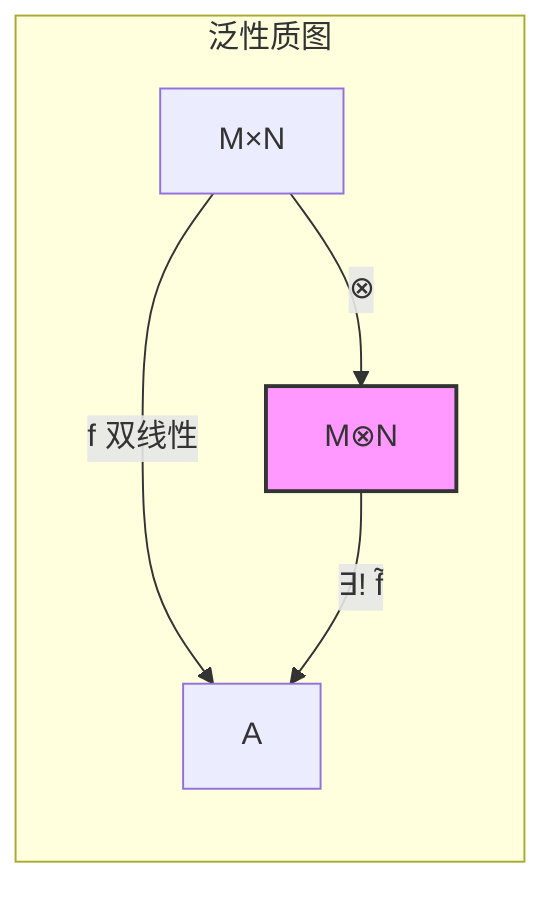
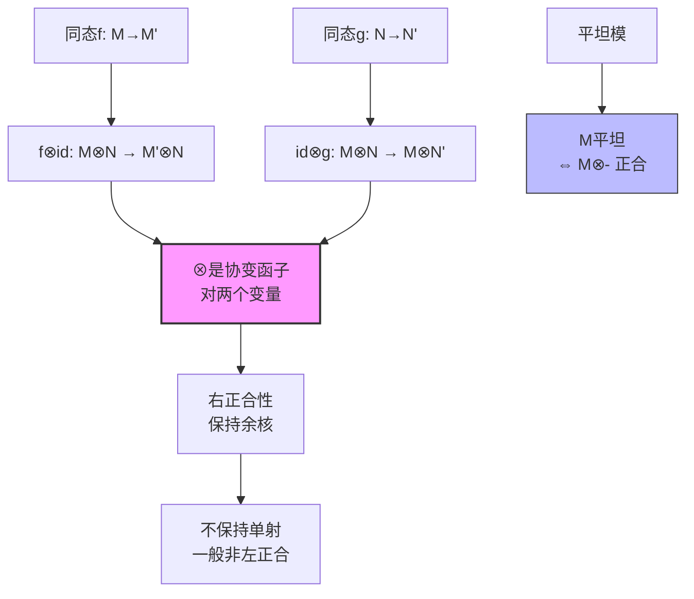
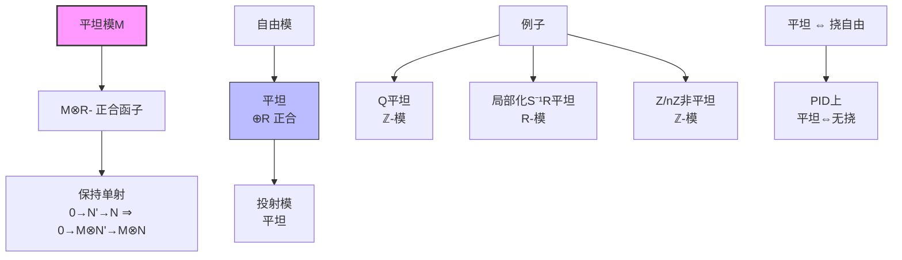

# 张量积性质推导

## 核心概念

**张量积**：设 $R$ 是环，$M$ 是右 $R$-模，$N$ 是左 $R$-模。张量积 $M \otimes_R N$ 是阿贝尔群，配备双线性映射 $\otimes: M \times N \to M \otimes_R N$，满足泛性质。

---

## 构造推理树

```mermaid
graph TD
    A[右R-模M<br/>左R-模N] --> B[自由阿贝尔群<br/>F = ℤ[M×N]]
    B --> C[双线性关系<br/>生成子群K]
    
    C --> D1[(m₁+m₂)⊗n - m₁⊗n - m₂⊗n]
    C --> D2[m⊗(n₁+n₂) - m⊗n₁ - m⊗n₂]
    C --> D3[mr⊗n - m⊗rn]
    
    D1 --> E[商群<br/>M⊗N = F/K]
    D2 --> E
    D3 --> E
    
    E --> F[张量积元素<br/>m⊗n = (m,n)+K]
    
    G[泛性质] --> H[任意双线性<br/>f: M×N → A]
    H --> I[唯一同态<br/>f̃: M⊗N → A]
    
    F --> J[双线性<br/>⊗: M×N → M⊗N]
    J --> I
    
    I --> K[唯一性<br/>同构意义下唯一]
    K --> L[函子性<br/>-⊗N: Mod-R → Ab]
    
    style E fill:#f9f,stroke:#333,stroke-width:2px
    style I fill:#bbf,stroke:#333,stroke-width:1px

```

---

## 泛性质



**定理**：对任意阿贝尔群 $A$ 和 $R$-双线性映射 $f: M \times N \to A$，存在唯一的群同态 $\tilde{f}: M \otimes_R N \to A$ 使得 $\tilde{f} \circ \otimes = f$。

---

## 基本性质

### 1. 加法结构

```mermaid
graph TD
    A[张量积元素] --> B[纯张量<br/>m⊗n]
    B --> C[一般元素<br/>Σ mᵢ⊗nᵢ]
    
    D[双线性性] --> E[(m₁+m₂)⊗n = m₁⊗n + m₂⊗n]
    D --> F[m⊗(n₁+n₂) = m⊗n₁ + m⊗n₂]
    
    G[零元] --> H[m⊗0 = 0⊗n = 0]
    G --> I[-(m⊗n) = (-m)⊗n = m⊗(-n)]

```

### 2. 模结构

**右 $S$-模，左 $R$-模**：若 $M$ 是 $(S, R)$-双模，则 $M \otimes_R N$ 是左 $S$-模：
$$s \cdot (m \otimes n) = (sm) \otimes n$$

**$(R, S)$-双模情形**：若 $N$ 是 $(R, S)$-双模，则 $M \otimes_R N$ 是右 $S$-模。

### 3. 函子性



---

## 重要同构

```mermaid
graph TD
    A[张量积同构] --> B[结合律<br/>M⊗(N⊗P) ≅ (M⊗N)⊗P]
    A --> C[单位律<br/>R⊗M ≅ M ≅ M⊗R]
    A --> D[直和<br/>⊕Mᵢ ⊗ N ≅ ⊕(Mᵢ⊗N)]
    A --> E[Hom-张量伴随<br/>Hom(M⊗N, P) ≅ Hom(M, Hom(N,P))]
    
    B --> B1[三元张量积<br/>M⊗N⊗P]
    C --> C1[R作为单位元]
    D --> D1[与直和交换]
    E --> E1[伴随对<br/>-⊗N ⊣ Hom(N,-)]
    
    style B fill:#bbf,stroke:#333,stroke-width:1px
    style C fill:#bbf,stroke:#333,stroke-width:1px
    style D fill:#bbf,stroke:#333,stroke-width:1px
    style E fill:#bbf,stroke:#333,stroke-width:1px

```

### 详细同构

| 同构 | 条件 | 映射 |
|-----|------|-----|
| $R \otimes_R M \cong M$ | 任意 | $r \otimes m \mapsto rm$ |
| $M \otimes_R R \cong M$ | 任意 | $m \otimes r \mapsto mr$ |
| $(M \oplus M') \otimes N \cong (M \otimes N) \oplus (M' \otimes N)$ | 任意 | 分量wise |
| $M \otimes_R (N \otimes_S P) \cong (M \otimes_R N) \otimes_S P$ | 双模 | 结合 |
| $\text{Hom}_R(M \otimes_S N, P) \cong \text{Hom}_S(M, \text{Hom}_R(N, P))$ | 伴随 |  curry化 |

---

## 特殊情形

### 向量空间张量积

```mermaid
graph TD
    A[k-向量空间<br/>V, W] --> B[维数<br/>dim(V⊗W) = dimV·dimW]
    B --> C[基{eᵢ}⊗{fⱼ}<br/>构成V⊗W的基]
    
    D[矩阵表示] --> E[V⊗W ≅ M_{m×n}(k)]
    E --> F[克罗内克积<br/>A⊗B]
    
    G[应用] --> H[多线性代数]
    G --> I[量子力学<br/>复合系统]
    G --> J[表示论<br/>张量积表示]

```

### 基变换

**命题**：若 $\{e_i\}$ 是 $M$ 的基，$\{f_j\}$ 是 $N$ 的基，则 $\{e_i \otimes f_j\}$ 是 $M \otimes_R N$ 的基。

### 例子：$\mathbb{Z}$-模

$$\mathbb{Z}/m\mathbb{Z} \otimes_{\mathbb{Z}} \mathbb{Z}/n\mathbb{Z} \cong \mathbb{Z}/\gcd(m,n)\mathbb{Z}$$

**证明**：
- 生成元：$\bar{1} \otimes \bar{1}$
- 阶：$\gcd(m,n)$（因 $m(\bar{1} \otimes \bar{1}) = n(\bar{1} \otimes \bar{1}) = 0$）

---

## 平坦模



---

## 应用网络

```mermaid
graph LR
    T[张量积] --> A[扩张标量<br/>M⊗R S]
    T --> B[代数几何<br/>层张量积]
    T --> C[同调代数<br/>Tor函子]
    T --> D[表示论<br/>诱导表示]
    T --> E[微分几何<br/>张量场]
    
    A --> F[复化<br/>V⊗R ℂ]
    C --> G[导出函子<br/>Lₙ(-⊗N)]
    D --> H[Frobenius互反]
    E --> I[黎曼几何<br/>度量张量]
    
    style T fill:#f9f,stroke:#333,stroke-width:2px

```

---

## 参考

- Dummit & Foote, Chapter 10.4
- Atiyah-Macdonald, Chapter 2
- Lang, *Algebra*, Chapter XVI
- Eisenbud, *Commutative Algebra*, Chapter A3
