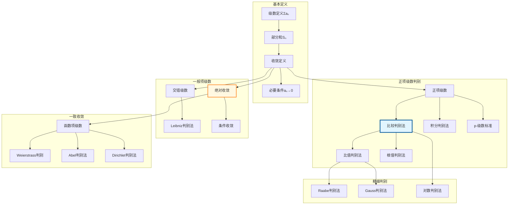

msc_primary: "00A99"
msc_secondary: ['00-00']
---

# 收敛判别法决策链

## 概述
本推理树展示数项级数各种收敛判别法之间的逻辑关系，形成完整的收敛性判定决策树。



## 核心判别法

### 正项级数判别层次

```

必要条件检验(aₙ→0)
    ↓ 通过
比较判别法(找标准级数)
    ├── 比值判别法(lim aₙ₊₁/aₙ)
    │       ├── =1失效→Raabe
    │       └── 结果明确
    ├── 根值判别法(lim ⁿ√aₙ)
    │       └── 最强（与比值关系）
    └── 积分判别法(单调函数)

```

### 关键定理

**比较判别法**：$0 \leq a_n \leq b_n$，则
- $\sum b_n$ 收敛 ⇒ $\sum a_n$ 收敛
- $\sum a_n$ 发散 ⇒ $\sum b_n$ 发散

**比值判别法(D'Alembert)**：$\lim \frac{a_{n+1}}{a_n} = \rho$
- $\rho < 1$：收敛
- $\rho > 1$：发散
- $\rho = 1$：不确定

**根值判别法(Cauchy)**：$\limsup \sqrt[n]{a_n} = \rho$
- 结论同比值判别法
- 适用范围更广

**Leibniz判别法**：$a_n \downarrow 0$，则 $\sum (-1)^n a_n$ 收敛

### 判别法强度比较

$$\text{根值} \geq \text{比值} \geq \text{Raabe}$$

等号成立条件：极限存在时
