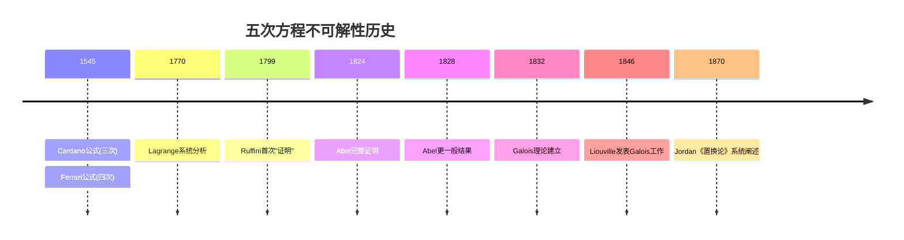
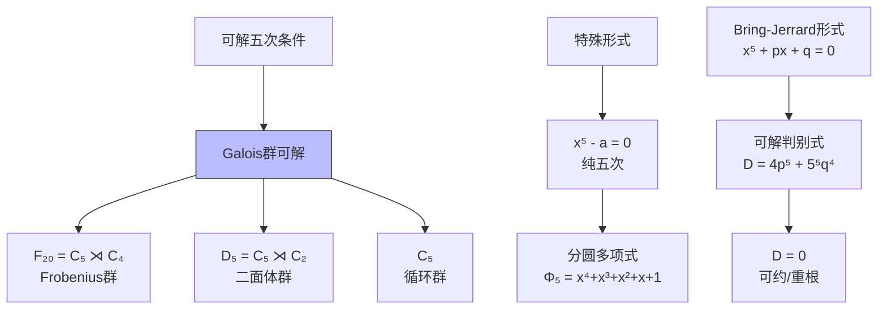
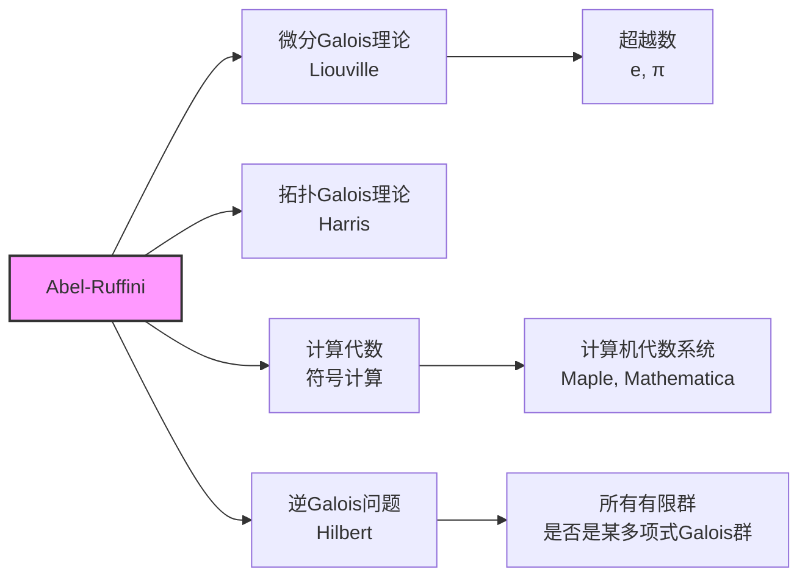

# 五次方程不可解性

## 核心定理陈述

**Abel-Ruffini 定理**：一般五次及五次以上多项式方程没有根式解公式。

---

## 推理树

```mermaid
graph TD
    A[一般五次方程<br/>f = x⁵ + t₁x⁴ + ... + t₅] --> B[分裂域E<br/>Q(t₁,...,t₅)上]
    B --> C[Galois群<br/>Gal(E/Q(t₁,...,t₅))]
    
    C --> D[Galois群 ≅ S₅<br/>对称群]
    D --> E[S₅的非可解性<br/>[S₅,S₅] = A₅]
    
    E --> F[A₅单群<br/>非交换单群]
    F --> G[导列<br/>S₅ ⊵ A₅ ⊵ A₅ ⊵ ...]
    G --> H[导列不终止于{e}<br/>S₅非可解]
    
    I[根式可解] --> J[可解Galois群<br/>可解群定义]
    J --> K[可解列<br/>G = G₀ ⊵ G₁ ⊵ ... ⊵ {e}]
    K --> L[商群交换<br/>Gᵢ/G_{i+1} 交换]
    
    H --> M{矛盾}
    L --> N[若根式可解<br/>则Gal可解]
    N --> M
    
    M --> O[结论<br/>一般五次无根式解]
    
    style O fill:#f9f,stroke:#333,stroke-width:2px
    style E fill:#bbf,stroke:#333,stroke-width:1px
    style F fill:#bbf,stroke:#333,stroke-width:1px

```

---

## 关键步骤详解

### 步骤1：一般五次方程的Galois群

**定义**：设 $f(x) = x^n - t_1 x^{n-1} + t_2 x^{n-2} - \cdots + (-1)^n t_n \in \mathbb{Q}(t_1, \ldots, t_n)[x]$ 是一般多项式。

**定理**：$\text{Gal}(f) \cong S_n$

**证明概要**：
1. 设根为 $x_1, \ldots, x_n$，则 $t_i = e_i(x_1, \ldots, x_n)$（初等对称多项式）
2. 分裂域 $E = \mathbb{Q}(x_1, \ldots, x_n)$
3. 对称群 $S_n$ 作用在根上，给出嵌入 $S_n \hookrightarrow \text{Gal}(E/\mathbb{Q}(t_1, \ldots, t_n))$
4. 由对称函数基本定理，$[E : \mathbb{Q}(t_1, \ldots, t_n)] = n! = |S_n|$

5. 故同构 ∎

### 步骤2：$S_5$ 的非可解性

**定理**：$S_5$ 不是可解群。

**证明**：

```mermaid
graph TD
    S5[S₅] --> A5[A₅<br/>交错群]
    A5 --> E[{e}]
    
    style A5 fill:#f99,stroke:#333,stroke-width:2px

```

1. **换位子群**：$[S_5, S_5] = A_5$
2. **$A_5$ 的单性**：$A_5$ 是非交换单群
3. **导列**：$S_5 \triangleright A_5 \triangleright A_5 \triangleright \cdots$
4. 导列在 $A_5$ 处稳定，不终止于 $\{e\}$
5. 故 $S_5$ 非可解 ∎

### 步骤3：可解群与根式扩张的联系

**定理**：多项式 $f \in F[x]$ 根式可解当且仅当 $\text{Gal}(f)$ 是可解群。

**证明方向**（根式可解 $\Rightarrow$ 可解群）：

```mermaid
graph TD
    A[根式扩张塔<br/>F = F₀ ⊆ ... ⊆ Fₘ] --> B[F_{i+1} = Fᵢ(ⁿ√aᵢ)<br/>添加根式]
    B --> C[每步Galois群<br/>循环或分圆]
    C --> D[整体Galois群<br/>可解群]
    
    E[根在Fₘ中] --> F[分裂域E ⊆ Fₘ]
    F --> G[Gal(E/F) 商<br/>Gal(Fₘ/F)]
    G --> D

```

### 步骤4：得出结论

1. 一般五次：$\text{Gal}(f) \cong S_5$
2. $S_5$ 非可解
3. 若根式可解，则 $\text{Gal}(f)$ 可解
4. 矛盾！故一般五次无根式解 ∎

---

## 具体不可解多项式

```mermaid
graph TD
    A[具体五次] --> B[Galois群 = S₅]
    B --> C[判别式非平方<br/>⇒ 群含奇置换]
    B --> D[三次预解式<br/>不可约]
    B --> E[复数根<br/>≥2对]
    
    F[例子: x⁵ - x + 1] --> G[模2不可约]
    G --> H[模3: 2+2+1分解]
    H --> I[循环型 (5) 和 (2,2,1)]
    I --> J[生成S₅]
    
    K[例子: x⁵ - 4x + 2] --> L[有理根测试<br/>无有理根]
    L --> M[Eisenstein p=2<br/>不可约]
    M --> N[导数分析<br/>3实根, 2复根]
    N --> O[对合存在<br/>复共轭]
    O --> P[Galois群 = S₅]
    
    style P fill:#f9f,stroke:#333,stroke-width:2px

```

### 不可解五次多项式表

| 多项式 | Galois群 | 说明 |
|-------|---------|------|
| $x^5 - x + 1$ | $S_5$ | 经典例子 |
| $x^5 - 4x + 2$ | $S_5$ | 3实根，应用广泛 |
| $x^5 + 20x + 16$ | $S_5$ | 简化计算 |
| $x^5 - 2$ | $F_{20}$（20阶）| 可解，非一般形 |

---

## 历史发展



---

## 可解五次的特例



---

## 现代发展



---

## 参考

- Abel, *Mémoire sur les équations algébriques* (1824)
- Galois, *Mémoire sur les conditions de résolubilité* (1830)
- Tignol, *Galois' Theory of Algebraic Equations*
- Dummit & Foote, Chapter 14.7
- Cox, *Galois Theory*, Chapter 13
