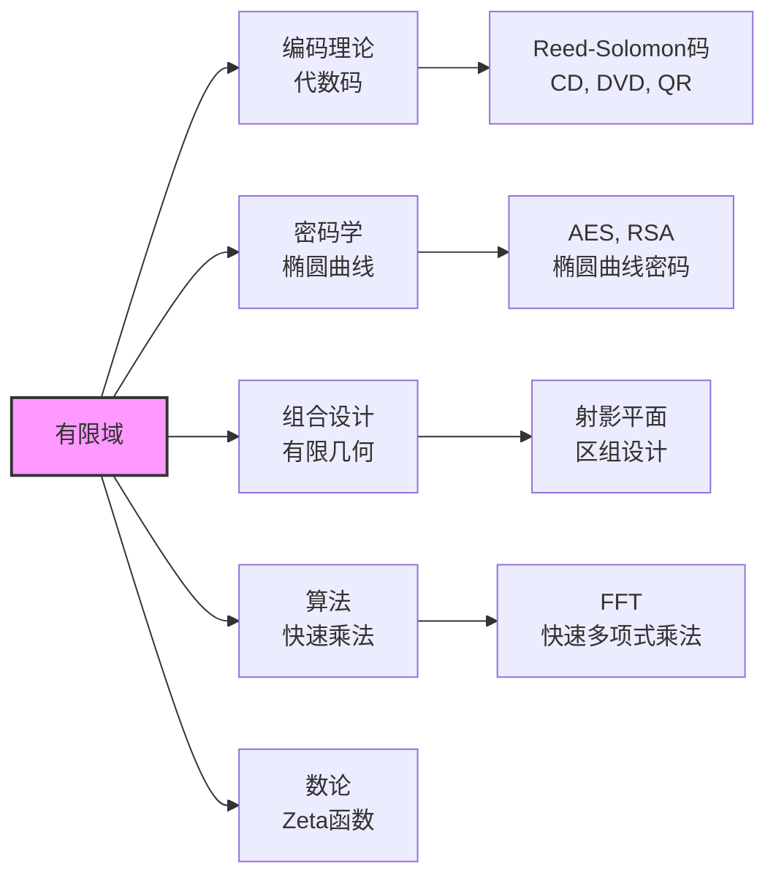

# 有限域结构推导

## 核心定理陈述

**有限域基本定理**：
1. 有限域的阶为 $p^n$（$p$ 素数，$n \geq 1$）
2. 对每个 $q = p^n$，存在唯一的（同构意义下）$q$ 元域 $\mathbb{F}_q$
3. $\mathbb{F}_{p^n}$ 是 $x^{p^n} - x$ 在 $\mathbb{F}_p$ 上的分裂域

---

## 推理树

```mermaid
graph TD
    A[有限域F] --> B[特征p<br/>素子域 ≅ Fₚ]
    B --> C[F是Fₚ-向量空间]
    C --> D[维数n<br/>[F:Fₚ] = n]
    D --> E[[F] = pⁿ<br/>F ≅ Fₚⁿ 作为向量空间]
    
    E --> F[乘法群F*<br/>pⁿ - 1阶]
    F --> G[F*循环<br/>有限域乘法群循环]
    G --> H[本原元存在<br/>F = Fₚα]
    
    I[x^{pⁿ} - x] --> J[在F中分裂<br/>Frobenius]
    J --> K[F包含所有根<br/>pⁿ个互异根]
    K --> L[根 = F的所有元素<br/>F是分裂域]
    
    L --> M[唯一性<br/>分裂域唯一]
    M --> N[存在性<br/>对每个pⁿ存在F_{pⁿ}]
    
    N --> O[构造<br/>Fₚ[x]/(f), f不可约deg n]
    O --> P[存在性证明<br/> counting argument]
    
    style E fill:#f9f,stroke:#333,stroke-width:2px
    style G fill:#bbf,stroke:#333,stroke-width:1px
    style M fill:#bbf,stroke:#333,stroke-width:1px

```

---

## 关键引理与证明

### 1. 有限域的特征与阶

**命题**：有限域 $F$ 的特征为素数 $p$，且 $|F| = p^n$。

**证明**：
- 特征：环同态 $\mathbb{Z} \to F$，核是素理想 $\Rightarrow$ 特征为素数 $p$
- 素子域：$\mathbb{F}_p = \mathbb{Z}/p\mathbb{Z} \hookrightarrow F$
- 向量空间：$F$ 是 $\mathbb{F}_p$-向量空间
- 若 $\dim_{\mathbb{F}_p} F = n$，则 $|F| = p^n$ ∎

### 2. 乘法群循环

**定理**：$\mathbb{F}_q^\times$ 是循环群（$q = p^n$）。

**证明**：

```mermaid
graph TD
    A[F_q*<br/>q-1阶] --> B[有限Abel群结构]
    B --> C[基本定理<br/>⊕ Z_{mᵢ}]
    C --> D[元素阶 = lcm(mᵢ)]
    D --> E[若非循环<br/>最大阶 < q-1]
    E --> F[多项式x^m - 1<br/>根数 > m]
    F --> G[矛盾<br/>域中根数≤次数]
    G --> H[结论: F_q*循环]
    
    style H fill:#f9f,stroke:#333,stroke-width:2px

```

- 设 $n = \max\{\text{ord}(a) : a \in \mathbb{F}_q^\times\}$
- 每个元素满足 $x^n = 1$
- 多项式 $x^n - 1$ 最多 $n$ 个根
- 故 $n \geq q - 1$，又 $n \mid q - 1$，所以 $n = q - 1$
- 存在 $q - 1$ 阶元，即生成元 ∎

### 3. 作为分裂域

**定理**：$\mathbb{F}_{p^n}$ 是 $x^{p^n} - x$ 在 $\mathbb{F}_p$ 上的分裂域。

**证明**：
- **根在域中**：对 $a \in \mathbb{F}_{p^n}$，由Frobenius自同构，$a^{p^n} = a$
- **互异性**：导数 $\frac{d}{dx}(x^{p^n} - x) = -1 \neq 0$，故无重根
- **恰好 $p^n$ 个根**，构成 $\mathbb{F}_{p^n}$ ∎

---

## Frobenius自同构

```mermaid
graph TD
    A[特征p] --> B[Frobenius映射<br/>φ: x ↦ xᵖ]
    B --> C[域同态<br/>(x+y)ᵖ = xᵖ + yᵖ]
    C --> D[自同构<br/>φ ∈ Gal(F_{pⁿ}/Fₚ)]
    
    D --> E[阶n<br/>φⁿ = id]
    E --> F[Gal(F_{pⁿ}/Fₚ) ≅ Cₙ<br/>循环群]
    
    G[子域对应] --> H[F_{pᵈ} ⊆ F_{pⁿ}<br/>⇔ d | n]

    H --> I[中间域个数<br/>= n的因子个数]
    
    style F fill:#f9f,stroke:#333,stroke-width:2px
    style H fill:#bbf,stroke:#333,stroke-width:1px

```

### Galois群结构

**定理**：$\text{Gal}(\mathbb{F}_{p^n}/\mathbb{F}_p) \cong \mathbb{Z}/n\mathbb{Z}$，由Frobenius生成。

**证明**：
- $\text{Gal}(\mathbb{F}_{p^n}/\mathbb{F}_p)$ 的阶为 $[\mathbb{F}_{p^n} : \mathbb{F}_p] = n$
- $\varphi^n(a) = a^{p^n} = a$，故 $\varphi^n = \text{id}$
- 若 $\varphi^k = \text{id}$，则 $a^{p^k} = a$ 对所有 $a$，故 $p^k \geq p^n$，$k \geq n$
- $\varphi$ 生成整个Galois群 ∎

---

## 子域格

```mermaid
graph TD
    F16[F₁₆] --> F4[F₄]
    F4 --> F2[F₂]
    
    F16 --> F4b[F₄]
    F4b --> F2
    
    subgraph 16 = 2⁴的因子
    4a[d=2] --> 2a[d=1]
    4b[d=2] --> 2a
    end
    
    F16 -.-> 4a
    F4 -.-> 4a
    F2 -.-> 2a

```

**子域定理**：$\mathbb{F}_{p^n}$ 的子域恰好是 $\mathbb{F}_{p^d}$，其中 $d \mid n$。

---

## 不可约多项式

```mermaid
graph TD
    A[F_q[x]] --> B[不可约多项式<br/>次数d | n]

    B --> C[本原多项式<br/>根是本原元]
    C --> D[构造F_{qⁿ}<br/>F_q[x]/(f)]
    
    E[计数公式] --> F[I_d = 1/d Σ μ(d/e)qᵉ]
    F --> G[次数d不可约<br/>首一多项式个数]
    
    H[应用] --> I[纠错码<br/>BCH, Reed-Solomon]
    H --> J[密码学<br/>AES的F_{2⁸}]
    H --> K[伪随机数<br/>LFSR]
    
    style D fill:#bbf,stroke:#333,stroke-width:1px

```

### 不可约多项式计数

**公式**：次数 $d$ 的首一不可约多项式个数为
$$I_d = \frac{1}{d} \sum_{e \mid d} \mu(d/e) q^e$$

**证明**：由 $x^{q^n} - x = \prod_{d \mid n} \prod_{\deg f = d} f(x)$ 比较次数。

---

## 应用网络



---

## 具体例子

### $\mathbb{F}_4$ 的构造

$$\mathbb{F}_4 = \mathbb{F}_2[x]/(x^2 + x + 1)$$

元素：$0, 1, \alpha, \alpha + 1$（其中 $\alpha^2 = \alpha + 1$）

乘法表：

| × | 1 | $\alpha$ | $\alpha + 1$ |
|---|-----|---------|-------------|
| 1 | 1 | $\alpha$ | $\alpha + 1$ |
| $\alpha$ | $\alpha$ | $\alpha + 1$ | 1 |
| $\alpha + 1$ | $\alpha + 1$ | 1 | $\alpha$ |

### $\mathbb{F}_8$ 与 $\mathbb{F}_{2^8}$

- $\mathbb{F}_8 = \mathbb{F}_2[x]/(x^3 + x + 1)$
- $\mathbb{F}_{2^8}$ 用于AES加密（字节运算）

---

## 参考

- Lidl & Niederreiter, *Introduction to Finite Fields and Their Applications*
- Dummit & Foote, Chapter 14.3
- Ireland & Rosen, *A Classical Introduction to Modern Number Theory*, Chapter 7
- Serre, *A Course in Arithmetic*
