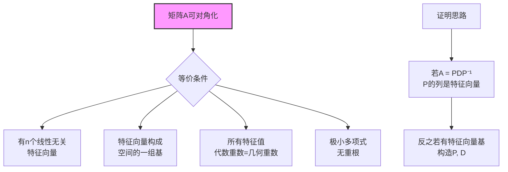

# 特征值与对角化链

## 核心概念

**特征值与特征向量**：设 $A$ 是 $n \times n$ 矩阵，若 $A\mathbf{v} = \lambda \mathbf{v}$（$\mathbf{v} \neq 0$），则 $\lambda$ 称为特征值，$\mathbf{v}$ 称为特征向量。

---

## 推理树

```mermaid
graph TD
    A[方阵A] --> B[特征多项式<br/>p(λ) = det(λI - A)]
    B --> C[特征值<br/>p(λ) = 0的根]
    C --> D[代数重数<br/>根的重数]
    
    D --> E[特征空间<br/>E_λ = Null(λI - A)]
    E --> F[几何重数<br/>dim E_λ]
    
    F --> G{对角化条件}
    G -->|充分必要| H[代数重数 = 几何重数<br/>对所有λ]
    
    H --> I[特征向量基<br/>n个线性无关]
    I --> J[A = PDP⁻¹<br/>P = [v₁...vₙ], D = diag(λᵢ)]
    
    K[对角化性质] --> L[Aᵏ = PDᵏP⁻¹]
    K --> M[e^A = Pe^DP⁻¹]
    K --> N[多项式f(A) = Pf(D)P⁻¹]
    
    O[特殊矩阵] --> P[实对称<br/>正交对角化]
    O --> Q[厄米特<br/>酉对角化]
    O --> R[正规矩阵<br/>谱定理]
    
    style J fill:#f9f,stroke:#333,stroke-width:2px
    style H fill:#bbf,stroke:#333,stroke-width:1px

```

---

## 特征值求解链

```mermaid
graph TD
    A[矩阵A] --> B[构造λI - A]
    B --> C[计算特征多项式<br/>det(λI - A)]
    C --> D[求特征值<br/>多项式求根]
    D --> E[对每个λ<br/>解(λI - A)v = 0]
    E --> F[特征空间<br/>Null空间的基]
    
    G[根的存在性] --> H[代数闭域<br/>ℂ上总有n个根]
    H --> I[实矩阵<br/>可能有复特征值]
    
    style D fill:#f9f,stroke:#333,stroke-width:2px

```

### 特征多项式详解

**定义**：$p_A(\lambda) = \det(\lambda I - A) = \lambda^n - c_1\lambda^{n-1} + \cdots + (-1)^n c_n$

**系数含义**：
- $c_1 = \text{tr}(A)$（迹）
- $c_n = \det(A)$
- $c_k =$ 所有 $k$ 阶主子式之和

**Cayley-Hamilton定理**：$p_A(A) = 0$（矩阵满足自己的特征方程）

---

## 对角化定理

### 充分必要条件



### 对角化步骤

1. **求特征值**：解 $\det(\lambda I - A) = 0$
2. **求特征向量**：对每个 $\lambda_i$，解 $(\lambda_i I - A)\mathbf{v} = 0$
3. **验证**：检查是否有 $n$ 个线性无关特征向量
4. **构造**：$P = [\mathbf{v}_1 \ \mathbf{v}_2 \ \cdots \ \mathbf{v}_n]$，$D = \text{diag}(\lambda_1, \ldots, \lambda_n)$

---

## 谱定理

```mermaid
graph TD
    A[正规矩阵<br/>AA* = A*A] --> B[谱定理<br/>酉对角化]
    B --> C[A = UDU*<br/>U酉矩阵, D对角]
    
    D[厄米特矩阵<br/>A = A*] --> E[特征值实数]
    F[酉矩阵<br/>A*A = I] --> G[特征值单位圆上]
    H[实对称<br/>A = Aᵀ] --> I[正交对角化<br/>A = QDQᵀ]
    
    J[谱分解] --> K[A = Σ λᵢPᵢ<br/>Pᵢ投影到E_{λᵢ}]
    
    style B fill:#f9f,stroke:#333,stroke-width:2px
    style I fill:#bbf,stroke:#333,stroke-width:1px

```

### 谱定理（厄米特情形）

**定理**：设 $A$ 是厄米特矩阵（$A = A^*$），则：
1. 所有特征值为实数
2. 不同特征值的特征向量正交
3. 存在酉矩阵 $U$ 使 $A = UDU^*$（$D$ 实对角）

**实对称情形**：$U$ 可取为实正交矩阵。

---

## Jordan标准形（不可对角化情形）

```mermaid
graph TD
    A[不可对角化<br/>几何重数<代数重数] --> B[广义特征空间<br/>Null((λI-A)^k)]
    B --> C[Jordan块<br/>J_kλ]
    C --> D[Jordan标准形<br/>分块对角]
    
    D --> E[J = diag(J_{k₁}λ₁, ...)]
    E --> F[A = PJP⁻¹]
    
    G[Jordan块结构] --> H[J_kλ = λI + N<br/>N幂零]
    H --> I[Jᵏ易算<br/>(λI+N)ᵏ展开]
    
    style D fill:#f9f,stroke:#333,stroke-width:2px

```

---

## 应用

```mermaid
graph LR
    EV[特征值/对角化] --> A[矩阵幂<br/>Aᵏ = PDᵏP⁻¹]
    EV --> B[微分方程<br/>x' = Ax]
    EV --> C[差分方程<br/>x_{n+1} = Axₙ]
    EV --> D[主成分分析<br/>PCA]
    EV --> E[PageRank<br/>Google]
    EV --> F[振动分析<br/>模态分析]
    
    B --> G[解 = e^{At}x₀<br/>谱分解]
    D --> H[协方差矩阵<br/>特征向量主成分]
    E --> I[转移矩阵<br/>Perron-Frobenius]
    
    style EV fill:#f9f,stroke:#333,stroke-width:2px

```

---

## 参考

- Horn & Johnson, *Matrix Analysis*, Chapter 1
- Strang, *Linear Algebra and Its Applications*, Chapter 6
- Axler, *Linear Algebra Done Right*, Chapters 5, 7
- Hoffman & Kunze, *Linear Algebra*, Chapter 6
