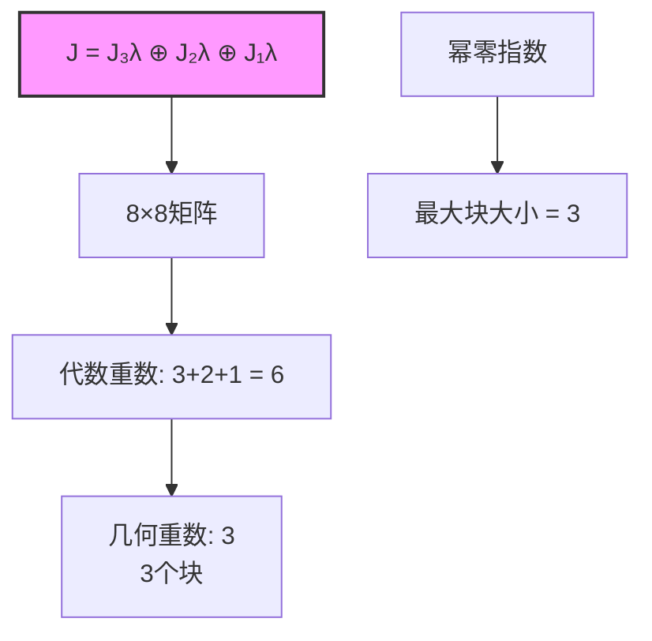

# Jordan标准形推导

## 核心定理陈述

**Jordan标准形定理**：设 $A$ 是复 $n \times n$ 矩阵，则存在可逆矩阵 $P$ 使得
$$J = P^{-1}AP = \text{diag}(J_{k_1}(\lambda_1), J_{k_2}(\lambda_2), \ldots, J_{k_m}(\lambda_m))$$
其中 $J_k(\lambda)$ 是 $k \times k$ Jordan块。

---

## 推理树

```mermaid
graph TD
    A[方阵A ∈ M_nℂ] --> B[特征多项式<br/>分解为线性因子]
    B --> C[特征值λ₁,...,λₛ<br/>代数重数mᵢ]
    
    C --> D[广义特征空间<br/>G_λ = Null((A-λI)^n)]
    D --> E[空间分解<br/>ℂⁿ = ⊕ G_{λᵢ}]
    
    E --> F[幂零算子<br/>N = A|G_λ - λI]

    F --> G[循环子空间<br/>⟨v, Nv, N²v, ...⟩]
    
    G --> H[循环基<br/>每个Jordan块对应]
    H --> I[Jordan块J_kλ<br/>k阶上三角]
    
    I --> J[Jordan标准形<br/>分块对角]
    J --> K[J = P⁻¹AP]
    
    L[唯一性] --> M[忽略块序<br/>唯一]
    M --> N[不变因子<br/>初等因子]
    
    style J fill:#f9f,stroke:#333,stroke-width:2px
    style E fill:#bbf,stroke:#333,stroke-width:1px

```

---

## Jordan块详解

### 定义

**$k$ 阶Jordan块**：
$$J_k(\lambda) = \begin{pmatrix} \lambda & 1 & & \\ & \lambda & 1 & \\ & & \ddots & 1 \\ & & & \lambda \end{pmatrix} = \lambda I_k + N_k$$

其中 $N_k$ 是幂零Jordan块（超对角线为1）。

### 幂零性质

```mermaid
graph TD
    A[N_k 幂零] --> B[N_k^k = 0]
    B --> C[(λI + N)^m<br/>二项式展开]
    C --> D[J_kλ^m 易算]
    
    E[几何重数] --> F[J_kλ的几何重数 = 1<br/>特征空间1维]
    F --> G[代数重数 = k]
    G --> H[可对角化 ⇔ k=1]

```

---

## 构造性证明

### 步骤1：广义特征空间分解

**命题**：$\mathbb{C}^n = \bigoplus_{i=1}^s G_{\lambda_i}$，其中 $G_\lambda = \ker((A - \lambda I)^n)$。

**证明**：
- 考虑 $A$ 的极小多项式 $m_A(x) = \prod (x - \lambda_i)^{d_i}$
- 由中国剩余定理，$V = \bigoplus \ker((A - \lambda_i I)^{d_i})$ ∎

### 步骤2：循环分解（幂零情形）

**引理**：设 $N$ 是幂零算子，则 $V$ 可分解为循环子空间的直和。

**证明思路**：

```mermaid
graph TD
    A[幂零N] --> B[选取v₁ ∉ Im N]
    B --> C[循环子空间<br/>W₁ = span{v₁, Nv₁, ...}]
    C --> D[V = W₁ ⊕ V']
    D --> E[对V'归纳]
    E --> F[V = ⊕ Wᵢ]
    
    style F fill:#f9f,stroke:#333,stroke-width:2px

```

### 步骤3：构造Jordan基

对每个特征值 $\lambda$：
1. 在 $G_\lambda$ 上，$N = A - \lambda I$ 幂零
2. 找到循环基：对每个循环子空间，基为 $\{v, Nv, N^2v, \ldots, N^{k-1}v\}$
3. Jordan基：$\{N^{k-1}v, \ldots, Nv, v\}$（反向）

---

## 唯一性定理

```mermaid
graph TD
    A[Jordan标准形唯一性] --> B[特征值多重集<br/>由特征多项式确定]
    A --> C[Jordan块大小<br/>由几何重数确定]
    
    C --> D[dim Ker(A-λI)ᵏ<br/>计算块数]
    D --> E[b_k = 2dim Ker(A-λI)ᵏ - dim Ker(A-λI)^{k+1} - dim Ker(A-λI)^{k-1}]
    E --> F[k阶Jordan块数]
    
    G[不变因子] --> H[有理标准形<br/>companion矩阵]
    H --> I[初等因子<br/>(x-λ)^k]
    I --> J[Jordan块 ↔ 初等因子]
    
    style A fill:#f9f,stroke:#333,stroke-width:2px

```

### 计数公式

**$k$ 阶Jordan块数**：
$$n_k(\lambda) = \text{rank}(A - \lambda I)^{k-1} - 2\cdot\text{rank}(A - \lambda I)^k + \text{rank}(A - \lambda I)^{k+1}$$

---

## 例子

### 例子1：单一特征值



### 例子2：具体计算

$$A = \begin{pmatrix} 2 & 1 & 0 \\ 0 & 2 & 1 \\ 0 & 0 & 2 \end{pmatrix} = J_3(2)$$

- 特征值：$\lambda = 2$（代数重数3）
- $A - 2I = N_3$，秩2，零度1
- 几何重数 = 1 < 3，不可对角化
- Jordan形就是自身

---

## 应用

```mermaid
graph LR
    J[Jordan标准形] --> A[矩阵函数<br/>f(A) = Pf(J)P⁻¹]
    J --> B[微分方程组<br/>x' = Ax]
    J --> C[差分方程<br/>x_{n+1} = Ax_n]
    J --> D[矩阵指数<br/>e^A]
    J --> E[控制理论<br/>能控性]
    
    A --> F[f(J_kλ) = f(λ)I + f'(λ)N + ...]
    B --> G[解 = e^{At}x₀]
    D --> H[e^{J_kλ} = e^λ e^{N}]
    
    style J fill:#f9f,stroke:#333,stroke-width:2px

```

### 矩阵函数计算

**公式**：若 $f$ 解析，则
$$f(J_k(\lambda)) = \begin{pmatrix} f(\lambda) & f'(\lambda) & \frac{f''(\lambda)}{2!} & \cdots \\ & f(\lambda) & f'(\lambda) & \ddots \\ & & \ddots & \ddots \\ & & & f(\lambda) \end{pmatrix}$$

---

## 有理标准形对比

```mermaid
graph TD
    A[有理标准形] --> B[任意域上存在]
    A --> C[Companion矩阵块]
    A --> D[不变因子<br/>d₁|d₂|...|d_k]
    
    E[Jordan标准形] --> F[代数闭域]
    F --> G[初等因子<br/>(x-λ)^k]
    G --> H[Jordan块]
    
    I[关系] --> J[代数闭域上<br/>两种形式等价]
    J --> K[Jordan = 初等因子分解<br/>有理 = 不变因子分解]
    
    style A fill:#bbf,stroke:#333,stroke-width:1px
    style E fill:#f9f,stroke:#333,stroke-width:2px

```

---

## 参考

- Hoffman & Kunze, *Linear Algebra*, Chapter 7
- Horn & Johnson, *Matrix Analysis*, Chapter 3
- Gantmacher, *The Theory of Matrices*
- Axler, *Linear Algebra Done Right*, Chapter 8
