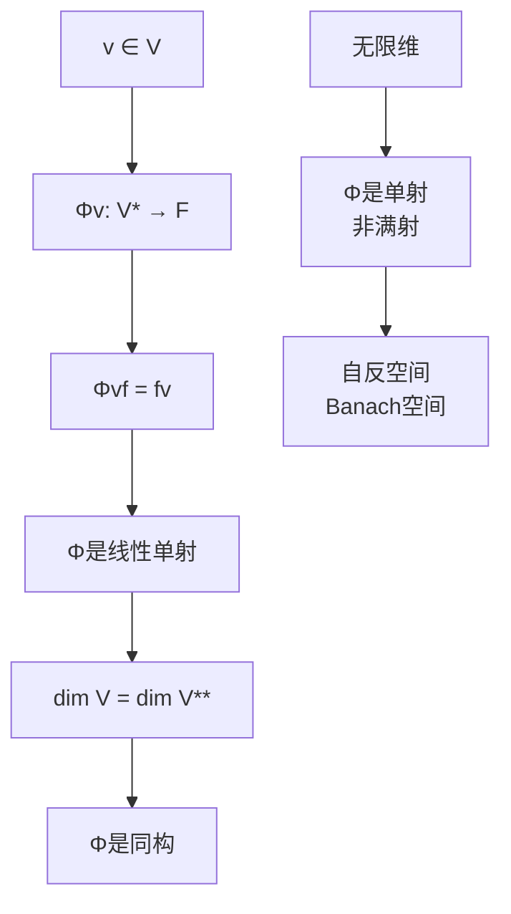
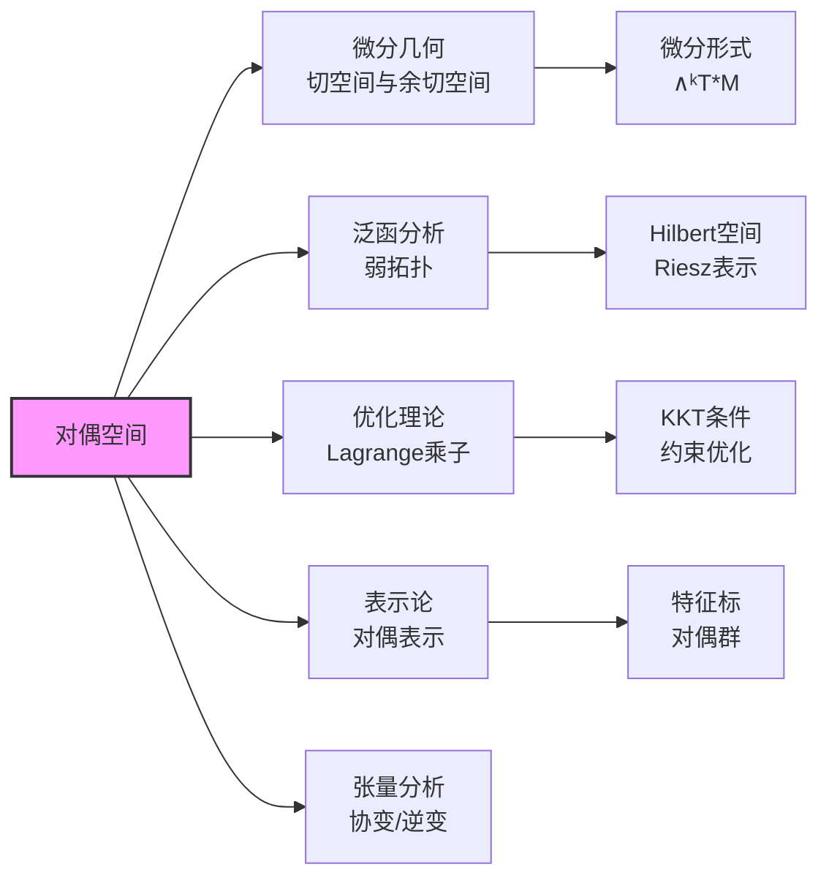

# 对偶空间理论

## 核心概念

**对偶空间**：设 $V$ 是域 $F$ 上的向量空间，**对偶空间** $V^* = \text{Hom}(V, F)$ 是所有线性泛函 $f: V \to F$ 的集合。

---

## 推理树

```mermaid
graph TD
    A[向量空间V] --> B[对偶空间V*<br/>线性泛函空间]
    B --> C[对偶基<br/>{fᵢ}, fᵢvⱼ = δᵢⱼ]
    
    C --> D[dim V* = dim V<br/>有限维情形]
    D --> E[V ≅ V**<br/>自然同构]
    
    F[线性映射T: V→W] --> G[转置T*: W*→V*<br/>T*g = g∘T]
    G --> H[矩阵转置<br/>对应对偶映射]
    
    I[子空间U ⊆ V] --> J[零化子U⁰<br/>= {f∈V*: f|ᵤ = 0}]

    J --> K[维数公式<br/>dim U + dim U⁰ = dim V]
    K --> L[U ↔ U⁰<br/>对应定理]
    
    M[应用] --> N[微分形式<br/>余切空间]
    M --> O[泛函分析<br/>分布理论]
    M --> P[优化<br/>Lagrange乘子]
    
    style B fill:#f9f,stroke:#333,stroke-width:2px
    style E fill:#bbf,stroke:#333,stroke-width:1px
    style K fill:#bbf,stroke:#333,stroke-width:1px

```

---

## 基本性质

### 1. 对偶基

**定理**：设 $\{v_1, \ldots, v_n\}$ 是 $V$ 的基，则存在唯一的对偶基 $\{f_1, \ldots, f_n\} \subseteq V^*$ 满足
$$f_i(v_j) = \delta_{ij} = \begin{cases} 1 & i = j \\ 0 & i \neq j \end{cases}$$

**证明**：定义 $f_i(\sum c_j v_j) = c_i$，验证线性性和唯一性 ∎

### 2. 自然同构 $V \cong V^{**}$

**定理**（有限维）：映射 $\Phi: V \to V^{**}$，$\Phi(v)(f) = f(v)$ 是同构。



---

## 转置映射

```mermaid
graph TD
    A[T: V → W] --> B[T*: W* → V*]
    B --> C[T*g = g∘T]
    
    C --> D[函子性<br/>(ST)* = T*S*]
    D --> E[id* = id]
    
    F[矩阵表示] --> G[T的矩阵A]
    G --> H[T*的矩阵Aᵀ]
    H --> I[转置对应<br/>对偶映射]
    
    J[核与像] --> K[Ker T* = Im T⁰<br/>零化子]
    K --> L[rank T = rank T*]
    
    style B fill:#f9f,stroke:#333,stroke-width:2px

```

### 转置性质

| 性质 | 公式 |
|-----|------|
| $(S + T)^*$ | $S^* + T^*$ |
| $(cT)^*$ | $cT^*$ |
| $(ST)^*$ | $T^*S^*$ |
| $(T^{-1})^*$ | $(T^*)^{-1}$ |
| $\text{rank}(T^*)$ | $\text{rank}(T)$ |

---

## 零化子理论

### 定义与基本性质

**定义**：设 $U \subseteq V$ 是子空间，**零化子**为
$$U^0 = \{f \in V^* : f(u) = 0, \forall u \in U\}$$

**性质**：
1. $U^0$ 是 $V^*$ 的子空间
2. $U_1 \subseteq U_2 \Rightarrow U_2^0 \subseteq U_1^0$（反序）
3. $(U_1 + U_2)^0 = U_1^0 \cap U_2^0$
4. $(U_1 \cap U_2)^0 = U_1^0 + U_2^0$

### 维数公式

**定理**：$\dim U + \dim U^0 = \dim V$

**证明**：
- 限制映射 $\rho: V^* \to U^*$，$\rho(f) = f|_U$

- $\ker \rho = U^0$
- $\dim V^* = \dim U^* + \dim U^0$
- 即 $\dim V = \dim U + \dim U^0$ ∎

---

## 子空间对应定理

```mermaid
graph TD
    A[子空间格] --> B[U ↦ U⁰<br/>V*的子空间]
    B --> C[反序同构<br/>对偶格]
    
    C --> D[双重零化<br/>U⁰⁰ ≅ U在V**中]
    D --> E[U₁ ⊆ U₂ ↔ U₂⁰ ⊆ U₁⁰]
    
    F[商空间] --> G[(V/U)* ≅ U⁰]
    F --> H[U* ≅ V*/U⁰]
    
    style B fill:#f9f,stroke:#333,stroke-width:2px

```

### 同构公式

**定理**：
1. $(V/U)^* \cong U^0$
2. $U^* \cong V^*/U^0$

**证明**（第一部分）：
- 定义 $\Phi: (V/U)^* \to U^0$，$\Phi(f)(v) = f(v + U)$
- 良定：若 $v \in U$，则 $f(v + U) = f(0) = 0$
- 同构验证：线性、单射、满射 ∎

---

## 应用网络



### 应用1：微分几何

**余切空间**：流形 $M$ 上点 $p$ 的余切空间 $T_p^*M = (T_pM)^*$

**微分形式**：$\omega \in \Omega^k(M) = \Gamma(\Lambda^k T^*M)$

### 应用2：优化理论

**Lagrange乘子**：约束优化
$$\min f(x) \quad \text{s.t.} \quad g(x) = 0$$

最优性条件：$\nabla f = \lambda \nabla g$（$\lambda$ 是 $g$ 值空间的对偶变量）

---

## 内积空间中的对偶

```mermaid
graph TD
    A[内积空间V] --> B[Riesz表示<br/>Φ: V → V*]
    B --> C[Φᵥ(w) = ⟨v,w⟩]
    C --> D[等距同构<br/>V ≅ V*]
    
    D --> E[实空间<br/>同构自然]
    D --> F[复空间<br/>反线性]
    
    G[正交补] --> H[U⊥ = {v: ⟨v,u⟩=0, ∀u∈U}]
    H --> I[U⊥ ≅ U⁰<br/>通过Riesz]
    
    style B fill:#f9f,stroke:#333,stroke-width:2px

```

### Riesz表示定理

**定理**：设 $V$ 是有限维内积空间，则映射 $\Phi: V \to V^*$，$\Phi(v)(w) = \langle v, w \rangle$ 是（反线性）同构。

---

## 张量积视角

```mermaid
graph TD
    A[V ⊗ W*] --> B[Hom(V,W)<br/>线性映射空间]
    A --> C[V* ⊗ W*<br/>=(V⊗W)*]
    
    D[秩1张量] --> E[v⊗f<br/>秩1算子]
    E --> F[矩阵秩<br/>秩分解]
    
    G[对偶配对] --> H[V × V* → F]
    H --> I[自然收缩<br/>缩并]
    
    style B fill:#bbf,stroke:#333,stroke-width:1px

```

---

## 参考

- Hoffman & Kunze, *Linear Algebra*, Chapter 3
- Axler, *Linear Algebra Done Right*, Chapter 3, 6
- Lang, *Algebra*, Chapter XIII
- Treves, *Topological Vector Spaces, Distributions and Kernels*
