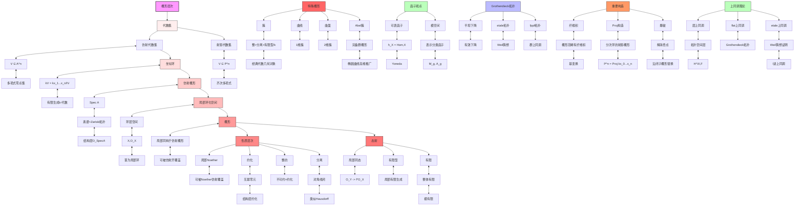

# 概形构造层次推理树

## 概述

本推理树展示从仿射代数集到概形的严格层次构造，以及各类概形的性质关系。

## 推理树

## 构造层次详解

### 1. 仿射代数集
- 定义：kⁿ 中多项式的零点集
- 坐标环：k[V] = k[x₁,...,xₙ]/I(V)

### 2. 仿射概形 Spec A
- 底空间：A 的素理想集合
- 拓扑：Zariski拓扑
- 结构层：O_{Spec A}(D(f)) = A_f

### 3. 概形
- 局部同构于仿射概形
- 可被仿射开子集覆盖
- 态射是局部环化空间的态射

### 4. 分离性
- 对角线 Δ: X → X × X 是闭浸入
- 类似拓扑空间的 Hausdorff 条件
- 保证纤维积的良好行为

## 重要概形类型

| 概形类型 | 定义 | 例子 |
|----------|------|------|
| 簇 | 整的+分离+有限型 | 光滑射影曲线 |
| Abel簇 | 完备群概形 | 椭圆曲线、Jacobi簇 |
| 曲线 | 1维整概形 | ℙ¹、椭圆曲线 |
| 曲面 | 2维整概形 | K3曲面、Del Pezzo |

## 核心定理

1. **Serre定理**: 仿射概形 ⇔ 拟凝聚层上同调消失
2. **Chevalley定理**: 有限型态射保持局部有限性
3. **Zariski主定理**: 拟有限的分离态射可分解

---
*生成时间: 2026年4月*
*领域: 代数几何 / 概形理论*
