msc_primary: "00A99"
msc_secondary: ['00-XX']
---

# 层上同调推导推理树

## 概述

本推理树展示层上同调理论的构造，从层论基础到导出函子上同调，以及重要应用。

## 推理树

```mermaid
graph TD
    A[层上同调] --> B[层论基础]
    B --> B1[预层]<-->B2[F: OpenX^op -> Set/Ab/Ring]
    B1 --> B3[层公理]<-->B4[局部决定整体]<-->B5[粘接唯一]
    B3 --> B6[层化]<-->B7[左伴随: PSh -> Sh]<-->B8[F^+]
    
    B --> C[茎与芽]<-->C1[F_x = colim_FU]<-->C2[x∈U]<-->C3[局部信息]
    C --> C4[芽空间]<-->C5[etale空间]<-->C6[拓扑构造]
    
    D[层运算] --> D1[核与余核]<-->D2[Abel层范畴是Abel]
    D --> D3[正合列]<-->D4[ stalk-wise正合]
    D --> D5[张量积与Hom]<-->D6[F⊗G, HomF,G]<-->D7[内Hom]
    
    E[上同调构造] --> E1[整体截面函子]<-->E2[ΓX: ShX -> Ab]<-->E3[F -> ΓXF = FX]
    E1 --> E4[左正合]<-->E5[保持核不保持余核]
    
    E4 --> F[导出函子]<-->F1[H^iX,F = R^iΓXF]<-->F2[内射分解]
    F --> F3[内射层]<-->F4[软层Flasque]<-->F5[松散层]<-->F6[零调对象]
    
    G[计算方法] --> G1[Cech上同调]<-->G2[H^~U,F]<-->G3[开覆盖]
    G1 --> G4[与导出上同调比较]<-->G5[仿射概形: 一致]
    G --> G6[acyclic分解]<-->G7[足够好的层]
    
    H[长正合列] --> H1[0->F'->F->F''->0]<-->H2[...->H^iF'->H^iF->H^iF''->H^i+1F'->...]
    H --> I[连接同态]<-->I1[边界映射]<-->I2[几何意义: 障碍]
    
    J[重要定理] --> J1[Grothendieck消失]<-->J2[H^i=0 for i>dim X]<-->J3[Noether空间]
    J --> J4[Serre仿射判定]<-->J5[X仿射 <=> H^iF=0 ∀i>0, F拟凝聚]
    J --> J6[Serre对偶]<-->J7[H^iX,F^∨ ≅ H^n-iX,ω⊗F^*]<-->J8[完备光滑n维]
    
    K[具体计算] --> K1[常值层]<-->K2[H^0=Γ, H^1=局部常值障碍]<-->K3[H^i=奇异上同调]
    K --> K4[结构层]<-->K5[仿射: H^i=0 i>0]<-->K6[射影: 按次数分解]
    K --> K7[局部自由层]<-->K8[向量丛的截面]
    
    L[应用] --> L1[Riemann-Roch]<-->L2[χF = Σ-1^i dim H^iF]<-->L3[Euler示性数]
    L --> L4[曲线分类]<-->L5[模空间构造]<-->L6[M_g的射影性]
    L --> L7[Weil猜想]<-->L8[etale上同调]<-->L9[Deligne证明]
    
    M[谱序列] --> M1[Leray谱序列]<-->M2[H^iY, R^jf*F => H^i+jX,F]<-->M3[f: X->Y]
    M --> M4[局部-整体谱序列]<-->M5[Ext]<-->M6[Ext^iF,G]
    M --> M7[Grothendieck谱序列]<-->M8[复合函子的导出]
    
    style A fill:#f9f,stroke:#333,stroke-width:2px
    style B fill:#bbf,stroke:#333
    style C fill:#fbb,stroke:#333
    style D fill:#bfb,stroke:#333
    style E fill:#bfb,stroke:#333
    style F fill:#f96,stroke:#333
    style G fill:#bfb,stroke:#333
    style H fill:#f96,stroke:#333
    style I fill:#fbb,stroke:#333
    style J fill:#f96,stroke:#333
    style K fill:#bfb,stroke:#333
    style L fill:#f96,stroke:#333
    style M fill:#f66,stroke:#333

```



## 层上同调详解

### 1. 整体截面函子

```

Γ(X, -): Sh(X) → Ab
F ↦ F(X) = Γ(X, F)

```

- 左正合函子
- 保持单射，不保持满射

### 2. 导出函子定义

```

H^i(X, F) = R^i Γ(X, F)

```

通过内射分解计算：

```

0 → F → I⁰ → I¹ → I² → ...
H^i(X, F) = ker(Iⁱ(X) → Iⁱ⁺¹(X)) / im(Iⁱ⁻¹(X) → Iⁱ(X))

```

### 3. 零调对象
- **内射层**: 右导出函子的标准零调对象
- **软层(Flasque)**: 限制映射满射
- **松散层**: 限制到开集满射
- 都是 Γ-零调：H^i(X, F) = 0 (i>0)

## 核心定理

### Serre仿射判定定理
X 是仿射概形 ⟺ H^i(X, F) = 0 对所有 i>0 和拟凝聚层 F 成立

### Grothendieck消失定理
对于 n 维 Noether 拓扑空间，H^i(X, F) = 0 对 i > n 成立

### Serre对偶定理
对于 n 维完备光滑簇：

```

H^i(X, F)^∨ ≅ H^{n-i}(X, ω_X ⊗ F^*)

```

## Cech上同调

对于开覆盖 U = {U_i}：

```

H̃^i(U, F) = ker(δ: C^i → C^{i+1}) / im(δ: C^{i-1} → C^i)

```

在仿射概形上，Čech上同调与导出上同调一致。

## 应用

1. **Riemann-Roch定理**: 通过上同调计算Euler示性数
2. **曲线模空间**: 层上同调构造 M_g
3. **Weil猜想**: etale上同调作为工具

---
*生成时间: 2026年4月*
*领域: 代数几何 / 同调方法*
