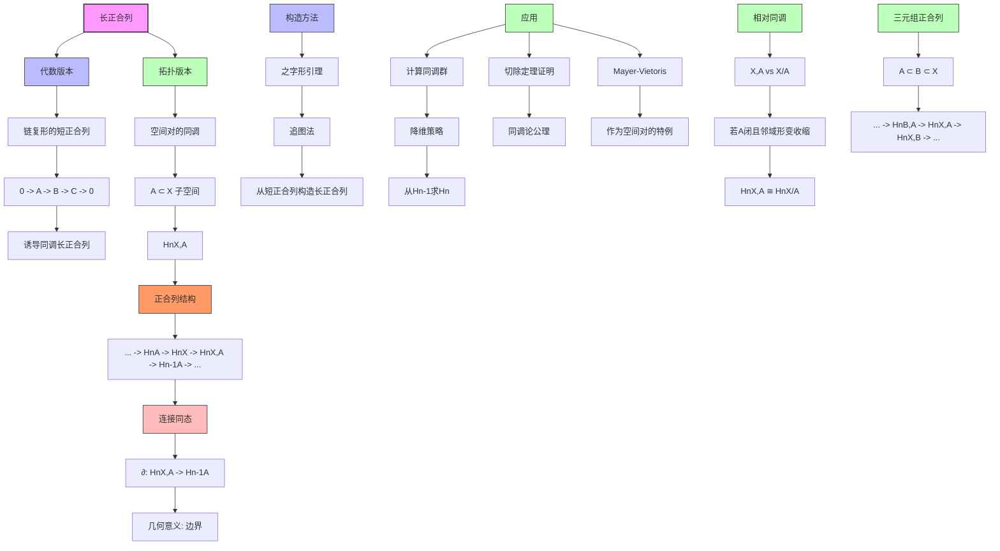

# 同调群长正合列推理树

## 概述

本推理树展示同调代数中长正合列的构造，以及它在代数拓扑中的重要应用。

## 推理树



## 长正合列详解

### 代数版本

给定链复形的短正合列：
```
0 -> A• -> B• -> C• -> 0
```

诱导同调长正合列：
```
... -> Hn(A) -> Hn(B) -> Hn(C) -> Hn-1(A) -> Hn-1(B) -> ...
```

### 拓扑版本：空间对的同调

对于空间对 (X, A)，有长正合列：
```
... -> Hn(A) -> Hn(X) -> Hn(X,A) -> Hn-1(A) -> ...
```

其中：
- Hn(A) -> Hn(X) 是包含映射诱导
- Hn(X) -> Hn(X,A) 是相对化映射
- ∂: Hn(X,A) -> Hn-1(A) 是连接同态

### 连接同态的几何意义

对于相对闭链 [c] ∈ Hn(X,A)：
- ∂[c] = [∂c] ∈ Hn-1(A)
- 几何上就是取边界（落在A中）

## 应用

### 1. 计算策略
- 利用短正合列降维计算
- 已知 Hn-1(A) 可推出 Hn(X,A)

### 2. 重要推论
- 若 A ↪ X 诱导同构，则 Hn(X,A) = 0
- 若 X 可缩，则 Hn(X,A) ≅ Hn-1(A)

### 3. 三元组正合列
对于 A ⊂ B ⊂ X：
```
... -> Hn(B,A) -> Hn(X,A) -> Hn(X,B) -> Hn-1(B,A) -> ...
```

---
*生成时间: 2026年4月*
*领域: 代数拓扑 / 同调代数*
