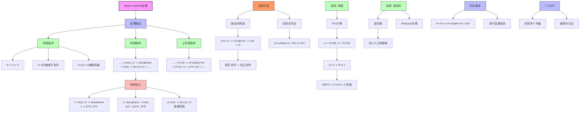

# Mayer-Vietoris序列推理树

## 概述

本推理树展示Mayer-Vietoris序列的推导与应用，这是计算同调群最重要的工具之一。

## 推理树



## 定理详解

### Mayer-Vietoris正合列

设 X = U ∪ V，其中 U, V 是开集（或子复形），则存在长正合列：

```
... -> Hn(U∩V) -> Hn(U)⊕Hn(V) -> Hn(X) -> Hn-1(U∩V) -> ...
```

**映射说明**：
- `i*: Hn(U∩V) -> Hn(U)⊕Hn(V)`，x ↦ (iᵤ*(x), iᵥ*(x))
- `j*: Hn(U)⊕Hn(V) -> Hn(X)`，(a,b) ↦ jᵤ*(a) - jᵥ*(b)
- `∂: Hn(X) -> Hn-1(U∩V)`：连接同态

### 上同调版本

```
... -> H^n(X) -> H^n(U)⊕H^n(V) -> H^n(U∩V) -> H^{n+1}(X) -> ...
```

## 应用实例

### 1. 球面同调
- U = Sⁿ \ {北极}, V = Sⁿ \ {南极}
- U ∩ V ≃ Sⁿ⁻¹
- 归纳证明 Hₖ(Sⁿ) = ℤ (k=0,n)，否则 0

### 2. 实射影空间
- 分解为 RPⁿ = Dⁿ ∪ RPⁿ⁻¹
- 利用 MV 序列归纳计算

### 3. 亏格 g 曲面
- 分解为两个带边曲面
- 计算 H₁ 和 H₂

## 计算策略

1. **分解空间**: 将复杂空间分解为简单部分
2. **利用已知**: U,V,U∩V 的同调已知或可计算
3. **正合性**: 利用正合列追图求未知群
4. **降维**: 从高维同调求低维同调

---
*生成时间: 2026年4月*
*领域: 代数拓扑 / 同调计算*
