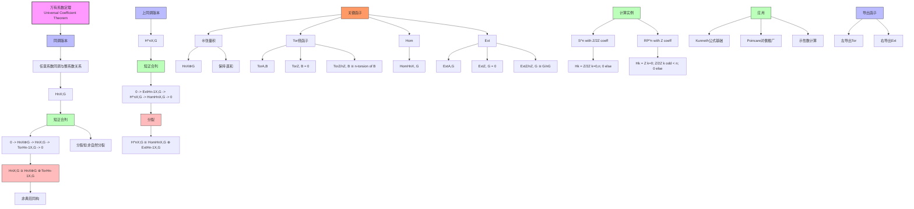

msc_primary: "00A99"
msc_secondary: ['00-XX']
---

# 万有系数定理推理树

## 概述

本推理树展示万有系数定理的结构，它建立了整系数同调与任意系数同调之间的关系。

## 推理树



## 定理详解

### 同调万有系数定理

对于拓扑空间 X 和 Abel 群 G，存在自然的短正合列：

```

0 -> Hn(X)⊗G -> Hn(X;G) -> Tor(Hn-1(X), G) -> 0

```

该序列分裂（非自然分裂），因此：

```

Hn(X;G) ≅ Hn(X)⊗G ⊕ Tor(Hn-1(X), G)

```

### 上同调万有系数定理

```

0 -> Ext(Hn-1(X), G) -> H^n(X;G) -> Hom(Hn(X), G) -> 0

```

分裂，因此：

```

H^n(X;G) ≅ Hom(Hn(X), G) ⊕ Ext(Hn-1(X), G)

```

## 关键函子

### Tor 函子（左导出）
- Tor(ℤ, B) = 0
- Tor(ℤ/nℤ, B) ≅ {b ∈ B : nb = 0}（n-挠子群）
- 挠子群间的关系

### Ext 函子（右导出）
- Ext(ℤ, G) = 0
- Ext(ℤ/nℤ, G) ≅ G/nG
- 测量同态扩张的障碍

## 应用

1. **Z/2Z 系数**: 常用于流形理论
2. **有理系数**: 消除挠，Hn(X;ℚ) ≅ Hn(X)⊗ℚ
3. **Kunneth公式**: 乘积空间同调计算基础

---
*生成时间: 2026年4月*
*领域: 代数拓扑 / 同调代数*
