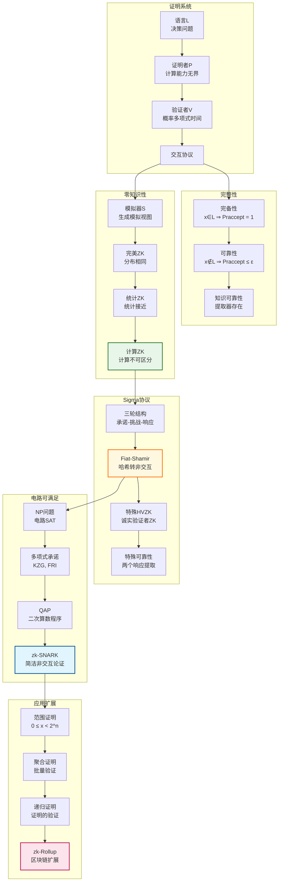

# 零知识证明理论推导链

## 概述
本推理树展示零知识证明（ZKP）的完整数学理论，包括交互证明系统、知识可靠性、零知识性、Sigma协议、zk-SNARK等核心内容。

---

## 推理树



---

## 核心推导详解

### 第一步：交互证明系统

**定义**：语言 $L$ 的交互证明系统是一对算法 $(P, V)$：
- $P$（证明者）：计算能力无限制
- $V$（验证者）：概率多项式时间（PPT）

通过多轮消息交换，$V$ 最终输出接受或拒绝。

**复杂性类IP**：存在交互证明系统的语言类。

**定理（Shamir, 1992）**：$IP = PSPACE$

### 第二步：零知识定义

**视图（View）**：验证者在协议执行中看到的所有信息：
$$\text{View}_V(P(x), V(x)) = (r, m_1, m_2, \ldots)$$

其中 $r$ 为 $V$ 的随机数，$m_i$ 为消息。

**零知识类型**：

| 类型 | 定义 | 强度 |
|------|------|------|
| 完美ZK | 模拟分布与真实分布完全相同 | 最强 |
| 统计ZK | 统计距离可忽略 | 中 |
| 计算ZK | 计算不可区分 | 最常用 |

**模拟器**：PPT算法 $S$，对 $x \in L$：
$$S(x) \approx \text{View}_V(P(x), V(x))$$

### 第三步：Graph Isomorphism的ZK证明

**问题**：给定图 $G_0, G_1$，证明者知道同构 $\phi: G_0 \to G_1$。

**协议**：
1. $P$ 随机选择 $H = \pi(G_0)$，发送 $H$（承诺）
2. $V$ 随机选择 $b \in \{0, 1\}$，发送 $b$（挑战）
3. $P$ 发送 $\sigma$ 使得 $H = \sigma(G_b)$（响应）
4. $V$ 验证 $H = \sigma(G_b)$

**零知识性**：

模拟器 $S$：
1. 猜测 $b' \in \{0, 1\}$
2. 随机选择 $\sigma$，计算 $H = \sigma(G_{b'})$
3. 若 $b' = b$，输出视图；否则重试

成功概率 $1/2$，期望2次尝试。

### 第四步：Sigma协议

**结构**（三轮）：
```
P                    V
|  承诺 t = g(r)     |
|------------------->|
|     挑战 c         |
|<-------------------|
|   响应 s = f(r,c)  |
|------------------->|
|                验证V(t,c,s)
```

**性质**：
1. **完备性**：诚实验证者总是接受
2. **特殊可靠性**：给定两个有效响应 $(c, s)$ 和 $(c', s')$，可提取见证
3. **特殊诚实验证者ZK（SHVZK）**：存在模拟器对给定 $c$ 生成不可区分视图

**Fiat-Shamir变换**：

将公共随机挑战 $c$ 替换为哈希函数：
$$c = H(x, t)$$

得到非交互零知识证明（NIZK）。

### 第五步：知识可靠性

**定义**：证明者"知道"见证，如果存在提取器 $E$ 可从 $P$ 中提取见证。

**提取器构造**（ rewinding 技术）：

1. 运行协议得到 $(t, c, s)$
2. 回滚到挑战步骤，重新选择 $c'$
3. 得到另一响应 $s'$
4. 从 $(s, s')$ 计算见证

**可靠性**：若 $P$ 能以不可忽略概率使 $V$ 接受，则 $E$ 能以高概率提取见证。

### 第六步：zk-SNARK基础

**zk-SNARK**：零知识简洁非交互知识论证

- **零知识**：隐藏见证
- **简洁**：证明大小、验证时间与见证大小无关
- **非交互**：单条消息
- **论证**：计算安全性（vs 证明的信息论安全性）

**构造路线**：

1. **电路可满足性（Circuit SAT）**：
   - 将NP问题转化为算术电路
   
2. **QAP（Quadratic Arithmetic Program）**：
   - 多项式表示电路约束
   
3. **多项式承诺**：
   - KZG承诺（基于双线性对）
   - FRI（基于哈希，透明设置）

**Pinocchio协议框架**：

- 证明者承诺满足电路的见证多项式
- 验证者检查多项式等式在随机点成立
- 使用双线性对高效验证

### 第七步：zk-SNARK构建块

**算术电路**：
- 乘法门：$z = x \cdot y$
- 加法门：$z = x + y$（线性，免费）

**QAP构造**：

对电路 $C$ 有 $n$ 个输入和 $m$ 个门，构造多项式：
$$A(x), B(x), C(x), Z(x)$$

使得：
$$A(x) \cdot B(x) - C(x) = H(x) \cdot Z(x)$$

当且仅当见证满足电路时成立。

**验证等式**：
$$e(\pi_1, \pi_2) = e(g^{v(s)}, h) \cdot e(\pi_3, h^{\alpha})$$

其中 $e$ 为双线性对，$s, \alpha$ 为 toxic waste（需安全删除）。

---

## 零知识证明类型对比

| 类型 | 证明大小 | 验证时间 | 设置 | 量子安全 |
|------|----------|----------|------|----------|
| Sigma协议 | $O(n)$ | $O(n)$ | 无需 | 部分 |
| zk-SNARK | $O(1)$ | $O(1)$ | 可信 | 否 |
| zk-STARK | $O(\log^2 n)$ | $O(\log^2 n)$ | 透明 | 是 |
| Bulletproofs | $O(\log n)$ | $O(n)$ | 无需 | 否 |

---

## 依赖关系图

```
计算复杂性理论 ← NP, PSPACE
    ↓
交互证明系统 ← 随机性
    ↓
零知识定义 ← 模拟范式
    ↓
Sigma协议 ← 特殊结构
    ↓
Fiat-Shamir ← 随机预言机
    ↓
zk-SNARK ← 配对密码学
    ↓
实际应用 ← 区块链、隐私
```

---

## 关键定理汇总

| 定理 | 内容 | 意义 |
|------|------|------|
| Shamir | $IP = PSPACE$ | 交互证明威力 |
| GMW | 所有NP问题有ZK证明 | 零知识普遍性 |
| Fiat-Shamir | HVZK → NIZK | 非交互化 |
| Pinocchio | 实用zk-SNARK | 实际部署 |

---

## 参考

- Goldwasser, S., Micali, S., & Rackoff, C. (1989). "The Knowledge Complexity of Interactive Proof Systems"
- Goldreich, O., Micali, A., & Wigderson, A. (1991). "Proofs that Yield Nothing but their Validity"
- Fiat, A. & Shamir, A. (1986). "How to Prove Yourself"
- Gennaro, R., et al. (2013). "Quadratic Span Programs and Succinct NIZKs without PCPs"
- Ben-Sasson, E., et al. (2018). "Scalable, transparent, and post-quantum secure computational integrity"

---

*生成时间：2026年4月*
