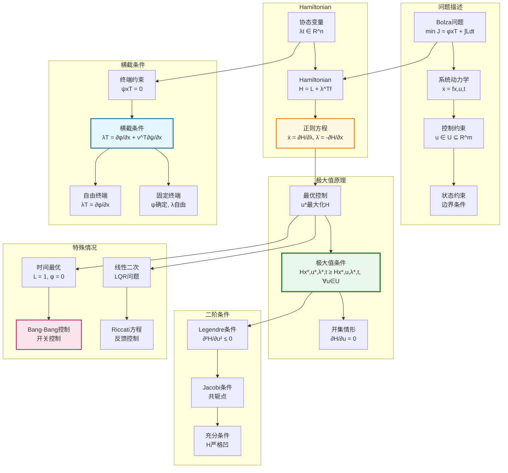

# 最优控制Pontryagin原理推导链

## 概述
本推理树展示Pontryagin极大值原理的数学基础，包括变分法、Hamiltonian系统、最优性必要条件、横截条件等核心内容。

---

## 推理树



---

## 核心推导详解

### 第一步：最优控制问题描述

**Bolza问题**：
$$\min_{u} J = \phi(x(t_f), t_f) + \int_{t_0}^{t_f} L(x(t), u(t), t)dt$$

约束：
- 动力学：$\dot{x} = f(x, u, t)$
- 控制约束：$u(t) \in U \subseteq \mathbb{R}^m$
- 边界条件：$x(t_0) = x_0$，$\psi(x(t_f), t_f) = 0$

**问题分类**：
- Lagrange问题：$\phi = 0$
- Mayer问题：$L = 0$
- Bolza问题：一般形式

### 第二步：Hamiltonian系统

**Hamiltonian函数**：
$$H(x, u, \lambda, t) = L(x, u, t) + \lambda^T f(x, u, t)$$

其中 $\lambda(t) \in \mathbb{R}^n$ 为协态（costate）变量。

**正则方程（Canonical Equations）**：
$$\dot{x} = \frac{\partial H}{\partial \lambda} = f(x, u, t)$$
$$\dot{\lambda} = -\frac{\partial H}{\partial x} = -\frac{\partial L}{\partial x} - \lambda^T \frac{\partial f}{\partial x}$$

**物理意义**：
- $\lambda$ 可理解为"影子价格"或敏感度
- 协态方程描述最优轨道的伴随演化

### 第三步：Pontryagin极大值原理

**定理（Pontryagin极大值原理, 1962）**：

设 $u^*(t)$ 为最优控制，$x^*(t)$ 为对应最优轨道，则存在协态 $\lambda^*(t)$ 使得：

1. **状态方程**：$\dot{x}^* = \frac{\partial H}{\partial \lambda}$
2. **协态方程**：$\dot{\lambda}^* = -\frac{\partial H}{\partial x}$
3. **极大值条件**：$H(x^*, u^*, \lambda^*, t) \geq H(x^*, u, \lambda^*, t), \quad \forall u \in U$
4. **横截条件**：$\lambda^*(t_f) = \frac{\partial \phi}{\partial x} + \nu^T \frac{\partial \psi}{\partial x}$

**证明概要**（针状变分）：
1. 构造针状控制变分：$u_\epsilon(t) = v$ 在 $[\tau, \tau+\epsilon]$，否则为 $u^*$
2. 计算性能指标变分 $\Delta J$
3. 最优性要求 $\Delta J \geq 0$
4. 导出Hamiltonian在 $u^*$ 处取极大

### 第四步：横截条件详解

**终端约束分类**：

| 终端条件 | 横截条件 | 说明 |
|----------|----------|------|
| 自由终端 | $\lambda(t_f) = \frac{\partial \phi}{\partial x}$ | 无约束 |
| 固定终端 | $\psi(x(t_f)) = x(t_f) - x_f = 0$ | $\lambda(t_f)$ 自由 |
| 一般约束 | $\psi(x(t_f)) = 0$ | $\lambda(t_f) = \frac{\partial \phi}{\partial x} + \nu^T \frac{\partial \psi}{\partial x}$ |

**自由终端时间**：若 $t_f$ 自由，则额外条件：
$$H(x^*(t_f), u^*(t_f), \lambda^*(t_f), t_f) + \frac{\partial \phi}{\partial t_f} + \nu^T \frac{\partial \psi}{\partial t_f} = 0$$

### 第五步：开集控制情形

若 $U = \mathbb{R}^m$（开集），则极大值条件等价于：

$$\frac{\partial H}{\partial u} = 0$$

**二阶必要条件（Legendre-Clebsch条件）**：
$$\frac{\partial^2 H}{\partial u^2} \leq 0$$

（对极大化问题；最小化问题则要求 $\geq 0$）

### 第六步：时间最优控制

**问题描述**：
$$\min J = \int_0^{t_f} 1 \cdot dt = t_f$$

约束：$\dot{x} = f(x) + g(x)u$，$|u_i| \leq 1$

**Hamiltonian**：
$$H = 1 + \lambda^T(f(x) + g(x)u)$$

**Bang-Bang控制**：
$$u^*_i = \text{sgn}(\lambda^T g_i(x))$$

控制仅在开关函数 $\lambda^T g_i(x) = 0$ 时切换。

### 第七步：线性二次调节器（LQR）

**问题**：
$$\min J = \frac{1}{2}x^T(t_f)Sx(t_f) + \frac{1}{2}\int_0^{t_f}(x^TQx + u^TRu)dt$$

约束：$\dot{x} = Ax + Bu$

**Hamiltonian**：
$$H = \frac{1}{2}(x^TQx + u^TRu) + \lambda^T(Ax + Bu)$$

**最优控制**：
$$\frac{\partial H}{\partial u} = Ru + B^T\lambda = 0 \Rightarrow u^* = -R^{-1}B^T\lambda$$

**假设**：$\lambda(t) = P(t)x(t)$，导出Riccati方程：
$$\dot{P} = -PA - A^TP + PBR^{-1}B^TP - Q$$

**稳态解**：$\dot{P} = 0$，代数Riccati方程：
$$PA + A^TP - PBR^{-1}B^TP + Q = 0$$

---

## 最优控制方法对比

| 方法 | 适用场景 | 求解难度 |
|------|----------|----------|
| 变分法 | 开集控制 | 解析解 |
| 极大值原理 | 控制约束 | 两点边值问题 |
| 动态规划 | 一般问题 | Hamilton-Jacobi-Bellman方程 |
| LQR | 线性二次 | 解析解+Riccati方程 |

---

## 依赖关系图

```
变分法基础
    ↓
Hamiltonian构造 ← 经典力学
    ↓
正则方程系统
    ↓
Pontryagin极大值原理 ← 针状变分
    ↓
横截条件 ← 终端约束处理
    ↓
二阶充分条件
    ↓
特殊问题: Bang-Bang, LQR
```

---

## 关键公式汇总

| 名称 | 公式 | 意义 |
|------|------|------|
| Hamiltonian | $H = L + \lambda^T f$ | 最优控制核心 |
| 协态方程 | $\dot{\lambda} = -\partial H/\partial x$ | 伴随系统 |
| 极大值条件 | $H(u^*) \geq H(u)$ | 最优性必要 |
| 横截条件 | $\lambda(t_f) = \partial \phi/\partial x$ | 终端条件 |
| LQR控制 | $u = -R^{-1}B^TPx$ | 线性反馈 |

---

## 参考

- Pontryagin, L. S., et al. (1962). *The Mathematical Theory of Optimal Processes*
- Bryson, A. E. & Ho, Y. C. (1975). *Applied Optimal Control*
- Liberzon, D. (2012). *Calculus of Variations and Optimal Control Theory*
- Kirk, D. E. (2004). *Optimal Control Theory: An Introduction*
- Lewis, F. L., Vrabie, D., & Syrmos, V. L. (2012). *Optimal Control*

---

*生成时间：2026年4月*
