# Gauss-Bonnet定理推理树

## 概述

本推理树展示Gauss-Bonnet定理的不同形式及其证明思路，这是微分几何中最深刻的结果之一。

## 推理树

```mermaid
graph TD
    A[Gauss-Bonnet定理] --> B[经典形式]
    B --> B1[紧致可定向曲面]
    B1 --> B2[∫_M K dA = 2π χM]
    
    B2 --> C[Gauss曲率K]<-->C1[内蕴曲率]<-->C2[主曲率乘积]
    B2 --> D[Euler示性数χ]<-->D1[V - E + F]<-->D2[拓扑不变量]
    B2 --> E[整体=局部]<-->E1[曲率积分 = 拓扑量]
    
    F[推广形式] --> F1[带边界曲面]<-->F2[∫_M K dA + ∫_∂M κ_g ds = 2π χM]
    F2 --> G[测地曲率κ_g]<-->G1[边界弯曲]
    F2 --> H[转角项]<-->H1[∫_∂M dθ = 2π - Σα_i]<-->H2[外角]
    
    I[高维推广] --> I1[Chern-Gauss-Bonnet]<-->I2[∫_M PfΩ/2π^n = χM]<-->I3[n维可定向闭流形]
    I2 --> J[Pfaffian]<-->J1[曲率形式的多项式]
    I2 --> K[欧拉类]<-->K1[eTM]<-->K2[特征类]
    
    L[证明方法] --> L1[局部证明]<-->L2[三角剖分]<-->L3[各三角形求和]
    L2 --> L4[指数定理]<-->L5[孤立零点指标和]<-->L6[χM = Σ indexp_i]
    
    L --> M[热核证明]<-->M1[Atiyah-Singer指标定理]<-->M2[热方程]
    M --> M3[η不变式]<-->M4[谱不对称性]
    
    L --> N[陈省身证明]<-->N1[超渡]<-->N2[transgression]<-->N3[球丛上的形式]
    
    O[应用] --> O1[拓扑刚性]<-->O2[K>0 ⇒ χ>0]<-->O3[球面]
    O --> O4[分类]<-->O5[χ决定亏格]<-->O6[g = 1-χ/2]
    O --> O7[Poincare-Hopf]<-->O8[向量场零点]<-->O9[χM = Σ index]
    O --> P[指标定理原型]<-->P1[局部不变量=整体不变量]<-->P2[Atiyah-Singer先驱]
    
    Q[例子] --> Q1[S^2]<-->Q2[K=1, χ=2, ∫=4π = 2π·2]<-->Q3[单位球]
    Q --> Q4[T^2]<-->Q5[K=0, χ=0]<-->Q6[平坦环面]
    Q --> Q7[Σ_g]<-->Q8[χ=2-2g]<-->Q9[亏格g曲面]
    
    R[物理意义] --> R1[引力作用量]<-->R2[拓扑项]<-->R3[Euler示性数项]
    R --> R4[弦理论]<-->R5[世界面欧拉数]<-->R6[曲面瞬子]
    
    style A fill:#f9f,stroke:#333,stroke-width:2px
    style B fill:#bfb,stroke:#333
    style C fill:#fbb,stroke:#333
    style D fill:#fbb,stroke:#333
    style E fill:#f66,stroke:#333
    style F fill:#bfb,stroke:#333
    style G fill:#fbb,stroke:#333
    style H fill:#fbb,stroke:#333
    style I fill:#f96,stroke:#333
    style J fill:#fbb,stroke:#333
    style K fill:#fbb,stroke:#333
    style L fill:#f96,stroke:#333
    style M fill:#f96,stroke:#333
    style N fill:#f96,stroke:#333
    style O fill:#bfb,stroke:#333
    style P fill:#f66,stroke:#333
    style Q fill:#f96,stroke:#333
    style R fill:#bbf,stroke:#333
```



## 定理详解

### 经典Gauss-Bonnet
对于紧致无边可定向黎曼曲面 (M², g)：
```
∫_M K dA = 2π χ(M)
```

其中：
- K: Gauss曲率（内蕴曲率）
- χ(M) = 2 - 2g: Euler示性数
- g: 曲面亏格

### 带边界形式
对于带边界的紧致曲面：
```
∫_M K dA + ∫_∂M κ_g ds + Σ(π - α_i) = 2π χ(M)
```

其中：
- κ_g: 边界的测地曲率
- α_i: 顶点的内角

### Chern-Gauss-Bonnet（高维推广）
对于2n维紧致可定向黎曼流形：
```
∫_M Pf(Ω)/(2π)^n = χ(M)
```

其中Pf(Ω)是曲率形式矩阵的Pfaffian

## 证明思路

### 1. 三角剖分方法
- 将曲面三角剖分
- 在每个三角形上证明局部公式
- 求和得到整体结果

### 2. Poincare-Hopf指标定理
```
χ(M) = Σ_p index(V, p)
```
向量场零点指标和等于Euler示性数

### 3. 陈省身证明（超渡）
- 在单位切球丛上构造
- 利用超渡公式连接局部与整体

## 重要推论

| 条件 | 结论 |
|------|------|
| K > 0 处处 | χ(M) > 0，M ≅ S² |
| K = 0 处处 | χ(M) = 0，M ≅ T² |
| K < 0 处处 | χ(M) < 0，高亏格曲面 |

## 拓扑意义

1. **刚性**: 曲率的积分由拓扑完全决定
2. **障碍**: 给定拓扑，曲率受限制
3. **分类**: Euler示性数完全分类闭曲面

---
*生成时间: 2026年4月*
*领域: 微分几何 / 整体几何*
