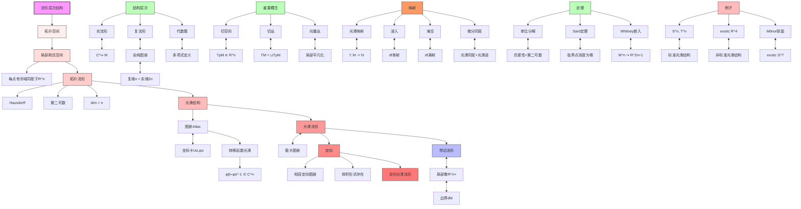

msc_primary: "00A99"
msc_secondary: ['00-XX']
---

# 流形定义层次推理树

## 概述

本推理树展示从拓扑空间到光滑流形的严格层次结构，以及各种流形类型之间的关系。

## 推理树

## 层次详解

### 1. 局部欧氏空间
- 每点有邻域同胚于 R^n 开集
- 维数局部常数（连通分支上常数）

### 2. 拓扑流形
增加两个拓扑条件：
- **Hausdorff**: 分离公理，保证极限唯一
- **第二可数**: 有可数的拓扑基，保证仿紧性

### 3. 光滑流形
- **图册**: 坐标卡集合覆盖全空间
- **光滑相容**: 转移函数是光滑微分同胚
- **极大图册**: 包含所有相容坐标卡

### 4. 定向
- **定向图册**: 所有转移函数的Jacobian行列式为正
- **等价**: 存在处处非零的 n-形式

## 重要定理

| 定理 | 内容 | 意义 |
|------|------|------|
| 单位分解 | 光滑函数族，局部有限，和为1 | 构造整体对象 |
| Sard定理 | 临界值集合测度为零 | 正则值丰富 |
| Whitney嵌入 | n维流形可嵌入 R^{2n+1} | 流形的具体表示 |

## 特殊例子

1. **Exotic R⁴**: 与标准 R⁴ 同胚但不微分同胚的光滑流形
2. **Milnor球面**: 与 S⁷ 同胚但不微分同胚的 7 维流形
3. **不可定向**: Möbius带, Klein瓶, RPⁿ

---
*生成时间: 2026年4月*
*领域: 微分几何 / 流形理论*
