msc_primary: "00A99"
msc_secondary: ['00-XX']
---

# 同伦类型论：同伦层次结构推理树

## 概述

本推理树展示同伦类型论中的层次结构（h-levels），从合同性到集合、群胚、n-类型，揭示类型论与拓扑学之间的深刻联系。

## 推理树

```mermaid
graph TD
    A[同伦层次] --> B[-2层: 合同]
    B --> B1[可缩类型]<-->B2[∃中心点a, ∀x, a=x]
    B --> B3[等价于1]<-->B4[合同于单位类型]
    
    A --> C[-1层: 命题]
    C --> C1[真值类型]<-->C2[至多一个元素]
    C --> C3[P → Q → P=Q]<-->C4[证明无关性]
    
    A --> D[0层: 集合]
    D --> D1[0-截断]<-->D2[∀x,y, x=y是命题]
    D --> D3[等同是性质]<-->D4[无高阶同伦]
    D --> D5[UFP中的hSet]<-->D6[经典集合论]
    
    A --> E[1层: 群胚]
    E --> E1[1-截断]<-->E2[∀x,y, x=y是集合]
    E --> E3[高阶等同平凡]<-->E4[π_n=0 for n≥2]
    E --> E5[经典群胚]<-->E6[对象+态射]
    
    A --> F[n层: n-群胚]
    F --> F1[n-截断]<-->F2[递归定义]
    F --> F3[n-连通]<-->F4[π_k=0 for k≤n]
    F --> F5[∞-群胚]<-->F6[无截断条件]
    
    G[截断运算] --> G1[‖-‖₋₁命题截断]<-->G2[‖A‖是命题]
    G --> G3[‖-‖₀集合截断]<-->G4[‖A‖₀是集合]
    G --> G5[‖-‖ₙn-截断]<-->G6[截断到n-类型]
    
    H[连通性] --> H1[-1连通]<-->H2[‖A‖成立]
    H --> H3[0连通]<-->H4[‖A‖₀合同]
    H --> H5[n连通]<-->H6[‖A‖ₙ合同]
    
    I[同伦群] --> I1[π₀A]<-->I2[‖A‖₀]
    I --> I3[π₁A,a]<-->I4[ΩA,a的集合截断]
    I --> I5[πₙA,a]<-->I6[ΩⁿA,a的截断]
    
    J[谱序列] --> J1[纤维序列]<-->J2[长正合列]
    J --> J3[同伦下降]<-->J4[n-类型反映射性质]
    
    style A fill:#f9f,stroke:#333,stroke-width:2px
    style B fill:#bbf,stroke:#333
    style C fill:#bfb,stroke:#333
    style D fill:#f96,stroke:#333
    style E fill:#fbb,stroke:#333
    style F fill:#fdd,stroke:#333
    style G fill:#fcc,stroke:#333
    style H fill:#f99,stroke:#333
    style I fill:#f88,stroke:#333
    style J fill:#f77,stroke:#333

```



## 层次结构详解

### 1. 合同类型（-2层）

类型A是合同的，如果：

```

isContr(A) := Σ(a:A). Π(x:A). (a = x)

```

等价于：
- A ≃ 1（等价于单位类型）
- A可缩到一点

### 2. 命题类型（-1层）

类型P是命题，如果：

```

isProp(P) := Π(x,y:P). (x = y)

```

性质：
- 证明无关性：所有证明相等
- 逻辑命题对应

### 3. 集合类型（0层）

类型A是集合，如果：

```

isSet(A) := Π(x,y:A). Π(p,q:x=y). (p=q)

```

即：对所有x,y，路径类型x=y是命题。

### 4. 群胚类型（1层）

类型A是1-群胚（经典群胚），如果：

```

isGroupoid(A) := Π(x,y:A). isSet(x=y)

```

即：路径空间是集合，高阶路径平凡。

## 截断运算

### 命题截断

‖A‖₋₁是命题，满足：

```

| - |: A → ‖A‖

‖A‖是命题

```

泛性质：

```

(‖A‖ → P) ≃ (A → P), 对命题P

```

### n-截断

递归构造：

```

‖A‖₋₂ := 1
‖A‖ₙ₊₁ := im(|-|: A → ‖A‖ₙ)

```

## 同伦群定义

```

π₀(A) := ‖A‖₀
π₁(A,a) := ‖Ω(A,a)‖₀
πₙ(A,a) := ‖Ωⁿ(A,a)‖₀

```

## 重要定理

| 定理 | 陈述 |
|------|------|
| 集合的等价 | isSet(A) ↔ 等同是命题 |
| 截断的泛性质 | ‖A‖ₙ是最优n-类型逼近 |
| 连接的同伦 | n连通空间的同伦群性质 |
| 下降原理 | n-类型反映射由n-骨架决定 |

---
*生成时间: 2026年4月*
*领域: 同伦类型论 / 高阶范畴论 / 代数拓扑*
