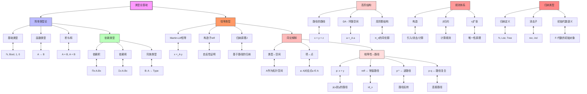

# 同伦类型论：类型论基础推导推理树

## 概述

本推理树展示Martin-Löf类型论的基础构造，以及如何通过同论解释将类型视为空间、相等性视为路径，为同伦类型论奠定基础。

## 推理树



## 核心构造详解

### 1. 依赖类型

**依赖积**（全称量词）：
```
Π(x:A). B(x)   对应   ∀x:A, B(x)
```

**依赖和**（存在量词）：
```
Σ(x:A). B(x)   对应   {(x,b) | x:A, b:B(x)}
```

### 2. 恒等类型规则

**形成规则**：
```
Γ ⊢ A: Type    Γ ⊢ a: A    Γ ⊢ b: A
-----------------------------------
      Γ ⊢ Id_A(a,b): Type
```

**引入规则**：
```
Γ ⊢ a: A
--------------
Γ ⊢ refl_a: Id_A(a,a)
```

**消去规则（J）**：
```
C: Πx,y:A. (x=y) → Type    c: Πx:A. C(x,x,refl_x)
------------------------------------------------
        J(C,c): Πx,y:A. Πp:x=y. C(x,y,p)
```

### 3. 同论解释

| 类型论 | 拓扑学 | 说明 |
|--------|--------|------|
| 类型A | 空间\|A\| | 拓扑空间 |
| 项a:A | 点a ∈ \|A\| | 空间的点 |
| p: a = b | 路径p: [0,1]→\|A\| | 从a到b的连续路径 |
| α: p = q | 同伦α: p ≃ q | 路径之间的形变 |
| 路径复合 | 路径连接 | 拓扑路径乘法 |

### 4. 高阶结构

**环路空间**：
```
Ω(A,a) := (a =_A a)
```

**迭代环路空间**：
```
Ωⁿ(A,a) 对应 π_n(\|A\|, a)
```

## 示例：自然数类型

```
inductive ℕ: Type
| zero: ℕ
| succ: ℕ → ℕ
```

消去规则（原始递归）：
```
rec_ℕ(C, c_0, c_s, zero) ≡ c_0
rec_ℕ(C, c_0, c_s, succ(n)) ≡ c_s(n, rec_ℕ(C, c_0, c_s, n))
```

---
*生成时间: 2026年4月*
*领域: 类型论 / 数学基础 / 同伦论*
