msc_primary: "00A99"
msc_secondary: ['00-00']
---

# Langlands纲领：自守形式理论推导推理树

## 概述

本推理树展示自守形式的理论基础、构造方法及其与L函数的深刻联系，这是Langlands纲领的核心内容。

## 推理树

```mermaid
graph TD
    A[自守形式理论] --> B[经典模形式]
    B --> B1[全模群SL2Z]<-->B2[同余子群Γ]
    B --> B3[权k模形式]<-->B4[M_kΓ全纯+增长条件]
    
    B --> C[自守观点]
    C --> C1[上半平面作用]<-->C2[GL2R/O2R·R^×]
    C --> C3[adelic语言]<-->C4[GL2Q\GL2AQ/GL2Ẑ·O2]
    
    A --> D[一般自守形式]
    D --> D1[约化群G]<-->D2[GLn, Sp2n等]
    D --> D3[GQ\GA]<-->D4[双陪集空间]
    
    D --> E[自守表示]
    E --> E1[不可约分量]<-->E2[G_A的表示]
    E --> E3[尖点表示]<-->E4[增长条件]
    
    A --> F[Whittaker模型]
    F --> F1[Whittaker函数]<-->F2[特征标积分]
    F --> F3[唯一性定理]<-->F4[局部整体分解]
    
    G[自守L函数] --> G1[积分表示]<-->G2[Rankin-Selberg方法]
    G --> G3[标准L函数]<-->G4[Ls,π = ∏ Ls,π_p]
    
    H[解析性质] --> H1[全纯延拓]<-->H2[函数方程]
    H --> H3[解析延拓到C]<-->H4[Ls,π ↔ L1-s,π̃]
    
    I[构造方法] --> I1[Eisenstein级数]<-->I2[诱导表示]
    I --> I3[Theta对应]<-->I4[Weil表示]
    I --> I5[Arthur猜想]<-->I6[离散谱分解]
    
    J[比较定理] --> J1[Jacquet-Langlands]<-->J2[四元数与GL2]
    J --> J3[基变换Base Change]<-->J4[循环扩张提升]
    
    style A fill:#f9f,stroke:#333,stroke-width:2px
    style B fill:#bbf,stroke:#333
    style C fill:#bfb,stroke:#333
    style D fill:#f96,stroke:#333
    style E fill:#fbb,stroke:#333
    style F fill:#fdd,stroke:#333
    style G fill:#fcc,stroke:#333
    style H fill:#f99,stroke:#333
    style I fill:#f88,stroke:#333
    style J fill:#f77,stroke:#333

```



## 自守形式详解

### 1. 经典模形式

权k的全纯模形式f: ℍ → ℂ满足：

```

f(γ·τ) = (cτ+d)^k f(τ),  ∀γ ∈ SL₂(ℤ)
f在尖点全纯

```

### 2. Adelic语言

自守形式提升为G_ℚ\G_𝔸上的函数：

```

φ: G_ℚ\G_𝔸 → ℂ
φ在中心特征下不变
φ是光滑且适度增长的

```

### 3. 尖点条件

对于抛物子群P = MU：

```

∫_U(ℚ)\U(𝔸) φ(ug) du = 0

```

这保证L函数的绝对收敛。

## L函数构造

### Rankin-Selberg方法

对于GL_n × GL_m表示π × π'：

```

L(s, π × π') = ∫ φ(g)φ'(g) E(g,s) dg

```

其中E(g,s)是Eisenstein级数。

### 函数方程

```

L(s, π) = ε(s, π) L(1-s, π̃)

```

其中ε因子是局部ε因子的乘积。

## 谱分解

```

L²(G_ℚ\G_𝔸) = L²_cusp ⊕ L²_res ⊕ L²_cont

```

| 分量 | 来源 | 特征 |
|------|------|------|
| 尖点 | 尖点形式 | 离散谱 |
| 剩余 | 退化Eisenstein | 有限维 |
| 连续 | 一般Eisenstein | 连续谱 |

---
*生成时间: 2026年4月*
*领域: 自守形式 / 表示论 / L函数*
