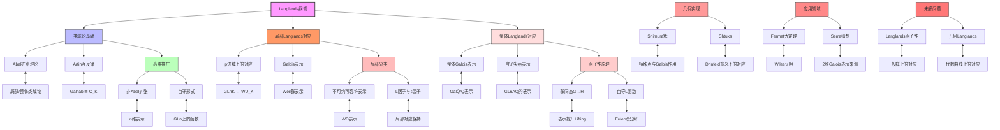

msc_primary: "00A99"
msc_secondary: ['00-XX']
---

# Langlands纲领：类域论到Langlands对应推理树

## 概述

本推理树展示从经典类域论到Langlands纲领的深刻推广，揭示数论与表示论之间的神秘联系。

## 推理树



## 核心概念详解

### 1. 类域论回顾

**局部类域论**：对于p进域K，有Artin同构

```

K^× ≅ W_K^ab

```

**整体类域论**：对于数域K，有

```

GalK^ab/K ≅ C_K/K̄^×

```

### 2. 局部Langlands对应

对于p进域K，存在双射：

```

{GLnK的不可约可容许表示} ↔ {WD_K的n维Frobenius半单表示}

```

其中WD_K = Weil-Deligne群。

### 3. 整体Langlands对应

猜想：存在对应

```

{GLnAQ的尖点自守表示} ↔ {GalQ̄/Q的n维不可约表示}

```

## 重要定理

| 定理 | 陈述 | 证明者 |
|------|------|--------|
| 局部对应n=1 | GL₁对应 | Lubin-Tate |
| 局部对应n=2 | GL₂局部对应 | Kutzko |
| 局部对应一般n | 特征0 | Harris-Taylor |
| 整体对应n=2 | 经典模形式 | Wiles等 |
| 函数域对应 | GL_n | Drinfeld, Lafforgue |

## 研究前沿

1. **p进Langlands对应**: 模p与p进族版本
2. **几何Langlands**: 代数曲线上的对应
3. **函子性猜想**: 一般约化群的提升

---
*生成时间: 2026年4月*
*领域: 数论 / 自守形式 / Langlands纲领*
