msc_primary: "00A99"
msc_secondary: ['00-XX']
---

# 几何Langlands对应推理树

## 概述

本推理树展示几何Langlands对应的框架，这是Langlands纲领在代数曲线上的几何实现，揭示了D模、Hecke特征层与局部系统之间的深刻对偶。

## 推理树

```mermaid
graph TD
    A[几何Langlands] --> B[几何设置]
    B --> B1[光滑射影曲线X]<-->B2[亏格g ≥ 2]
    B --> B3[结构群G]<-->B4[GLn, SLn, 一般约化群]
    
    B --> C[模空间]
    C --> C1[BunG]<-->C2[G-主丛模空间]
    C --> C3[LocSys]<-->C4[平坦G-局部系统]
    
    A --> D[D模层]
    D --> D1[BunG上的D模]<-->D2[扭曲微分算子]
    D --> D3[Hecke特征D模]<-->D4[特征层]
    
    D --> E[Hecke对应]
    E --> E1[修改BunG]<-->E2[点x处改变纤维]
    E --> E3[Hecke函子]<-->E4[拉回与推进]
    
    A --> F[几何对应]
    F --> F1[Hecke特征层]<-->F2[带有本征值性质]
    F --> F3[↔]<-->F4[局部系统的Hecke本征值]
    
    G[范畴等价] --> G1[DG-modBunG]<-->G2[凝聚层范畴]
    G --> G3[白噪声范畴]<-->G4[LocSys上的拟凝聚层]
    
    H[局部理论] --> H1[仿射Grassmannian]<-->H2[GrG = GK/GO]
    H --> H3[球面范畴]<-->H4[PG几何Satake等价]
    
    I[扭结理论] --> I1[Kac-Moody代数]<-->I2[仿射Lie代数]
    I --> I3[共形块]<-->I4[WZW模型]
    
    J[算术应用] --> J1[函数域Langlands]<-->J2[Drinfeld, Lafforgue]
    J --> J3[Drinfeld模]<-->J4[椭圆模的推广]
    
    K[量子化] --> K1[几何量子化]<-->K2[形变量子化]
    K --> K3[量子几何Langlands]<-->K4[参数化的对应]
    
    style A fill:#f9f,stroke:#333,stroke-width:2px
    style B fill:#bbf,stroke:#333
    style C fill:#bfb,stroke:#333
    style D fill:#f96,stroke:#333
    style E fill:#fbb,stroke:#333
    style F fill:#fdd,stroke:#333
    style G fill:#fcc,stroke:#333
    style H fill:#f99,stroke:#333
    style I fill:#f88,stroke:#333
    style J fill:#f77,stroke:#333
    style K fill:#bfb,stroke:#333

```



## 几何设置详解

### 1. 曲线与模空间

设X是有限域𝔽_q上的光滑射影曲线，亏格g ≥ 2。

**Bun_G**: G-主丛的模空间，是光滑Deligne-Mumford叠。

**LocSys_G**: 具有平坦联络的G-主丛模空间，即表示

```

ρ: π₁(X) → G

```

的模空间。

### 2. Hecke对应

对于点x ∈ X，Hecke对应是：

```

    Hecke_x
   /       \
  ↓         ↓
Bun_G   Bun_G

```

对应于在x点修改主丛的纤维。

### 3. 几何Langlands猜想

**弱形式**: 对于不可约G^∨-局部系统E，存在非零Hecke特征D模F_E，使得：

```

H_x(F_E) ≅ F_E ⊠ E_x

```

**强形式**: 范畴等价

```

D-mod(Bun_G) ≅ QCoh(LocSys_{G^∨})

```

## 关键定理

| 结果 | 陈述 | 证明者 |
|------|------|--------|
| GL_n的弱对应 | 不可约局部系统→Hecke特征层 | Frenkel, Gaitsgory, Vilonen |
| GL_n的强对应 | 范畴等价（亏格0/1） | Gaitsgory |
| 经典Satake | 球面函数代数 ≅ 表示环 | Satake, Lusztig, Ginzburg |
| 几何Satake | 球面范畴 ≅ Rep(G^∨) | Lusztig, Ginzburg, Mirković-Vilonen |

## 与经典Langlands的关系

```

几何Langlands ──函数层──→ 经典Langlands（函数域）
    ↓                             ↓
D-模层                        自守函数
    ↓                             ↓
迹公式                          Weil猜想

```

## 研究方向

1. **量子几何Langlands**: 引入形变参数
2. **扭结不变量**: 与Jones多项式等联系
3. **算术几何**: 数域情形的几何化

---
*生成时间: 2026年4月*
*领域: 代数几何 / D模理论 / 几何表示论*
