msc_primary: "00A99"
msc_secondary: ['00-00']
---

# 镜像对称：SYZ猜想推导推理树

## 概述

本推理树展示Strominger-Yau-Zaslow(SYZ)猜想的核心思想，通过特殊Lagrange纤维化揭示镜像对称的几何机制，将镜像对偶解释为对偶环面纤维化。

## 推理树

```mermaid
graph TD
    A[SYZ猜想] --> B[Calabi-Yau流形]
    B --> B1[复n维]<-->B2[第一陈类为零]
    B --> B3[Ricci平坦度量]<-->B4[Yau定理]
    B --> B5[全纯n-形式]<-->B6[平凡典则丛]
    
    B --> C[特殊Lagrange子流形]
    C --> C1[拉格朗日子流形]<-->C2[辛形式限制为零]
    C --> C3[特殊条件]<-->C4[ReΩ限制为零]
    C --> C5[SLAG: n维极小]<-->C6[校准子流形]
    
    A --> D[SYZ纤维化]
    D --> D1[f: X → B]<-->D2[纤维化到n维底]
    D --> D3[一般纤维为环面]<-->D4[T^n]
    D --> D5[奇异纤维]<-->D6[判别轨迹Δ ⊂ B]
    
    D --> E[镜像构造]
    E --> E1[对偶纤维化]<-->E2[纤维对偶环面]
    E --> E3[X̌ = T^*B/Λ^*]<-->E4[对偶环面丛]
    
    A --> F[几何对应]
    F --> F1[X的点 ↔ X̌的SLAG纤维]<-->F2[纤维本身]
    F --> F3[SLAG纤维 ↔ 点]<-->F4[对偶构造]
    F --> F5[B场 ↔ 辛结构]<-->F6[模空间对应]
    
    G[大复结构极限] --> G1[复结构退化]<-->G2[极限环面纤维化]
    G --> G3[最大单值性]<-->G4[Picard-Lefschetz]
    
    H[镜像变换] --> H1[ Fourier-Mukai ]<-->H2[在纤维上积分]
    H --> H3[ SYZ变换 ]<-->H4[几何傅里叶变换]
    
    I[判别轨迹] --> I1[奇异性]<-->I2[纤维退化]
    I --> I3[Ooguri-Vafa度量]<-->I4[半平坦近似]
    I --> I5[瞬子修正]<-->I6[ discs 贡献]
    
    J[验证结果] --> J1[椭面对]<-->J2[Dolgachev定理]
    J --> J3[K3曲面]<-->J4[超Kähler情形]
    
    K[推广] --> K1[广义Calabi-Yau]<-->K2[非Kähler情形]
    K --> K3[Landau-Ginzburg]<-->K4[超势纤维化]
    
    style A fill:#f9f,stroke:#333,stroke-width:2px
    style B fill:#bbf,stroke:#333
    style C fill:#bfb,stroke:#333
    style D fill:#f96,stroke:#333
    style E fill:#fbb,stroke:#333
    style F fill:#fdd,stroke:#333
    style G fill:#fcc,stroke:#333
    style H fill:#f99,stroke:#333
    style I fill:#f88,stroke:#333
    style J fill:#f77,stroke:#333
    style K fill:#bfb,stroke:#333

```



## SYZ猜想详解

### 1. 核心陈述

**SYZ猜想**: 对于镜面对(X, X̌)，存在大复结构极限附近：
- X容许特殊Lagrange环面纤维化 f: X → B
- 镜像X̌是对偶纤维化，纤维为对偶环面

### 2. 特殊Lagrange子流形

在Calabi-Yau n- fold (X, ω, Ω)中：

**Lagrange条件**: L^n ↪ X满足ω|_L = 0

**特殊条件**: Im(e^{iθ}Ω)|_L = 0，对某相位θ

### 3. 对偶纤维化

若f: X → B纤维为T^n = TB/Λ，则：

```

X̌ = T^*B/Λ^*

```

其中Λ^*是格Λ的对偶。

## 几何对应

| X上的对象 | X̌上的对象 | 解释 |
|-----------|-----------|------|
| 点p | 纤维f̌⁻¹(p) | SYZ对偶 |
| 纤维f⁻¹(b) | 点b | 反向对偶 |
| 截面 | 截面 | 对应 |
| SLAG环面 | SLAG环面 | T-对偶 |

## SYZ变换

对于支撑在纤维上的对象：

```

SYZ: D^bCoh(X) → D^bFuk(X̌)

```

在光滑纤维上，类似于经典傅里叶变换。

## 瞬子修正

半平坦度量在判别轨迹附近有奇异性，需要瞬子修正：

```

ω̃ = ω_0 + Σ_{discs} contributions

```

其中discs是X中边界在SLAG纤维上的全纯圆盘。

## 验证案例

| 案例 | 结果 | 证明者 |
|------|------|--------|
| 椭面 | SYZ成立 | Dolgachev |
| K3曲面 | 广义SYZ | Gross-Wilson |
| 平坦环面 | T-对偶 | 经典 |
| 局部模型 | 半平坦度量 | Hitchin等 |

## 研究前沿

1. **广义SYZ**: 非Calabi-Yau情形
2. **Gross-Siebert纲领**: 代数实现SYZ
3. **量子修正**: 瞬子贡献的精确公式

---
*生成时间: 2026年4月*
*领域: 复几何 / 辛几何 / 镜像对称*
