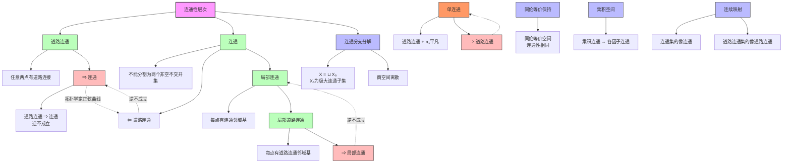

msc_primary: "00A99"
msc_secondary: ['00-XX']
---

# 连通性性质链推理树

## 概述

本推理树展示拓扑空间各种连通性概念之间的蕴含关系与层次结构。

## 推理树



## 连通性层次详解

### 1. 道路连通 (Path-connected)
- **定义**: ∀x,y∈X, ∃连续映射 γ: [0,1] → X 使得 γ(0)=x, γ(1)=y
- **强度**: 最强的连通性形式
- **典型反例**: 拓扑学家的正弦曲线（连通但非道路连通）

### 2. 连通 (Connected)
- **定义**: 不能写成两个非空不交开集的并
- **等价**: 既开又闭的子集只有∅和X
- **中间层次**: 道路连通 ⇒ 连通（严格强）

### 3. 局部连通 (Locally connected)
- **定义**: 每点存在由连通开集组成的邻域基
- **关系**: 与全局连通性独立
- **例子**: 有理数集 ℚ 完全不连通但局部连通

### 4. 局部道路连通 (Locally path-connected)
- **定义**: 每点存在道路连通邻域基
- **蕴含**: 局部道路连通 ⇒ 局部连通

### 5. 单连通 (Simply connected)
- **定义**: 道路连通且基本群平凡
- **应用**: 复分析、覆盖空间理论

## 重要关系链

```

单连通 ⇒ 道路连通 ⇒ 连通
    ↓
局部道路连通 ⇒ 局部连通

```

## 反例集合

| 空间 | 性质 | 反例说明 |
|------|------|----------|
| 拓扑学家正弦曲线 | 连通非道路连通 | y=sin(1/x) 与 y轴上的线段 |
| 有理数集 ℚ | 完全不连通 | 任意两点可分离 |
| Comb空间 | 道路连通非局部连通 | 梳子状拓扑构造 |
|  Warsaw圆 | 单连通非局部单连通 | 奇异单连通性 |

## 应用定理

1. **介值定理**: 连通区间上连续函数的像连通
2. **区域不变性**: ℝⁿ中开集的连通性
3. **覆盖空间**: 道路连通空间的覆盖分类

---
*生成时间: 2026年4月*
*领域: 一般拓扑学 / 连通性理论*
