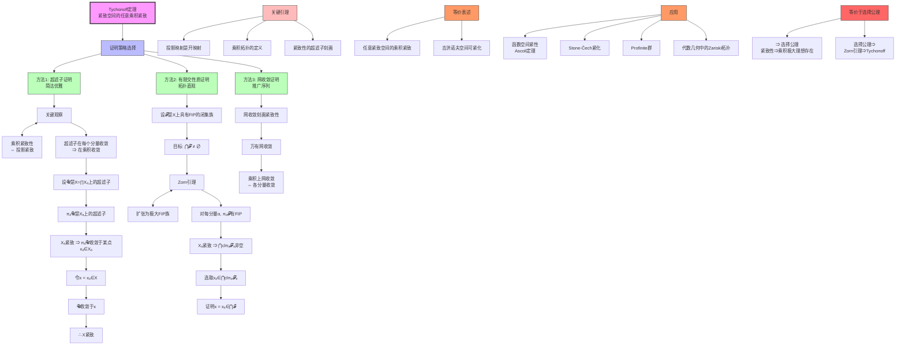

# Tychonoff定理证明推理树

## 概述

本推理树展示Tychonoff定理（紧致空间的任意乘积紧致）的完整证明思路与关键步骤。

## 推理树

## 证明详解

### 定理陈述
**Tychonoff定理**: 若 {Xₐ}ₐ∈ₐ 是一族紧致拓扑空间，则乘积空间 ∏ₐ∈ₐ Xₐ 在乘积拓扑下也是紧致的。

### 证明方法1: 超滤子证明（推荐）

**核心思路**: 紧致性等价于"每个超滤子都收敛"

**证明步骤**:
1. 设 X = ∏ₐ∈ₐ Xₐ，𝓤 是 X 上的超滤子
2. 对每个 α，投影 πₐ(𝓤) 是 Xₐ 上的超滤子
3. 由 Xₐ 紧致，πₐ(𝓤) 收敛于某点 xₐ ∈ Xₐ
4. 令 x = (xₐ)ₐ∈ₐ ∈ X
5. **关键**: 证明 𝓤 收敛于 x
6. x 的任意邻域含有限个约束集，每个约束集在 𝓤 中
7. 因此 X 紧致

### 证明方法2: 有限交性质证明

**核心思路**: 紧致性等价于"具有有限交性质的闭集族有非空交"

**证明步骤**:
1. 设 𝓕 是 X 上具有 FIP 的闭集族
2. 用 Zorn 引理将 𝓕 扩张为极大 FIP 族
3. 对每个 α，πₐ(𝓕) 在 Xₐ 上有 FIP
4. Xₐ 紧致 ⇒ ⋂{cl(πₐ(F)) : F ∈ 𝓕} ≠ ∅
5. 选取 xₐ 属于该交
6. 证明 x = (xₐ) 属于 ⋂𝓕

## 关键引理

### 引理1: 超滤子刻画紧致性
空间 X 紧致 ⟺ X 上每个超滤子都收敛

### 引理2: 乘积拓扑的邻域基
点 x = (xₐ) 的邻域基由有限约束开集组成

### 引理3: 投影与滤子
若 𝓤 是 X 上的超滤子，则 πₐ(𝓤) 是 Xₐ 上的超滤子

## 与选择公理的关系

| 蕴含方向 | 说明 |
|----------|------|
| Tychonoff ⇒ AC | 紧致空间的乘积极大理想存在 |
| AC ⇒ Tychonoff | Zorn引理证明中使用 |

**结论**: Tychonoff定理与选择公理等价

## 重要应用

1. **Ascoli定理**: 函数空间的紧性判定
2. **Stone-Čech紧化**: βX 的构造
3. **Profinite群**: 有限群逆极限的紧性
4. **谱理论**: C*-代数的谱紧性

## 推广与变体

- **箱拓扑**: 乘积在箱拓扑下一般不紧致
- **可数乘积**: 仅需要可数选择公理
- **度量空间**: 可度量化乘积需要可数个度量空间

---
*生成时间: 2026年4月*
*领域: 一般拓扑学 / 紧致性理论*
