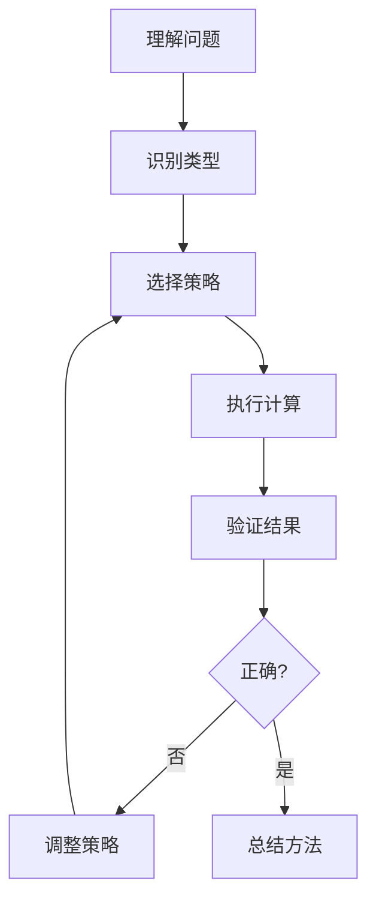
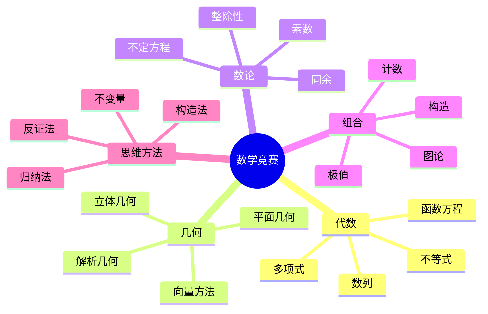

# 数学竞赛解题策略与思维方法

---

## 1. 解题思维框架

### 1.1 通用解题流程

### 1.2 问题类型与策略对应

| 问题特征 | 推荐策略 | 关键技巧 |
|---------|---------|---------|
| 存在性证明 | 构造法/反证法 | 极端原理、抽屉原理 |
| 不等式 | 放缩法/Cauchy-Schwarz | 对称性、齐次化 |
| 极值问题 | 变分法/Lagrange乘子 | 边界分析、临界点 |
| 组合计数 | 递推/生成函数 | 容斥原理、双射 |
| 数论问题 | 同余分析/素数分解 | 中国剩余、二次互反 |

---

## 2. 证明技巧精要

### 2.1 反证法使用场景

**适用情况**：
- 结论含"不存在"、"唯一"、"无限"等否定性词汇
- 直接证明困难，但假设反面可导出矛盾

**经典例子**：
- $\sqrt{2}$ 的无理性
- 素数无穷多
- Brouwer不动点定理

### 2.2 数学归纳法变体

| 类型 | 归纳假设 | 适用场景 |
|-----|---------|---------|
| **简单归纳** | $P(n) \Rightarrow P(n+1)$ | 递推关系明确 |
| **强归纳** | $P(1), \ldots, P(n) \Rightarrow P(n+1)$ | 依赖前面多个值 |
| **双归纳** | $P(n), Q(n) \Rightarrow P(n+1), Q(n+1)$ | 两个相关命题 |
| **倒向归纳** | 从无穷多值推出所有值 | 平均值不等式 |

---

## 3. 常见不等式工具箱

### 3.1 基本不等式链

$$\frac{n}{\frac{1}{a_1} + \cdots + \frac{1}{a_n}} \leq \sqrt[n]{a_1 \cdots a_n} \leq \frac{a_1 + \cdots + a_n}{n} \leq \sqrt{\frac{a_1^2 + \cdots + a_n^2}{n}}$$

调和平均 ≤ 几何平均 ≤ 算术平均 ≤ 平方平均

### 3.2 Cauchy-Schwarz不等式

$$\left(\sum a_i b_i\right)^2 \leq \left(\sum a_i^2\right)\left(\sum b_i^2\right)$$

**等号条件**：$(a_1, \ldots, a_n)$ 与 $(b_1, \ldots, b_n)$ 线性相关

**应用技巧**：
- 选择适当的 $b_i$ 使得 $\sum a_i b_i$ 简化
- 嵌入1的妙用：$a_i = a_i \cdot 1$

---

## 4. 组合问题策略

### 4.1 计数原理

**加法原理**：分类互斥时，总数 = 各类之和
**乘法原理**：分步独立时，总数 = 各步之积

### 4.2 容斥原理

$$|A_1 \cup \cdots \cup A_n| = \sum |A_i| - \sum |A_i \cap A_j| + \cdots + (-1)^{n-1}|A_1 \cap \cdots \cap A_n|$$

**应用场景**：
- 错位排列（derangement）
- 欧拉函数计算
- 筛法求素数

---

## 5. 几何问题策略

### 5.1 坐标法vs综合法

| 方法 | 优点 | 缺点 | 适用场景 |
|-----|-----|------|---------|
| **坐标法** | 系统化、机械化 | 计算量大 | 一般位置问题 |
| **向量法** | 避免坐标选择 | 需要向量直觉 | 涉及平行/垂直 |
| **综合法** | 简洁优美 | 需要灵感 | 经典几何构型 |
| **复数法** | 旋转自然 | 学习曲线陡峭 | 涉及旋转对称 |

### 5.2 常用几何变换

- **平移**：保持方向，简化共线问题
- **旋转**：构造等边三角形、正方形
- **反射**：利用对称性，最短路径问题
- **位似**：相似三角形、共点线
- **反演**：圆与直线的统一

---

## 6. 数论问题策略

### 6.1 同余分析框架

1. **模选择**：选择适当的模数以简化问题
2. **周期分析**：研究序列的周期性
3. **剩余类分析**：分类讨论各剩余类

### 6.2 常用模数

| 模数 | 特点 | 应用 |
|-----|------|-----|
| 2 | 奇偶性 | 存在性问题 |
| 3, 9 | 数字和 | 整除判定 |
| 4, 8 | 平方数 | 平方剩余 |
| 11 | 交错和 | 整除判定 |

---

## 7. 思维训练建议

### 7.1 刻意练习方法

1. **分类练习**：按类型集中训练
2. **限时挑战**：提高解题速度
3. **多解探索**：寻找不同解法
4. **错误分析**：建立错题本

### 7.2 推荐资源

**经典教材**：
- 《数学奥林匹克小丛书》
- 《初等数学研究》
- Problem-Solving Strategies (Engel)

**在线资源**：
- AoPS (Art of Problem Solving)
- Putnam Archive
- IMO Shortlist

---

## 8. 思维导图：数学竞赛知识体系

---

## 参考文献

1. Engel, A. *Problem-Solving Strategies*.
2. Zeitz, P. *The Art and Craft of Problem Solving*.
3. 单墫. *数学竞赛研究教程*.
4. 朱华伟. *数学奥林匹克*.

---

*本文档为数学竞赛解题策略与思维方法汇总*  
*质量等级：A（实用性+方法论）*
